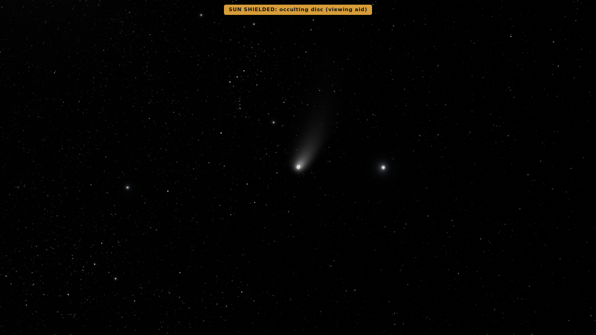
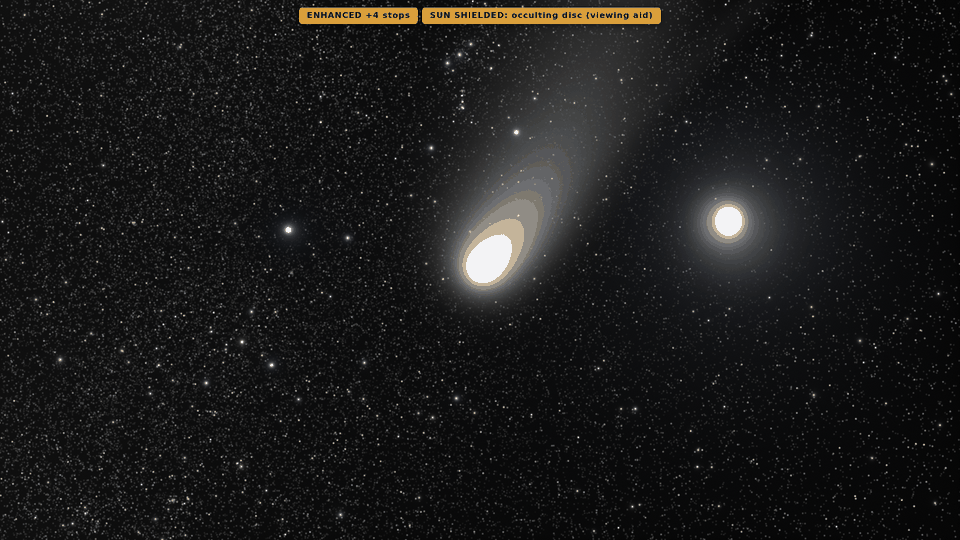
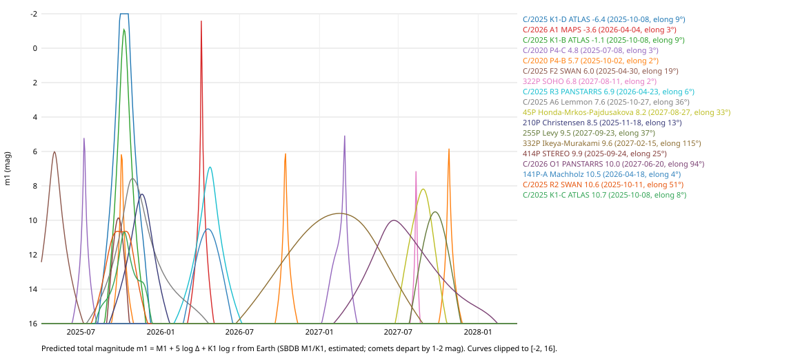

# Comets as they would look: coma, dust tail, ion tail

Until now every comet was a point of the small-body field, as bright as its SBDB total-magnitude law and coloured like the Sun. A comet resolved from the camera is now drawn extended: a coma whose light is split between gas emission bands and dust, a Finson–Probstein dust tail, and a CO⁺ ion tail. All of it is drawn in absolute luminance into the renderer's HDR target, so the eye model decides what can be seen.

The data come first, and the labels say what is known:

- **Total light:** the SBDB law m1 = M1 + 5 log Δ + K1 log r. It carries that law's label, as the point does.
- **Split, colour and shape:** these come from measured activity (production rates, Afρ, band strengths, colours) and from published physics. They are **estimated**. For a comet whose own composition A'Hearn et al. (1995) measured, the composition is **derived**.
- **Strict level:** nothing is drawn extended.

Numbers and pictures here describe the 2026-09-30 build. With `build.writeRepoFiles` enabled the stage writes `docs/reports/comets.json` and its diagnostic figure; profile builds preserve them. The committed comet reference is preserved by builds and renewed explicitly with `python -m pipeline.stages.comets --write-fixture`. The stage is `pipeline/src/pipeline/stages/comets.py`, and it takes about 5 minutes, most of it propagating 1992 comets over the window. The app module is `app/src/render/comets/`.

*C/2025 A6 (Lemmon) at its predicted peak, 2025-10-27, seen from the side at 0.27 au with the Sun shielded. This is the e2e scene `comet-lemmon`. The dust tail curves away from the Sun and lags behind the orbital motion. For a dark-adapted eye it is grey, because rods carry the vision at these light levels. The ion tail is there but below the eye's threshold.*

*The same comet from 1.2e7 km in Enhanced view (+4 stops, badge shown). The coma, smaller than the eye's Ricco area at this distance, is seen as a point. The dust tail fans out, with young fine dust along the anti-solar direction and older, larger grains lagging behind.*

## 1. Which comets matter in the window (2025-03-31 → 2028-03-31)

Every comet with an M1/K1 law, 1992 of the 4077, was propagated day by day through the window. Each started from its `smallbodies/core.bin` state and used the small-body force model, with non-gravitational terms where fitted. For each day the pipeline computed m1 from Earth, using the DE442s ephemeris.

For the showcase comet this reproduces JPL Horizons' T-mag, which uses the same law, to 0.001 mag. It also reproduces r and Δ to 10⁻⁴ au, the size of the light-time difference. The check is in `docs/reports/comets.json` under `horizonsCheck`, and in `app/tests/comets.test.ts`.

The table lists the 22 comets whose predicted peak is brighter than m1 = 12. "Closest to the Sun" means the smallest r inside the window. Elongation is the angle from the Sun as seen from Earth at the peak.

| comet | peak m1 | date | r (au) | Δ (au) | elongation | closest to the Sun | own composition |
|---|---:|---|---:|---:|---:|---|---|
| C/2025 K1-D (ATLAS) | −6.4 | 2025-10-08 | 0.34 | 1.29 | 9° | 2025-10-07 | |
| C/2026 A1 (MAPS) | −3.6 | 2026-04-04 | 0.05 | 0.97 | 3° | 2026-04-04 | |
| C/2025 K1-B (ATLAS) | −1.1 | 2025-10-08 | 0.34 | 1.29 | 9° | 2025-10-07 | |
| C/2020 P4-C | 4.8 | 2025-07-08 | 0.09 | 0.94 | 3° | 2025-07-08 | |
| C/2020 P4-B | 5.7 | 2025-10-02 | 0.09 | 0.91 | 2° | 2026-10-13 (a second passage at the same q) | |
| C/2025 F2 (SWAN) | 6.0 | 2025-04-30 | 0.33 | 0.96 | 19° | 2025-04-30 | |
| 322P/SOHO | 6.8 | 2027-08-11 | 0.06 | 1.06 | 2° | 2027-08-11 | |
| C/2025 R3 (PANSTARRS) | 6.9 | 2026-04-23 | 0.51 | 0.50 | 6° | 2026-04-19 | |
| **C/2025 A6 (Lemmon)** | **7.6** | **2025-10-27** | 0.59 | 0.68 | **36°** | 2025-11-08 | |
| 45P/Honda-Mrkos-Pajdušáková | 8.2 | 2027-08-27 | 0.56 | 0.99 | 33° | 2027-08-30 | 45P (A'Hearn et al.) |
| 210P/Christensen | 8.5 | 2025-11-18 | 0.53 | 0.48 | 13° | 2025-11-22 | |
| 255P/Levy | 9.5 | 2027-09-23 | 0.85 | 1.40 | 37° | 2027-09-25 | |
| 332P/Ikeya-Murakami | 9.6 | 2027-02-15 | 1.61 | 0.93 | 115° | 2027-01-09 | |
| 414P/STEREO | 9.9 | 2025-09-24 | 0.52 | 1.21 | 25° | 2025-09-25 | |
| C/2026 O1 (PANSTARRS) | 10.0 | 2027-06-20 | 1.55 | 1.10 | 94° | 2027-07-17 | |
| 141P-A/Machholz | 10.5 | 2026-04-18 | 0.81 | 1.81 | 4° | 2026-04-18 | |
| C/2025 R2 (SWAN) | 10.6 | 2025-10-11 | 0.84 | 0.31 | 51° | 2025-09-12 | |
| C/2025 K1-C (ATLAS) | 10.7 | 2025-10-08 | 0.33 | 1.29 | 8° | 2025-10-07 | |
| 141P-D/Machholz | 11.0 | 2026-04-21 | 0.81 | 1.81 | 3° | 2026-04-21 | |
| C/2024 E1 (Wierzchos) | 11.1 | 2026-01-31 | 0.62 | 1.15 | 33° | 2026-01-20 | |
| 73P-E/Schwassmann-Wachmann | 11.2 | 2028-01-03 | 0.92 | 1.88 | 8° | 2028-01-03 | |
| C/2025 M2 (PANSTARRS) | 11.9 | 2028-03-02 | 2.91 | 1.99 | 154° | 2027-11-23 | |

*Predicted m1 from Earth over the window for the 18 brightest of them.*

How to read the table:

- **Estimates.** M1/K1 predictions are estimated. Comets depart from their law by 1–2 mag, and much more when a comet outbursts, fades or breaks up. The SBDB fit for Lemmon (M1 10.4, K1 8.75) predicts 7.6 at its peak. A real apparition can differ from that by magnitudes, and the renderer shows the law, not the sky of that night.
- **Unreliable top of the list.** The brightest entries are not trustworthy. C/2025 K1 disintegrated, and its fragments' laws, with K1 up to 38, extrapolate wildly near perihelion. C/2026 A1 (MAPS) and 322P are Kreutz and SOHO sungrazers at 2–3° from the Sun. C/2020 P4 fragments are SOHO comets.
- **Crowded against the Sun.** Most bright predictions sit within 20° of the Sun.
- **Well placed.** The comets that are well placed and bright are:
  - **C/2025 A6 (Lemmon)**: 7.6 on 2025-10-27, 36° from the Sun. This is the showcase and the e2e scene;
  - **45P/Honda-Mrkos-Pajdušáková**: 8.2 in August 2027, 33°. Its own composition was measured;
  - **255P/Levy**: 9.5 in September 2027, 37°;
  - **332P/Ikeya-Murakami**: 9.6 in February 2027, 115°;
  - **C/2026 O1 (PANSTARRS)**: 10.0 in June 2027, 94°;
  - **C/2025 R2 (SWAN)**: 10.6, closest to Earth (0.31 au).
- **Showcase rule.** The brightest notable comet that is at least 30° from the Sun at its peak and is not a fragment (`comets/list.json` `showcase`).

## 2. Data

Datasets were downloaded and recorded by sha256, and each has a note in `docs/sources`.

| source | what it gives |
|---|---|
| `lowell-comet-db-1995`: A'Hearn et al. (1995), PDS SBN | 810 observations of 85 comets: log Q of OH, CN, C2, C3 and log Afρ (484.5 nm). Per comet and population, the medians of log Q(X)/Q(OH) and log Afρ/Q(OH). Population: C2 −2.68, CN −2.57, C3 −3.67, Afρ −25.35 (n = 47–53 comets). |
| `mcdonald-faint-comet-survey`: Cochran et al. (1992), PDS SBN | Flux-calibrated band fluxes at the same place in the coma, giving measured band strengths relative to C2 Δv = 0: **C2 Δv = +1 0.50** (n = 771; the dataset's own efficiencies give 0.54) and **CH 0.032** (n = 248). The band windows set where each band's light falls. |
| `lowell-comet-tools`: Lowell Observatory API | Fluorescence efficiencies L/N at 1 au: C2 Δv = 0 4.5e-13, C3 1.0e-12, CN 2.6–4.1e-13 depending on heliocentric velocity (Swings effect; Schleicher 2010). Haser parent/daughter scale lengths: C2 22 000/66 000 km, CN 13 000/210 000, C3 2800/27 000, OH 24 000/160 000, all ∝ r². |
| `schleicher-2010-dust-phase` | The composite dust phase function, for tail packets seen at other phase angles than the nucleus. |
| `omni2-2024`: NASA OMNI hourly | The solar-wind speed: median 385 km/s (16–84 %: 334–458) over 8581 hours. |

Numbers transcribed from papers are in `pipeline/src/pipeline/comet_tables/activity.json`, each with section and table references. The PDFs are kept with their sha256.

| source | numbers |
|---|---|
| Jorda, Crovisier & Green (2008) | log Q(H2O) = 30.675 − 0.2453 m_H, Q(H2O) = 1.1 Q(OH), RMS 0.19 dex |
| Jewitt (2015) | Dust colours. Long-period comets B−V 0.78, V−R 0.47, R−I 0.42; short-period comets B−V 0.80, V−R 0.46; the Sun 0.64, 0.35, 0.33 |
| Bhardwaj & Raghuram (2012) | O(¹D) per water molecule: 0.064 + 0.81 × 0.357 = 0.353 photons; 75 % at 6300 Å, 25 % at 6364 Å |
| Agarwal, Müller & Grün (2007) | β = 3L Q_pr/(16π c G M ρ s); size index −3.5 ± 0.2 (Halley, > 20 µm); grains to 10⁻³ kg; density 1000 kg m⁻³ |
| Moreno & Jehin (2025) | Grain speed v = v0 β^0.25 r^−0.5 with v0 = 1 km/s; Q_pr ≈ 1 for r ≳ 1 µm; C_pr = 1.191e-3 kg m⁻² (our β from L_sun, GM_sun and c agrees within 4 %) |
| Rousselot et al. (2024) | CO⁺ comet-tail band efficiencies (v′, v″ ≤ 5) at 1 au, total 9.5e-14 erg s⁻¹ ion⁻¹; the (3,0) and (2,0) line wavelengths |
| Cochran et al. (2015) | Measured Q(CO)/Q(H2O) from < 1 % to > 20 %; we use the geometric mean, 4.5 % |
| Ferellec et al. (2024) | The Haser convention v = 1 km/s that the Lowell scale lengths go with |

Searched for and not used:

- VizieR high-resolution line atlases (C/2020 F3 NEOWISE, 122P/de Vico). Their intensities are blaze-normalised, not flux-calibrated across orders, so they give line identities but not band strengths.
- A machine-readable ion-tail brightness or CO photoionisation rate. The phidrates server failed, and the NIST WebBook served a bot check.
- A Δv = −1 or −2 Swan-sequence strength.

## 3. The model (`app/src/render/comets/model.ts`)

### Coma brightness and colour

At the comet's heliocentric distance r and the observer's distance Δ:

1. The heliocentric magnitude is m_H = M1 + K1 log r. Water production is Q(H2O) = 10^(30.675 − 0.2453 m_H), and Q(OH) = Q(H2O)/1.1.
2. Q(C2), Q(CN) and Q(C3) are Q(OH) times the comet's own ratios, or the population medians. Afρ = Q(OH) × 10^(log Afρ/Q(OH)).
3. **Gas bands.** L = g(r)·N, with N = Q l_d/v the Haser total of daughters. Since g ∝ r⁻² and l_d ∝ r², this reduces to L = g₁ Q l_d,1/v. C2 Δv = +1 and CH are measured fractions of C2 Δv = 0. [O I] is 0.353 Q(H2O) photons.
4. **V-band check.** Each band's flux at the observer, F = L/(4πΔ²), is weighed by its V-band response. If the gas exceeded 90 % of the M1/K1 light it would be scaled down to that, but this does not happen for Lemmon.
5. **Dust.** The dust carries the rest of the V light. The dust continuum within projected radius ρ is Afρ·ρ·F☉/(4r²Δ²), which grows linearly with ρ. So the coma has a radius R, where the Afρ coma reaches that flux: R = F_dust·4r²Δ²/(Afρ·F☉). R does not depend on Δ, and the test checks this.
6. **Colour.** It is the sum of the components' XYZS. Each was integrated once in the pipeline against the CIE observers and Bessell V:
   - dust: sunlight (TSIS-1) × the reddening built from Jewitt's colour excesses, a gradient of ≈ 12 %/100 nm;
   - gas: each band spread over its measured window.

For **C/2025 A6 (Lemmon) at its peak** (r = 0.594 au, Δ = 0.676 au, phase 103°):

| quantity | value |
|---|---|
| Q(H2O) | 4.1e28 s⁻¹ |
| Afρ | 1650 cm |
| coma radius R | 10 400 km; half the light within 7600 km |
| gas share of the V light | 31 %, almost all C2 Swan Δv = 0 |
| chromaticity | coma (x, y) = (0.269, 0.314) against the Sun's (0.322, 0.332); dust alone (0.338, 0.345); C2 Δv = 0 alone (0.027, 0.570) |
| scotopic/photopic ratio | 3.4, against 2.4 for sunlight |

The coma is bluish-green and a little redder in its dust. To a dark-adapted eye it is brighter than a solar-coloured point of the same V magnitude, because rods favour green and blue.

### Coma shape

- **Dust.** Σ ∝ e^{−(ρ/Re)²}/ρ, with Re = 2R/√π so that the total is unchanged. The enclosed fraction is erf(ρ/Re).
- **Gas.** Each species follows the projected Haser distribution. The pipeline tabulates its enclosed fraction against ρ/l_d, and the pipeline test checks it against a direct line-of-sight integration. CH and C2 Δv = +1 follow C2, and [O I] follows OH.

### Dust tail

The dust tail follows Finson & Probstein (1968). A grain of radiation-pressure parameter β, released τ ago with the nucleus' velocity, moves on a Kepler orbit with μ(1 − β). The emission point is the nucleus' own state taken back τ on its two-body orbit.

The tail is a (τ, β) grid of packets: 48 ages log-spaced from 0.25 to 90 days, and 24 β values from 9.3e-5 (6.2 mm grains) to 0.57 (1 µm). Each packet carries cross-section A·σ = A·Q_σ(t − τ)·Δτ·p(β)Δβ:

- A·Q_σ = 2 Afρ/⟨1/v⟩ follows from Afρ = A Σ Q_σ(β)/(2 v(β)) for a steady 1/ρ coma.
- Afρ at the emission time scales with the water production at that distance.
- p(β) ∝ β^−0.5 is the cross-section-weighted form of the −3.5 size distribution.

Each packet is a Gaussian of width v(β)·τ/√3, the projected shell of grains with that speed. Its brightness uses its own r, Δ and phase, relative to the nucleus' phase. Packets inside the coma radius are left to the coma.

For Lemmon, 545 packets reach 5.6e7 km from the nucleus. Integrated over 90 days of production, the tail holds about 46 times the coma's light. That light is spread over a region many thousands of times larger. The M1/K1 total, like visual estimates, is the coma only.

### Ion tail

CO⁺ ions are produced at Q(CO) = 0.045 Q(H2O) and carried at the median solar-wind speed along v_sw r̂ − v_comet, the aberrated anti-solar direction. Each ion radiates the total comet-tail band efficiency × r⁻². The column per unit length is Q/v_sw.

The tail is drawn to one day of ion travel, 3.3e7 km, fading over its last 30 %, with the coma's width. Its colour comes from the (3,0) and (2,0) bands at 402 and 427 nm, which is violet. For Lemmon its total is 3 % of the coma's photopic light, which is why it does not show to the naked eye.

## 4. Rendering (`app/src/render/comets/`)

### Hooks

- `Renderer.setCometModel(model)`.
- `SceneSnapshot.comets`, a new optional field. Each entry carries the comet's camera-relative apparent position and its propagated heliocentric state.
- One pass after the bodies, marked 1b in the renderer's frame outline. It draws additively into EXT, is depth-tested against the bodies, and the Sun shield hides what lies behind the disc.
- A coma whose half-light disc is smaller than the eye's Ricco area is not drawn in EXT. The eye sums such a source over the Ricco area, like a star, so the coma joins the renderer's point sources with its total light and colour, and goes through the same eye path as the field's point did. A Ricco weight in W would also dim whatever lies behind the transparent coma: an earlier version did that and drew a dark disc around small comae.

### Coma

One camera-facing quad per coma, covering 99.9 % of every component's light. The CPU builds a 128-sample table of enclosed XYZS light against angle, log-spaced.

Each pixel takes the light inside it:

- within 6 pixels of the nucleus, the pixel square is integrated exactly: 8 thin rings, each weighted by the closed-form area of the disc inside the square;
- farther out, the pixel takes its share of the ring through it.

The pixels sum to the M1/K1 illuminance:

- within 0.12 % on the CPU mirror (`pixelIlluminance`), for comae 1–40 px in radius with the nucleus on or off pixel centres;
- within 0.4 % on the GPU. `sb-test.html?mode=comet` reads back an rgba32float render; the residual comes from f32 precision in the table.

### Tails

Gaussian splats of given illuminance, widened to at least 0.6 px so they still integrate to their light. They are drawn at their own depth.

### Level of detail (`lod.ts`)

A comet is drawn extended when either:

- its coma radius covers at least 1.5 px, or
- its dust tail could span 6 px (unprojected length ½ β_max g τ_max²) and its m1 is within 3 mag of the eye's limit (6.5 by default).

A comet must also lie in the frame, with its tail's reach, and 'estimated' must be admitted. Every other comet stays a point of the field, with its total light in one splat.

### Shell (`app/comets.ts`)

The candidates each frame are the notable comets (`comets/list.json`) plus the selection or target. Their states come from `SmallBodies`, the CPU reference propagator:

- a coarse state cached per hour of simulated time for the first cut;
- light-time-corrected geometry for the comets drawn.

Comets drawn extended are taken out of the field's points. The field's `stateOf` cache grew from 16 to 64 objects, so the 22 candidates do not thrash it.

### Cost

On the real catalogue, the shell costs 1.5–3.5 ms per frame after the first, which propagates each candidate from the catalogue epoch, about 80–340 ms.

The layer's CPU work is:

- per comet per frame: the coma model, its table and the tail packets' light, a few ms;
- when time moves: the tail geometry, about 20 ms per comet. It is cached while time is paused.

On SwiftShader, the software WebGPU the tests use, the comet pass takes about 160 ms in the showcase scene (1764 packets). Up close, at 3e6 km, the old tail packets cover much of the screen and the pass takes 4–5 s. Hardware cost for these specific tail views was not measured in this report.

### Inspector

A selected comet shows two extra rows:

- its composition (own or population medians), with label and sources;
- the coma and tails model (estimated).

The "why does it look like this" line says the comet is drawn with coma and tails.

## 5. Verification

- `app/tests/comets.test.ts` (fixture `app/tests/fixtures/comet_reference.json`, written by the explicit reference command):
  - The total V light equals the M1/K1 law, and our m1 equals Horizons T-mag to within 0.01 mag at three epochs.
  - The coma radius and gas fraction do not depend on Δ. Enclosed light is monotone and reaches the total.
  - The rendered coma integrates to the M1/K1 illuminance within 0.5 % for 1, 2, 8 and 40 px comae, with the nucleus on and off pixel centres.
  - Colour: gas moves the coma from the reddened dust towards blue-green, and the dust is redder than sunlight.
  - Tail geometry against Horizons' published PsAng (anti-sunward) and PsAMV (negative orbital velocity) at three epochs:
    - our radius vector matches PsAng within 0.3°, and our negative velocity matches PsAMV within 0.3°;
    - young high-β grains lie along PsAng within 3°;
    - 99 % of the tail's light lies in the PsAng–PsAMV sector, with a 5° margin.
  - A young syndyne is displaced ½ β g τ² anti-sunward, to 2e-3. Syndynes and synchrones through the same grain agree.
  - The ion tail lies within the aberration angle of PsAng, bent toward PsAMV.
  - Level of detail: extended from 2e6 km, a point from 170 au.
- `app/tests/app-smallbodies-real.test.ts`, on the real catalogue: Lemmon is drawn extended from Earth at its peak; its Δ matches the list; nothing is extended at Strict; frame cost.
- GPU: `node scripts/sb-gpu.mjs --query "mode=comet"` gives a worst error of 0.39 % against the model's light in frame.
- `pipeline/tests/test_comets.py`:
  - the Haser table against direct integration;
  - Jewitt's colour excesses reproduced through the Bessell passbands;
  - the McDonald C2 ratio against the dataset's own efficiencies (within 10 %);
  - the Lowell population medians against A'Hearn et al.'s classes;
  - β against C_pr;
  - the product checks.
- e2e scene `comet-lemmon`: its title says why it runs with `sbfield=0`.

## 6. Limitations

- **Colour.** Only C2 Δv = 0/+1, CN, C3, CH and [O I] are in the gas spectrum. C2 Δv = −1 (5635 Å) and −2 (6191 Å), and all NH2 bands, are missing. No flux-calibrated, machine-readable strength was found, and the McDonald NH2 column is unusable. Their absence makes the modelled gas bluer and a little fainter than it should be, because the missing light goes to the dust.
- **Brightness.** The M1/K1 law is the only brightness, with its scatter and its failures (fragments, sungrazers, outbursts).
- **Composition** comes from 1976–1992 photometry for the comets A'Hearn et al. observed, and from population medians otherwise.
- **Dust.**
  - Emission is isotropic and steady, following the water production. There are no jets, shells, striae or neckline, and the zenith-angle term of the grain speeds is averaged.
  - The emission history uses two-body motion over at most 90 days. The size distribution and speeds are population values, and v0 is C/2023 A3's.
  - Grains below 1 µm are left out.
- **Ion tail.**
  - Its brightness rests on a CO/H2O mean over a range that spans a factor of 20, with every CO molecule ionised.
  - The ions move at the solar-wind speed from the start. Real tails accelerate, kink and disconnect.
  - Its width and its one-day length are rendering choices.
- **Coma perception.** A coma is either a point (below the Ricco area) or extended with per-pixel luminance. Near that size the switch can show as a small step in perceived brightness.
- **e2e scene.** `sbfield=0` keeps the catalogue (for the target and the comets) but turns off the GPU field. SwiftShader cannot integrate 1.57 M objects 338 days back within the suite's time.

## 7. Schema changes (additive)

- `comets/model.json` (`CometModelProduct`) and `comets/list.json` (`CometListProduct`, `CometListEntry`, `CometMeasuredActivity`).
- `SmallBodyProducts.cometProducts`, `SmallBodyTables.cometModel` and `cometList`.
- `SceneSnapshot.comets` (`SceneComet`), `RendererStats.comets` and `RendererPort.setCometModel`.
- The URL parameter `sbfield=0|1`.
- Inspector rows `sb:cometComposition` and `sb:cometComa`.
