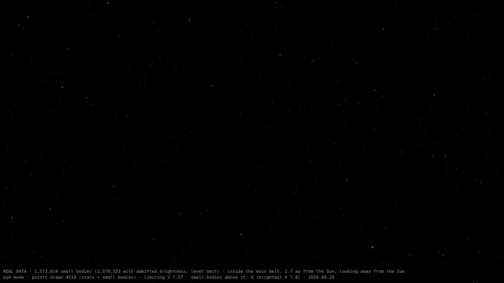
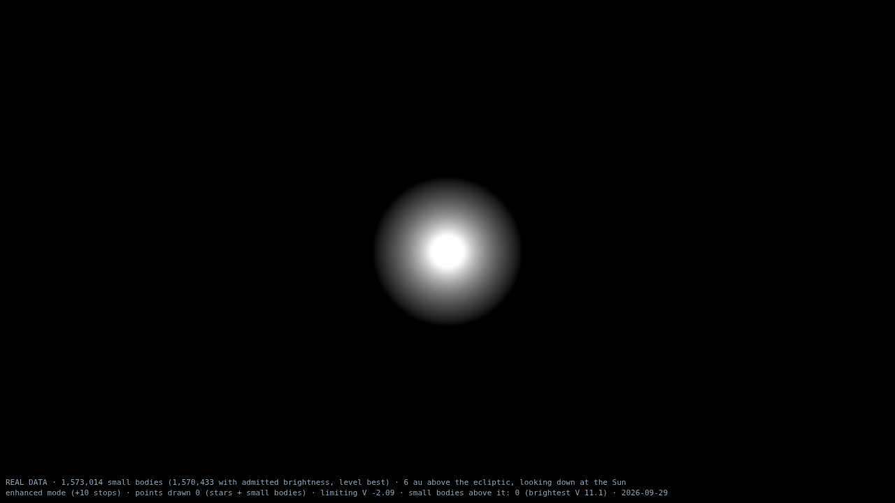
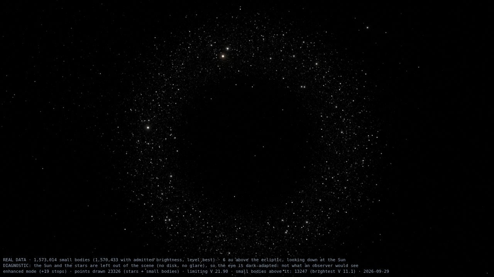
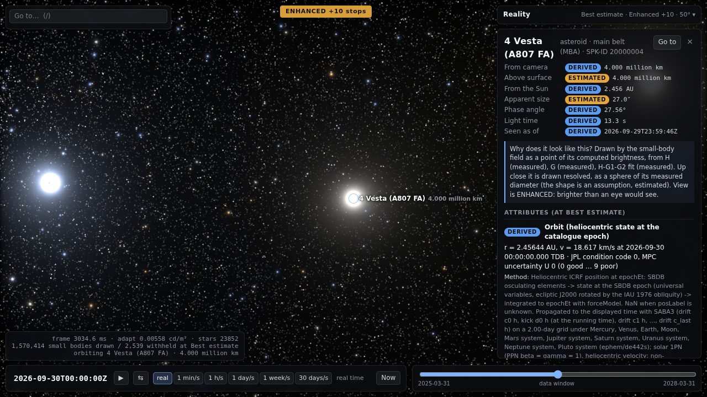

# Small bodies (M3): every catalogued asteroid and comet

Status: first full build on 2026-09-30. The stage is `smallbodies` (`pipeline/src/pipeline/stages/smallbodies.py`) and the reference propagator is `app/src/core/smallbody.ts`. The numbers below come from `uv run python -m pipeline.sb_report` after `uv run python -m pipeline build --only smallbodies`. Committed propagation references are regenerated explicitly with `uv run python -m pipeline.sb_fixtures`; ordinary rebuilds use `verification/smallbodies.json` instead. The shared product read on 7 October has 1,574,145 rows at 2026-10-04 TDB (ET 844344000), in the 2025-04-04 to 2028-04-04 window. Numerical tables and GPU timings below describe the stated earlier builds.

## 1. What was built

- **Every object in the JPL Small-Body Database:** 1,573,014 asteroids and comets as of the 2026-09-30 snapshot. Orbits are taken at full precision, with their non-gravitational models. Each object's osculating elements are turned into a state at its own epoch, then integrated to one **common epoch**: 2026-09-30 00:00 TDB (ET 843998400), the centre of the manifest window rounded to 0h TDB. The pipeline and the app use the same integrator.
- **Per-attribute provenance** for H, G, position, diameter, albedo, rotation period, colour, colour indices, taxonomy, the H-G1-G2 phase function and spin pole. Each has a label column and a source column, and the method is documented in the header. Estimated values sit in their own columns and never overwrite a measured or unknown one.
- **Verification:** 19 objects are compared with JPL Horizons over the ±548-day window, every 2 days. The 16 ordinary objects are within 7 km. Only the comets and a 21,000 km Earth flyby are worse, and they stay within their stated tolerances. A float64 TypeScript propagator reproduces the Python integrator bit for bit (difference 0.0 km).
- **On the GPU (§11):** `app/src/gpu/smallbodies/` propagates all 1.57 M objects with the same scheme in double-single WGSL and lights them as star-like point sources through the renderer's star path. Against the float64 reference over the whole window it agrees to 8 m (median) and 0.10 km (99th percentile) for 1,000 random objects. Brightness comes from H-G / H-G1-G2 / comet laws (`smallbodies/photometry.json`, stage `sbphotometry`), gated per reality level.

## 2. Products (`app/public/data/smallbodies/`)

All tables are `BinaryTableHeader` + `.bin`, little-endian, fixed stride (`app/src/data/schema.ts`: `SmallBodyCoreHeader`, `SmallBodyPhysicalHeader`, `SmallBodyNamesHeader`). Labels use `labelEncoding` = measured, derived, estimated, synthetic, unknown (u8 0–4). Source indices point into the shared `sourceTable`, and 255 means no source. Each header's `columns` block gives every column's unit, label/source columns and method.

| File | Records | Stride | Bytes |
|---|---|---|---|
| `core.bin` / `core.json` | 1,573,014 (one per object, SBDB spkid order) | 80 | 125,841,120 / 16,567 |
| `physical.bin` / `.json` | 335,431 (objects with any measured physical attribute) | 128 | 42,935,168 / 14,119 |
| `comets.bin` / `.json` | 4,077 | 28 | 114,156 / 1,808 |
| `nongrav.bin` / `.json` | 976 | 88 | 85,888 / 2,091 |
| `names.txt` / `names.json` | 1,573,014 lines | — | 46,923,755 / 555 |
| **total** | | | **215.9 MB** |

**core** (80 B): `pos` f64×3 km and `vel` f64×3 km/s are heliocentric ICRF states at `epochEt`. Add the Sun's SSB position from the ephemeris to place them. The other fields are:
- `H`, `G`, `diameterFromH` as f32.
- `physRow` u32: the record in physical.bin, or 0xFFFFFFFF if there is none.
- `flags` u16. `flagBits` maps each bit value ("1", "2", "4", ...) to its name, the same convention as the other binary catalogues: comet, numbered, neo, pha, nonGravitational, unsupportedModelTerms, preEphemerisTwoBody, positionLost, orbitFromMpc, twoBodyOrbitDetermination, oldPlanetaryEphemeris, horizonsState, mpcDisagrees, closeApproachInWindow, planetaryEphemeris.
- `orbitClass` u8: an index into `orbitClasses`, the SBDB class codes with names.
- `conditionCode` u8 (JPL) and `mpcU` u8 (MPC), on the U scale 0–9, with 255 for none.
- Labels: `posLabel`, `hLabel`, `gLabel`, `diameterFromHLabel`.
- Sources: `orbitSrc`, `hSrc`, `gSrc`, `diameterFromHSrc`.
- `colorClass` u8 (in the former padding at offset 77, so the stride is unchanged): an index into the header's `colorClasses`, the class whose mean colour is the object's **estimated** colour where it has no measured spectrum; 255 means comet. The classes are the 24 Bus-DeMeo classes of the light stage's `smallbody-class-colors.json` plus `population`. The class is the SsODNet best taxonomy class, else SMASSII, else Tholen, mapped through that product's aliases. Counts: 165,666 from SsODNet, 3 from SMASSII, 7 from Tholen, and 1,403,261 `population`.

The header also carries:
- `forceModel`: everything the propagator needs (§4).
- `classAlbedo`: the population statistic behind the estimated diameters.
- `colorClasses`: the method, `xyzsPerUnitPV` and `pVMedian` per class, and counts. The estimated colour is p_V × xyzsPerUnitPV. p_V is the measured value, else the class median, else the orbit-class median.
- `statistics`: the counts in this report.
- `epochEt`, `window` and `snapshot`.

At 80 B per object, the 5 million objects expected after two years of LSST come to 400 MB of core. This is acceptable because the orbit is the only per-object float64 state.

**physical** (128 B): `row` u32 (core row). The measured values are:
- `diameter`, `diameterSigma`, `albedo`, `albedoSigma`, `rotPeriod` (h).
- `geometricAlbedoXYZS` f32×4, in "lux at 1 AU" per docs/architecture.md §4.3.
- `BV`, `UB`, `IR`.
- From SsODNet: the H-G1-G2 phase function (`phaseH`, `phaseG1`, `phaseG2` and their sigmas, valid only over `phaseMinDeg..phaseMaxDeg`), fitted to `phaseN` observations, with filter and facility indices into `phaseFilters` and `phaseFacilities`.
- From SsODNet: the spin pole `poleRA` and `poleDec` (deg) and `spinPeriod` (h) of the preferred solution, with `spinTechnique` an index into `spinTechniques`.
- From SsODNet: the best taxonomy `taxonomyBft`, an index into `taxonomySsodnet` (`scheme|class|technique`).

Their labels and sources are in `diameterLabel/Src`, `albedoLabel/Src`, `rotLabel/Src`, `colorLabel/Src`, `colorIndexLabel/Src`, `taxonomyLabel/Src`, `phaseLabel/Src`, `spinLabel/Src` and `taxonomyBftLabel/Src`. Codes and indices:
- `rotQuality`: the LCDB U code, an index into `lcdbU`.
- `gaiaBands`: the number of Gaia bands used.
- `geometricAlbedoXYZS` of records without a Gaia spectrum: the estimated class colour. 280,980 records have it, with `colorSrc` = `smallbody-class-colors` and `colorLabel` = estimated. Adding it creates no new records.
- `taxonomyB` and `taxonomyT`: indices into the header lists (SMASSII/Bus, 35 classes; Tholen, 132 strings).

**comets** (28 B): `row`. Total-magnitude law `M1`, `K1`. Nuclear law `M2`, `K2`, `PC`. Labels `totalLabel` and `nuclearLabel`, with the SBDB as source. A brightness predicted from these laws is `estimated`: comets depart from them by 1–2 mag.

**nongrav** (88 B): `row`, then `A1 A2 A3` (km/s²), `DT` (s), `ALN`, `R0` (km), `NM`, `NN`, `NK` as f64. The propagator needs these, keyed by core row (`readNonGrav` in `app/src/core/smallbodyCatalog.ts`).

**photometry.json** (stage `sbphotometry`, after `smallbodies`): what the GPU field needs to turn magnitudes into light. It holds:
- `vSun` = −26.76 (Willmer 2018).
- `sunIrradianceXYZS1AU`, recomputed and checked equal to light.json.
- The H-G and H-G1-G2 phase-function constants, parsed from sbpy 0.6.0 (docs/sources/sbpy-0.6.0.md).
- Colour statistics.
- The label rules as text (§11.4).

**names**: line *i* describes core record *i*. The tab-separated columns are `spkid`, `designation` (the number for numbered asteroids), `name`, `prefix` (comets) and `principalProvisionalDesignation`.

## 3. Inputs and provenance

| Source id | Dataset | Used for |
|---|---|---|
| `jpl-sbdb-orbits` | SBDB query API, 32 pages × 50,000 objects, `full-prec=1` (556 MB raw) | elements, H, fitted G, comet M1/K1/M2/K2/PC, condition code |
| `jpl-sbdb-nongrav` | 1,116 `sbdb.api` answers: every object with A1/A2/A3/DT/S0, or solved against an older DE | non-grav model constants (ALN, R0, NM, NN, NK); detecting unsupported terms |
| `jpl-sbdb-physical` | SBDB, 154,477 objects with a physical field | diameter, albedo, rotation, B–V/U–B/I–R, taxonomy |
| `neowise-v2` | NEOWISE Diameters and Albedos V2.0 (PDS) | diameter/p_V where SBDB has none (fit code D/V only) |
| `lcdb-2023-10` | LCDB public summary | rotation period with reliability U |
| `gaia-dr3-sso-reflectance` | Gaia DR3, 60,518 spectra | geometricAlbedoXYZS |
| `ssodnet-ssobft` | SsODNet ssoBFT Parquet, dated 2026-09-22 (856 MB) | H-G1-G2 phase functions, spin poles, taxonomy |
| `mpc-mpcorb` | MPCORB.DAT, 2026-09-29 | MPC U, cross-check of JPL orbits |
| `jpl-horizons-sb-states` | Horizons | 4 states at the common epoch (§4.4) and the verification |
| `jpl-cneos-cad` | CNEOS close-approach API, all planets, < 0.05 au, within the window | flag `closeApproachInWindow` (3,159 objects, 4,125 approaches) |
| `smallbodies-class-albedo`, `bowell-1989` | population values (docs/sources/smallbodies-class-albedo.md) | estimated diameters, the conventional G |
| `naif-de442s`, `naif-gm-de440`, `naif-pck00011`, `tsis1-hsrs-v2`, `cie-*`, `bessell-1990-v` | shared with M1 | perturbers, GMs, radii, Earth pole; colour integration |

The raw downloads for this stage total about 1.55 GB (SBDB 560 MB, ssoBFT 817 MB, MPCORB 90 MB, LCDB 39 MB, NEOWISE 27 MB, Gaia 13 MB), and all of `data/raw` is 1.6 GB. Every file is sha256-recorded in `data/raw/_downloads.json`, and JPL is queried sequentially with pauses. The notes are in `docs/sources/`: `jpl-sbdb.md`, `neowise-v2.md`, `lcdb-2023-10.md`, `gaia-dr3-sso-reflectance.md`, `mpc-mpcorb.md`, `ssodnet-ssobft.md`, `smallbodies-class-albedo.md` and `jpl-horizons-sb-states.md`.

## 4. Propagation

### 4.1 Model (header `forceModel`)

The model is heliocentric, with the object treated as a test particle.

**Kepler drift about the Sun.** Exact, in universal variables: Stumpff c2 and c3, Laguerre–Conway iteration, and one code path for elliptic, parabolic and hyperbolic orbits.

**Kicks.** Each kick sums these accelerations:
- Mercury, Venus, Earth, Moon, and the Mars, Jupiter, Saturn, Uranus, Neptune and Pluto system barycentres, taken from DE442s: the direct term plus the indirect term Σ GM_p x_p/|x_p|³.
- Earth J2 (IERS 2010), about the IAU_EARTH pole.
- The solar 1PN term (IERS 2010 Eq. 10.12).
- The fitted non-gravitational acceleration g(r(t−DT))·(A1 r̂ + A2 t̂ + A3 n̂) (Marsden et al. 1973). Its constants come per object from SBDB, e.g. Apophis uses g = (1 au/r)².

**Elements → state.** The elements are referred to the ecliptic J2000, rotated to the ICRF with the IAU 1976 obliquity. For e < 1 the time since perihelion is M/n, with M reduced to (−π, π], otherwise it is epoch − tp. The perihelion state is then drifted by that time.

### 4.2 Scheme

The splitting is SABA3 (Laskar & Robutel 2001), with drifts c = (½ − √15/10, √15/10, √15/10, ½ − √15/10) and kicks d = (5/18, 4/9, 5/18).

Steps end on the grid `epochEt` + m·2 days. Each step of length h is split into 2^level equal substeps, and the level is set from the state at the start of the step:
- τ_sun = √(r_eff³/GM_sun), with r_eff = max(q_osc, r − |v||h|).
- For each planet p, the straight relative path over the step (planet velocity from its positions at the two ends) gives d_min. Then τ_p = min(d_min/u, √(d_min³/GM_p)).
- h ≤ min(0.3 τ_sun, η_p τ_p). η_p is 0.3, or 0.01 when that planet's pull exceeds 10⁻³ of the Sun's.
- The level is capped at 16.

**Encounter mode.** When any planet's pull exceeds 10⁻³ of the Sun's during a step, that step's substeps are classical RK4 on the full acceleration, capped at 0.01 τ_sun. The Sun-centred split converges badly once a planet dominates.

**Special handling:**
- **Pre-1850 epochs.** The 206 objects with epochs before DE442s begins (historical comets back to −146) are drifted two-body to the first grid point inside the ephemeris. Their position is labelled `estimated`.
- **Collisions.** Passing inside a planet, the Moon or the Sun gives position `unknown`. This applies to 61 objects: 21 Shoemaker-Levy 9 fragments, 27 SOHO/SMM/SOLWIND sungrazers, and 13 Earth impactors from 2008 TC3 to 2026 RW1.

### 4.3 How the scheme was chosen (measured)

**Scheme, against Horizons.** Maximum error in km over the window, with a 2-day base step:

| Scheme | Ceres | Eris | Eros | Icarus | Phaethon | Apophis | 2P/Encke | C/2025 A6 | 3I/ATLAS |
|---|---|---|---|---|---|---|---|---|---|
| SABA1 (leapfrog) | 5.21 | 1.78 | 1.08 | 2.88 | 3.32 | 0.99 | 4.03 | 1.71 | **108** |
| SABA2 | 5.47 | 0.57 | 0.82 | 1.74 | 3.49 | 0.12 | 29.2 | 0.81 | 1.55 |
| SABA3 | 5.47 | 0.57 | 0.82 | 1.74 | 3.49 | 0.12 | 29.2 | 0.81 | 1.53 |

SABA2 and SABA3 have converged onto the force model's own difference from Horizons. SABA1 has not: 3I/ATLAS is off by 108 km, and Encke's 4 km agrees with Horizons only by chance. SABA3 costs 3 kicks per step. A 4-day or 8-day base step gives the same numbers for these objects, but it breaks the 2026 RT34 flyby: the integration error is 34 km at 4 days and 3×10⁵ km at 8 days. The base step is therefore 2 days.

**Integration error alone.** Here the same forces are integrated with adaptive DOP853 (rtol 10⁻¹³, `sb_verify.reference`), sampled every 20 days over ±548 days:

| Sample | n | Max (km) | p99 | Median |
|---|---|---|---|---|
| random objects | 150 | 0.025 | 0.022 | 0.002 |
| Earth approaches < 0.05 au in the window (CNEOS) | 150 | 1.14 | 0.55 | 0.020 |
| q < 0.3 au | 60 | 0.35 | 0.19 | < 0.001 |
| comets with non-grav | 40 | 0.73 | 0.45 | < 0.001 |
| Jupiter Trojans | 20 | 0.001 | | |
| TNOs, hyperbolic | 20, 19 | < 0.001 | | |

Without encounter mode, the 21,000 km flyby of 2026 RT34 has an integration error of 143 km. With it the error is 0.01–0.14 km.

### 4.4 Horizons states at the common epoch

Four objects take their state at the common epoch from JPL Horizons instead of from integration:
- **101955 Bennu.** Farnocchia et al. 2021 thermal model (RHO, AMRAT); Horizons serves it from an SPK.
- **1P/Halley.** S0.
- **C/2013 A1 Siding Spring.** Rotating-jet terms.
- **134340 Pluto.** The SBDB object is also the force model's Pluto perturber, so it is flagged `planetaryEphemeris`. The app should draw it from the planetary ephemeris.

## 5. Verification against JPL Horizons

Each object follows the same path the stage and the app use:
1. SBDB elements give a state at the SBDB epoch.
2. That state is integrated to the common epoch.
3. From there it is integrated to every 2-day grid epoch in the window: 548 epochs, 2025-04-02 to 2028-03-30.

Horizons returns the same orbit solution in every case (orbit_id = `soln ref.`). Horizons' model differs from ours: it uses DE441 and adds 16 massive asteroids and, per ASSIST (Holman et al. 2023), which reproduces it, Earth J3/J4 and solar J2.

| Object | Class | q (au) | e | Solution | Max \|Δr\| (km) | Tolerance (km) | Max level |
|---|---|---|---|---|---|---|---|
| 1 Ceres | main belt (dwarf planet) | 2.545 | 0.080 | JPL 48 | 5.47 | 10 | 0 |
| 2 Pallas | main belt, i = 35° | 2.131 | 0.231 | JPL 74 | 2.10 | 10 | 0 |
| 4 Vesta | main belt | 2.148 | 0.090 | JPL 36 | 1.24 | 10 | 0 |
| 153 Hilda | Hilda (3:2) | 3.419 | 0.138 | JPL 87 | 2.50 | 10 | 0 |
| 624 Hektor | Jupiter Trojan | 5.149 | 0.024 | JPL 139 | 1.14 | 10 | 0 |
| 2060 Chiron | Centaur | 8.487 | 0.380 | JPL 171 | 0.85 | 10 | 0 |
| 10199 Chariklo | Centaur | 13.047 | 0.171 | JPL 61 | 0.72 | 10 | 0 |
| 136199 Eris | scattered-disc TNO | 38.163 | 0.438 | JPL 103 | 0.57 | 10 | 0 |
| 486958 Arrokoth | cold classical TNO | 42.486 | 0.036 | JPL 3 | 0.78 | 10 | 0 |
| 433 Eros | NEO (Amor) | 1.133 | 0.223 | JPL 659 | 0.82 | 10 | 0 |
| 1566 Icarus | NEO, q = 0.19 au | 0.186 | 0.827 | JPL 196 | 1.74 | 30 | 2 |
| 3200 Phaethon | NEO, q = 0.14 au | 0.140 | 0.890 | JPL 1003 | 3.49 | 30 | 2 |
| 99942 Apophis | NEO (Aten), Yarkovsky A2 | 0.746 | 0.191 | JPL 220 | 0.12 | 10 | 0 |
| 101955 Bennu | NEO, special thermal model (Horizons state at epoch) | 0.897 | 0.204 | JPL 118 | 6.98 | 10 | 0 |
| 2026 RT34 | NEO, Earth flyby at 21,000 km on 2026-09-13 | 0.618 | 0.394 | JPL 1 | 135 | 1000 | 14 |
| 2P/Encke | JFC, q = 0.34 au, non-grav | 0.340 | 0.847 | JPL K273/18 | 29.2 | 60 | 0 |
| 67P/Churyumov–Gerasimenko | JFC, non-grav, epoch 2015 | 1.243 | 0.641 | JPL K284/1 | 19.4 | 60 | 0 |
| C/2025 A6 (Lemmon) | long-period comet, non-grav | 0.530 | 0.996 | JPL 41 | 0.81 | 60 | 1 |
| 3I/ATLAS (C/2025 N1) | interstellar, e = 6.14, non-grav with DT | 1.356 | 6.141 | JPL 54 | 1.52 | 60 | 5 |

Each difference is accounted for as follows. The DOP853 reference gives the same differences to within 0.01 km, so every one of them comes from the force model, not the integrator.

- **Ceres, 5.5 km.** Vesta and Pallas are not perturbers. The research note found the same with this force model.
- **Bennu, 7.0 km.** From the Horizons state onward, it is propagated without its thermal Yarkovsky model.
- **2026 RT34, 135 km.** The flyby magnifies any difference in approach geometry by about 10⁴. Horizons models more Earth harmonics, and 16 asteroids act before the flyby. Without Earth J2 the error is 13,400 km. The orbit's own uncertainty (condition code 5) is far larger.
- **Comets.** The non-gravitational acceleration matches Horizons to about 0.3%. Changing it by 1% moves Encke by 90 km and 67P by 1,800 km. Encke's 29 km is a timing offset at the February 2027 perihelion, and it falls to 4 km afterwards. 67P is integrated from a 2015 epoch.

The 2 km to 7 km differences are far below a pixel at any viewing distance except a close fly-by. They are also far below the orbit uncertainty of most objects: U ≥ 3 means ≥ 20″/decade.

## 6. Catalogue content

| Kind | Objects |
|---|---|
| Numbered asteroids | 895,910 |
| Unnumbered asteroids | 673,027 |
| Numbered comets | 610 |
| Unnumbered comets | 3,467 |
| NEOs / PHAs | 42,743 / 2,549 |

| SBDB class | Objects | Median measured p_V (n) |
|---|---|---|
| MBA main belt | 1,387,741 | 0.081 (126,549) |
| OMB outer main belt | 50,589 | 0.060 (7,720) |
| IMB inner main belt | 33,012 | 0.469 (472) |
| MCA Mars-crosser | 30,162 | 0.144 (598) |
| APO Apollo | 24,179 | 0.128 (744) |
| TJN Jupiter Trojan | 16,394 | 0.070 (1,879) |
| AMO Amor | 14,856 | 0.129 (334) |
| TNO | 7,293 | < 20 measured → all-class 0.078 |
| ATE Aten | 3,462 | 0.205 (125) |
| CEN Centaur | 1,051 | 0.061 (56) |
| IEO Atira, AST, HYA | 38, 155, 5 | all-class 0.078 |
| comets: PAR 1,763, JFc 831, COM 733, HYP 520, HTC 111, ETc 80, CTc 22, JFC 17 | 4,077 | no diameter from H |

### Attribute coverage and labels

| Attribute | Measured | Derived | Estimated | Unknown |
|---|---|---|---|---|
| position at the common epoch | — | 1,572,747 | 206 | 61 |
| H | 1,568,436 | — | — | 4,578 (comets, 502 asteroids) |
| G | 120 | — | 1,568,315 (G = 0.15) | 4,579 |
| diameter | 139,730 | — | — | 1,433,284 |
| diameter from H (separate column) | — | 2 | 1,429,188 | 143,824 |
| geometric albedo p_V | 138,520 | — | — | 1,434,494 |
| rotation period | 32,951 | — | 1,664 (LCDB U ≤ 1+ or unrated) | 1,538,399 |
| colour (geometricAlbedoXYZS) | — | 36,081 | 18,253 (class p_V or gap) | 1,518,680 |
| B−V / U−B / I−R | 1,021 | — | — | 1,571,993 |
| taxonomy (SMASSII or Tholen, SBDB) | 2,174 | — | — | 1,570,840 |
| taxonomy (SsODNet best: Bus-DeMeo 144,588, Bus 16,988, Mahlke 9,391, Tholen 143) | 171,110 | — | — | 1,401,904 |
| phase function H-G1-G2 (V 175,637; ATLAS o/c 26,192; ZTF r/g 14,298; Gaia G 38; R 13) | 216,178 | — | — | 1,356,836 |
| spin pole (A-M 65,185; LCI 9,920; LC 3,645; others 841) | 79,591 | — | — | 1,493,423 |

**Diameter.** 139,687 diameters come from the SBDB and 43 more from NEOWISE. Of the 139,066 objects with both, 91% agree within 1% (median ratio 1.000): the SBDB value is mostly NEOWISE. NEOWISE rows whose fit code does not include D are never used as diameters.

**Rotation (LCDB).** LCDB supplies 30,907 measured periods and 1,664 estimated ones. The remaining measured periods come from the SBDB rot_per. 1,988 LCDB entries are period limits and one is U = 0; neither is used.

**Colour (Gaia DR3).** All 60,518 spectra match an SBDB object. 6,184 of them have a flagged or missing band between 418 and 770 nm, and those objects get no colour. The 374 nm band is flagged for 74% of objects. Bridging it changes XYZS by at most 0.37%, the maximum over 2,000 fully good spectra (`edgeBandEffectMax`), so it does not demote the label.

**SsODNet.** All 1,563,708 ssoBFT rows match an SBDB object. 24 phase functions fail the H-G1-G2 constraints and are not used. Among the spin poles, the amplitude-magnitude (A-M) solutions are statistical, low-precision poles; the technique is kept so a renderer can choose.

**Estimated diameters** use the class medians above. The 16th–84th percentile range, e.g. MBA 0.046–0.255, is the honest spread and implies roughly ±40–60% in D.

### Orbit quality

- **Condition code.** 1,141,450 objects have code 0. 2,967 have none, mostly comets.
- **MPC cross-check.** 1,464,556 objects appear in both MPCORB and SBDB at the 2026-06-09 epoch. At that epoch the positions from the two orbits differ by a median of 59 km for condition code 0, which is MPCORB's 5-decimal rounding. At code 2 the median difference is 1,650 km, at code 5 it is 35,000 km and at code 7 it is 380,000 km. The 59,180 objects where the gap exceeds 10⁵ km are flagged `mpcDisagrees`; they are almost all code 5–9 orbits.
- **Close approaches.** 3,159 objects have a CNEOS-listed approach within 0.05 au of a planet in the window, and they are flagged. The GPU needs encounter substeps for them.

## 7. Runtime and sizes

The full cold stage took **17 min 50 s** on 4 vCPUs shared with other jobs, before ssoBFT was added. ssoBFT adds a 32 s download and about 10 s of reading. Integrating 1.57 M objects to the common epoch took 865 s: 236 M substeps, 12% of them in encounter mode. The 100,273 objects with non-standard epochs take 63% of that time. The rest of the time breaks down as follows:

| Step | Time |
|---|---|
| parse the SBDB JSON | 31 s |
| MPCORB | 24 s |
| physical merge | 30 s |
| write | 7 s |
| Horizons verification | 10–80 s (numba JIT warm or cold) |

Propagated states are cached in `data/cache/smallbodies_states_<key>.npz`. The key covers the snapshot, objects, epoch, force model and integrator source. With the cache, a rebuild takes **2 min 40 s**.

Across the window, the scheme averages **274 substeps per object** for ±548 days, 9.7% of them RK4. On the CPU this is about 590 µs per object per direction, so ~15 min per direction for the whole catalogue on 4 cores. This is the workload the GPU takes over (§8).

Products total 215.9 MB (§2). Raw downloads for this stage come to about 1.55 GB.

## 8. Notes for the GPU implementation

- **Ground truth.** `SmallBodyPropagator.propagateOne(state, 0, epochEt, et, epochEt, nonGrav)` in `app/src/core/smallbody.ts` is the reference. It reproduces the pipeline to 0.0 km on all 19 fixtures, and `app/tests/smallbody-propagation.test.ts` checks it against Horizons. A GPU version should match it to its df64 rounding.
- **Grid.** Steps end on `epochEt + m·baseStepS`. On the grid, propagating t0 → t1 → t2 equals propagating t0 → t2, so keyframes on the grid are exact restarts.
- **Cost per substep.** SABA3 is 4 Kepler solves (usually 2–3 Laguerre iterations, with a Maclaurin Stumpff series since |z| < 1) and 3 force evaluations. A force evaluation covers 10 perturbers plus J2, 1PN and non-grav where present.
- **Shared perturber positions.** At level 0, every object on the grid kicks at the same times (t + c_cum·h), so perturber positions can be computed once per step for all objects. Only substeps and partial steps need per-object Chebyshev evaluation.
- **Divergence is rare.** In a ±548-day run of 50,000 random objects, 49,956 never leave level 0 and 15 go above level 4.
- **Precision.** WGSL has no f64. Heliocentric positions reach 10¹⁰ km, so the drift's f − 1 and ġ − 1 increments and the kicks need df64. Positions relative to the Sun keep the magnitudes moderate. Add the Sun's SSB position, from the ephemeris in df64, only for rendering.

## 9. Tests

- **Historical pytest run: 31 small-body tests** (80 in the whole suite then, all passing):
  - `test_sb_parsers.py`: MPC packed designations, SBDB pages and non-grav model_pars, NEOWISE, LCDB, Gaia, MPCORB, the ssoBFT reader's band and spin preference, and time-since-perihelion consistency.
  - `test_sb_dynamics.py`:
    - Kepler drift conservation and reversibility for all conic types.
    - Elements against the classical solution.
    - Stumpff series continuity.
    - The splitting without planets equals exact Kepler, conserving energy and angular momentum to 10⁻¹².
    - Forward/back reversibility through perihelion.
    - Integration error against DOP853 for 5 objects: Ceres 0.003, Phaethon 0.002, 2026 RT34 0.14, 3I 0.004 and Encke 0.002 km.
    - All 19 objects against Horizons within tolerance, and re-computation of the product's common-epoch states to 10⁻⁶ km.
  - `test_sb_physical.py`: label rules for SBDB/NEOWISE precedence and fit codes, inverse-variance combination, estimated diameters (never for comets or where measured), LCDB U codes and limits, Gaia derived versus estimated, and ssoBFT phase-function constraints, spins and taxonomy.
  - `test_sb_table.py`: layout alignment, float64 round-trip, and consistency of the built products: NaN ⇔ unknown, sources exist, physRow back-links, no measured diameter alongside diameterFromH, names line count, and SABA coefficients summing to 1.
- **pytest `test_sb_photometry.py`** (5): class-colour assignment order and aliases, filling of physical records (measured p_V, class median, orbit-class median), the sbpy constants and the spline construction (nodes, end slopes, clipping), and the built products.
- **vitest, GPU field and photometry** (§11.8): `smallbody-photometry.test.ts` (6) and `smallbody-gpu-table.test.ts` (3). The GPU itself is tested on the device with `node scripts/sb-gpu.mjs` (§11.3).
- **Historical vitest run: 16 small-body tests** (130 in the whole suite at M3; 340 at the later report update, all passing then):
  - `smallbody-kepler.test.ts`: Stumpff, conservation, reversibility, period closure, elements, obliquity rotation and the step grid.
  - `smallbody-catalog.test.ts`: core, non-grav and names readers, labels and flags.
  - `smallbody-propagation.test.ts`: elementsToState against Python to 10⁻¹⁴; propagation against Python (0.0 km) and against Horizons within tolerance; committed orbit solutions use their own epochs, while the built core is checked against its build record.

## 10. Open issues

1. **Asteroid perturbers.** The 16 massive asteroids are not perturbers (sb441-n16.bsp, 616 MB). This costs about 5 km for Ceres-like cases and more for objects that approach Ceres or Vesta.
2. **Deep Earth encounters.** Earth J3/J4 and solar J2 are missing. After a deep flyby positions carry tens to hundreds of km of model difference (2026 RT34: 135 km). 3,159 objects are flagged `closeApproachInWindow`. Close approachers could use Horizons SPKs, as the research note suggests.
3. **Comet non-gravitational models.** They match Horizons to ~0.3%, giving ≤ 30 km in the verification. Comets with only old orbits (e.g. 67P's 2015 epoch) accumulate more, although their true uncertainty is much larger.
4. **Special models.** Bennu, Halley and Siding Spring start from Horizons states but are propagated without their special terms (Bennu: 7 km over the window).
5. **Orbit uncertainty.** Only U and the condition code are carried. There are no covariances or sigma columns, and no per-object uncertainty ellipsoid yet.
6. **Physical data not yet ingested:**
   - The rest of SsODNet ssoBFT: diameters, albedos, masses, densities and colours with their errors. SsODNet's phase-curve H and G1/G2 are stored, but `core.H` and `core.G` remain the SBDB H-G values (G is `measured` for only 120 objects).
   - (Done since: the `shapes` stage ingests DAMIT meshes and poles; the app loads them for resolved close-ups.)
   - SDSS MOC colours.
   - The TNO/Centaur albedo compilation. TNOs currently fall back to the all-class median p_V 0.078, which is poor for TNOs.
   - (Done since: class-mean colours for objects without Gaia spectra, from the light stage's `smallbody-class-colors.json`; see §2 `colorClass`.)
7. **Stale or restricted sources.** The LCDB public release dates from 2023-10. The Gaia DR3 SSO licence is CC BY-NC.
8. **Sampling bias.** The class-albedo statistic uses the currently measured sample, which is biased (§3).
9. **Rebuild cost.** A full rebuild takes 18 minutes, dominated by the 100k objects with non-standard epochs. Sharing perturber positions per grid step (§8) would speed it up, and so would taking JPL's standard-epoch elements where they exist.
10. **Loader.** (Done since: the app loads the products in the background, `app/src/data/smallbodies.ts`, including `photometry.json` for the GPU field.)
11. GPU field issues: see §11.9.

## 11. GPU field (`app/src/gpu/smallbodies/`)

The catalogue is propagated and lit on the GPU every frame and drawn as point sources through the renderer's star path. The numbers below come from `node scripts/sb-gpu.mjs` (app/), which runs `sb-test.html` in headless Chromium on SwiftShader WebGPU. The full accuracy result is in `docs/reports/smallbodies-gpu-accuracy.json`.

### 11.1 API (as the app's port, `app/src/app/ports.ts`)

`SmallBodyField.create(device, tables, planets, options?)` → `update(encoder, et, cameraSSB, { brightness })`, `pointSources`, `pick(dirICRF, tolRad)`, `stateOf(index, et)`, `stats`, `exclude(indices)`.

Differences from the spec as first given:
- `tables.photometry` is new and optional. It is `smallbodies/photometry.json`; without it no brightness is known and every record is dark. The app's loader (`data/smallbodies.ts`) loads it, and `bootstrap.ts` passes it on. This is the one change to the port (`SmallBodyTablesInput`).
- `options` (4th argument) is optional: checkpoint budget, background-builder steps per update, objects per dispatch, and a debug state buffer.
- `stateOf` returns the **heliocentric** state, as the port requires; the app adds the Sun.
- `stats` returns `{drawn, withheld}` from GPU counters: objects with a position whose brightness is admitted, or not, at the level. The readback is asynchronous, so the values are one or two updates old.
- `exclude(rows)` replaces the set of objects the shell draws itself. They get no light but keep their direction, so `pick` still finds them.
- Objects flagged `planetaryEphemeris` (Pluto) or `positionLost`, or with an unknown position, are neither propagated nor drawn. `stateOf` gives Pluto from the planetary ephemeris (999, else barycentre 9).
- Contract: submit the encoder of one `update()` before calling the next. Uniforms are written with `queue.writeBuffer`, and buffers are retired one update later.

Test hooks, not in the port: `info` (precision mode, self-test, checkpoint spacing, last update's steps and timings), `slotOf`, `readDebugStates` (needs `{debug: true}`), `readRecords` and `destroy`.

### 11.2 Propagation design

- **Same scheme as the float64 reference.** SABA3 Kepler drift plus kicks, the step grid `epochEt + m·2 d`, 2^level substeps chosen from the state at the step start (same rule), and RK4 substeps in encounter mode. All constants are generated into the WGSL from the header's `forceModel` as exact float32 or double-single literals (`wgslConst.ts`); no numeric constant is written by hand.
- **Working state W.** It holds every object at one grid point m_W. For time et the target is m\*, the grid point between the epoch and et that is nearest et.
  - W is advanced step by step to m\* when et moves away from the epoch. This is the incremental path used when time runs.
  - Otherwise W is first restored, by a GPU buffer copy, from the checkpoint nearest m\* on the epoch side.
  - The last partial step m\* → et is taken in the shade kernel every frame and not stored.
  - So the state at et is the one the CPU computes with `propagateOne(epochEt → et)`: the same steps and the same levels.
- **Checkpoints.** States are kept at every C-th grid point. C is sized so that all checkpoints fit the budget: the default 1 GiB gives 13 slots and C = 46 steps (92 days) for the full catalogue; 2 GiB gives C = 22. They are stored when W passes them, or by a background builder. The builder walks out from the epoch, forward then backward, 2 steps per update when the update itself took fewer, and frees its buffer when done. A jump therefore integrates fewer than C steps.
- **Perturbers.** For each 2-day grid interval, 65 samples (45 min apart) of every perturber's heliocentric position come from the float64 ephemeris (`planetTable.ts`). They are stored in double-single with the indirect acceleration, filled lazily per interval (0.1–1 ms each), and uploaded with `writeBuffer`.
  - Kicks interpolate with 4-point Lagrange polynomials, on the differences between samples added to the nearest sample's double-single position, so float32 holds them to ~0.008 km.
  - Measured interpolation error against the ephemeris, emulating the kernel's float32 arithmetic (`smallbody-gpu-table.test.ts`): **≤ 0.018 km** (Venus), 0.010 km for the Moon.
- **Ordering.** Objects are stored by perihelion distance. Objects that need substeps (near-Sun, NEAs) then share workgroups instead of stalling main-belt ones. Records carry the core index in slot 7.
- **Arithmetic** (`kernels.ts` header comment):
  - The state is double-single.
  - The drift solves the universal Kepler equation in float32, then takes one Newton step with r0·G1 + η·G2 − dt in double-single.
  - The Lagrange coefficients are all double-single, sharing one division k = μ/(r·r0): f−1 = −k·r·G2, g = dt − μG3, ḟ = −k·G1, ġ−1 = −k·r0·G2.
  - Stumpff c2 and c3 are carried as ½ + tail and 1/6 + tail. β = 2μ/r0 − v² is formed in double-single because it cancels up to ×18 near perihelion.
  - Kicks are float32 accelerations from double-single differences planet − object.
  - RK4 stage positions are double-single, and the Sun's acceleration is summed over the stages in double-single.
- **Exactness guard.** The error-free transformations (two_sum, Dekker split/two_prod) pass intermediates through an XOR with a runtime zero from a uniform, so no compiler can fuse or re-associate them. A device self-test at create compares two_prod and two_sum bit for bit, and dd_mul, add, div and sqrt to 2⁻⁴³, with float64 on 4,096 random pairs. It picks `fma()` for two_prod when fma is verified exact (`precision: 'df64-fma'`), else Dekker (`'df64-dekker'`), else reports `'degraded'`. On SwiftShader fma is not fused, so Dekker is used; the self-test's max relative error was 1.8e-14.

### 11.3 Accuracy against the float64 reference

The setup: 19 verification objects plus 1,000 random objects with known positions. The GPU is updated to 12 times in an order that exercises incremental steps, checkpoint restores and the background builder: +0.37, +30.2, +200.6, +120.1 (jump back), +547.9, −0.71, −60.4, −274.3, −150.9, −547.2, +3.5 and +365.25 days. The GPU's double-single state at et is compared with `propagateOne(epochEt → et)` in float64.

| | max \|Δr\| over the window |
|---|---|
| 1,000 random objects | median **0.008 km**, p90 0.064 km, p99 **0.10 km**, max 1.54 km (an Apollo with an in-window close approach) |
| main belt, Trojans, Hildas, Centaurs, TNOs (Ceres … Arrokoth) | 0.001–0.033 km |
| Eros, Apophis, Bennu, Encke, 67P, C/2025 A6 | 0.004–0.027 km |
| 3I/ATLAS (hyperbolic, non-grav with DT) | 0.086 km |
| 1566 Icarus (q 0.19 au) | 0.13 km |
| 2026 RT34 (21,000 km Earth flyby) | 0.52 km |
| 3200 Phaethon (q 0.14 au), at −547 d | 1.60 km |

Other results:
- By time, the p99 grows from 0.01 km at ±200 d to 0.08–0.11 km at ±548 d.
- At 1 au, 0.1 km is 0.14 mas and 1.6 km is 2 mas.
- For the selected object, `stateOf` is the float64 reference itself.

Unit checks on the device (`mode=unit`, 4,000 random catalogue states):
- One Kepler drift of c·H against float64: the relative error of the velocity increment is ≤ 2.4e-10, and positions agree to ≤ 0.4 m for a whole 2-day drift.
- One kick acceleration: ≤ 1.2e-15 km/s² absolute.

How the precision was reached, measured on the same test:
- Float32 (f−1)x and (ġ−1)v terms and c2 rounded to float32 gave 2.4e-9 relative. Fixed as above.
- RK4 with a float32 Sun term gave 9 km for main-belt objects: Jupiter's pull exceeds 10⁻³ of the Sun's for many of them, so they are in encounter mode. Fixed with double-single.
- β in float32 gave Icarus 1.35 km. Fixed with double-single β.

Records (direction and light):
- The float32 direction agrees with float64 geometry from the same state to 1.3e-7 rad.
- The GPU illuminance agrees with the TypeScript photometry (`SmallBodyLight.apparent`) to 0.0008 mag, from half-float parameters.
- `pick` agrees with a CPU scan of the records 40/40, for cones from 1e-5 to 0.2 rad.

### 11.4 Light: magnitude laws, colours and labels (`core/smallbodyPhotometry.ts`, `smallbodies/photometry.json`)

**Magnitude, per object:**
- **H-G1-G2** (Muinonen et al. 2010) where SsODNet has a **V-band** fit, with its own H: 175,637 objects. Fits in other bands (ATLAS o/c, ZTF g/r, Gaia G; 40,541 objects) are not used, because their H is not a V magnitude.
- Else **H-G** (Bowell et al. 1989, Eq. A4) with the SBDB H and G.
- Comets: the total law M1 + 5 log Δ + K1 log r, else the nuclear law with PC·α.
- The phase-function constants come from sbpy 0.6.0 (parsed, sha256-checked).

**Illuminance:** E_k = E☉,k(1 au) · c_k · 10^(−0.4(m − V☉)), with V☉ = −26.76 (Willmer 2018) and E☉ the Sun's XYZS from light.json.

**Colour c, relative to sunlight:**
- The object's Gaia DR3 colour: c = geometricAlbedoXYZS / (p_V E☉), in which p_V cancels.
- Else the class colour of `core.colorClass`: c = xyzsPerUnitPV / E☉, from smallbody-class-colors.json.
- Comets use c = 1 (the Sun's colour), label estimated.

**Light time:** first order. The position is back-dated by τ = Δ/c along the SSB velocity; the residual is ~a·τ²/2, a few km at 5 au.

**Label rules**, with the level passed in `allowed.brightness` (text also in `photometry.json` `rules`):

| level | drawn if | colour |
|---|---|---|
| strict | position and brightness measured or derived. Brightness = worst of H and phase function at the current phase angle: a V-band H-G1-G2 fit counts only inside its fitted phase range (outside it is extrapolated, hence estimated), and SBDB G only where fitted (120 objects). Comets are never drawn (their laws are estimates). | The Gaia colour where its spectral shape is derived (37,811 objects). Otherwise **brightness only**: the measured V drawn with the Sun's colour (c = 1), which is neutral rather than a plausible asteroid colour. The Y error of that rule is the object's c_Y, which lies in 0.992–1.022 for 98% of the Gaia sample (0.975–1.036 overall). |
| best | adds estimated inputs: G = 0.15, H-G1-G2 outside its range, estimated positions (pre-1850 epochs), comet laws | Gaia colour (derived or estimated), else the class colour (estimated) |
| complete | as best, plus the built synthetic layer (§12) | as best |

At the epoch, seen from 6 au above the Sun, 107,728 objects are admitted at strict and 1,570,433 at best.

**Against JPL Horizons APmag** (`smallbody-photometry.test.ts`; 6 asteroids × 3 dates at Horizons' geometry, with our catalogue H and G, which equal Horizons'):
- |ΔV| ≤ 0.020 mag, and ≤ 0.005 mag beyond 15° phase. The residual is the difference between the IAU law and the exponential approximation Horizons evaluates.
- The H-G1-G2 path differs from APmag by up to 0.32 mag (433 Eros at 28°). That is the V-band fit's own H against the SBDB H-G H, whose systematic offsets are known (Pravec et al. 2012).

### 11.5 Timing and memory

All 1,573,014 objects on SwiftShader (headless Chromium, 4 vCPUs shared with other jobs), in chunks of 131,072 objects per dispatch:

| | time |
|---|---|
| create (CPU: read, sort by q, pack light parameters, self-test) | 3.2 s |
| shade only (et on the grid; first call 5.9 s with shader compilation) | 1.6 s |
| shade with a 0.5-day display step | 7.0 s |
| one 2-day grid step | 13.8 s (mean of 2) |

**Desktop estimate.** From an operation count of the WGSL: ~11.5 k float32 operations per object per level-0 SABA3 step (4 drifts ≈ 2 k each, 3 kicks ≈ 650, level selection ≈ 1.4 k), or ~8.6 k where fma is exact. That is ~18 G operations per step for the catalogue:
- A discrete GPU sustaining 5–10 T op/s on this code (20–40 TFLOPS peak): **2–4 ms per step**.
- An integrated GPU (0.5–1 T op/s): 20–35 ms.
- A frame with time running costs about one step: the display step, plus ~10% for shading.
- A jump costs fewer than C steps: C = 46 with the 1 GiB default, so ≤ 0.2 s on a discrete GPU.
- SwiftShader here reaches ~1.3 G op/s.

**Memory (full catalogue):**
- 48 B/object per state set (75.5 MB): W, the epoch states, each checkpoint, and the builder while it runs.
- Point records: 50 MB. Light parameters: 50 MB. Propagation info: 6 MB.
- Perturber table: 13.7 MB for the whole window. Debug states, only with `{debug: true}`: 100 MB.

### 11.6 Renderer hook

- **`app/src/render/extraPoints.ts`.** It holds the extra-source cull dispatch: its own info uniform, and a bind group on the renderer's existing cull pipeline.
- **`app/src/render/renderer.ts`**, at the original field integration:
  - an import;
  - a field `extraPts`;
  - `get gpuDevice()`;
  - `setExtraPointSources(src | null)`, which also re-sizes the `visible` buffer to stars + extras (cap 2²²);
  - `setStars` sizing `visible` for stars + extras;
  - the cull and point-draw conditions `starCount > 0 || extras`;
  - one call in the cull pass (`this.extraPts?.cull(...)`).
- The records go through the same Crumey-threshold cull and point splats as stars. Points are drawn at infinite depth, so a resolved body hides them even when they are in front of it.

### 11.7 Real-data renders (SwiftShader, 2026-09-29/30)

**Inside the main belt, eye mode** (2.7 au from the Sun, looking away from it). Only stars are drawn. The brightest small body is V 7.8 and the eye's limit is 7.6, so **no small body is above the threshold**: the belt looks empty, as it should.

**From 6 au above the Sun, enhanced +10 stops.** The Sun, 40–50° from every part of the belt, sets the adaptation (limiting V −2.1). Nothing else is drawn. The same holds from 3 au, where the belt lies within 48° of the Sun: boosting further whites the frame out with the Sun's veil.

**DIAGNOSTIC, same view, Sun and stars left out of the scene** (dark-adapted eye, +19 stops, limiting V 21.9). 23,326 small bodies are drawn and the main belt ring stands out. At strict (`img/smallbodies-belt-above-diagnostic-strict.png`) 107,728 objects are admitted and 4,048 drawn.

**The app, with the field wired in** (`node scripts/shot.mjs --url "/?t=2026-09-30T00:00:00Z&target=20000004&dist=4000000&view=enhanced&boost=10"`). 4 Vesta is selected, 4 million km away, and drawn by the field. The HUD counts come from the field's GPU counters: 1,570,414 drawn and 2,539 withheld at Best estimate. The frame takes 3.0 s on SwiftShader.

### 11.8 Tests and how to run

- **vitest `smallbody-photometry.test.ts`:**
  - Phase functions against sbpy's definitions (1e-16).
  - Magnitude → illuminance.
  - Half-float packing.
  - Horizons APmag (≤ 0.025 mag).
  - Label rules on the built catalogue.
- **vitest `smallbody-gpu-table.test.ts`:** double-single literals, and the perturber table interpolated as the kernel does it (≤ 0.02 km).
- **On the device** (from `app/`), `node scripts/sb-gpu.mjs --query "<q>" [--json out.json] [--out shot.png]`:
  - `mode=accuracy&n=1000`: GPU against float64 as in §11.3, plus records, pick, exclude and stats.
  - `mode=unit`: drift and kick against float64.
  - `mode=timing&chunk=131072`.
  - `mode=render&scene=inside|above|above-off&hau=6&boost=19&nosun=1&nostars=1&level=strict`.

### 11.9 Open issues (GPU field)

1. **Renderer, wide field.** With fovY ≳ 100° the renderer's image is black, stars included (seen at 110°; 60° is fine). This is in the renderer, not the field.
2. **Enhanced mode near the Sun.** The exposure boost also amplifies the Sun's glare veil, so the belt cannot be shown from above with the Sun in the scene. Showing it would need a glare-free enhanced option, which is a decision for the eye model.
3. **Per-frame cost.** The display step costs about one grid step per frame. Possible savings:
   - exact perturber positions uploaded per level-0 step, skipping interpolation;
   - reusing the display step while et changes by less than a threshold;
   - fma, which is used automatically where the self-test verifies it.
4. **Deep encounters and near-Sun objects.** The planetary acceleration is float32 and the table's positions carry up to 0.018 km. After a flyby within ~10⁵ km the GPU drifts from the CPU by up to ~1.5 km (the 2026 RT34 fixture flies by at 21,000 km). Phaethon reaches 1.6 km at the far window edge.
5. **Deep substep levels run serially in one thread.** Level 16 means 65,536 RK4 substeps. A grazing encounter inside a step can hitch a frame.
6. **Other limitations:**
   - Unresolved field comets use the Sun's colour; the shell now draws admitted nearby/notable comets with a coma and tails (comets.md).
   - Non-V-band H-G1-G2 fits are unused.
   - The checkpoint budget (default 1 GiB) should be tuned per device.

## 12. The synthetic layer (M6)

The field also draws the synthetic objects of `synthetic/objects` (pipeline stage `synthetic`), at the Complete level only. Their records follow the catalogue's in the same buffer (index = catalogue count + j). Heliocentric draws move on fixed Kepler ellipses: mean anomaly in double-single, the rest float32, with accurate sin/cos. Irregular moons instead use two host-barycentric instances of the catalogue kernel, with the Sun and external catalogue perturbers; [model, numerical budgets and device checks](synthetic-moon-kernel.md). They agree with float64 positions of the same two-body law to 1e-7 of the distance (p50); that arithmetic check does not bound missing-force propagation drift. [Audit C3](synthetic-limitations.md#sampled-propagation-drift-c3) supplies historical representative discrepancies while individual position budgets remain unknown. Completeness is a fitted count proxy and discovery yield is aggregate, with a separate CFEPS discovery veto for TNOs and no orbit-specific survey veto for the other populations; no discovery has one-to-one replacement. Algorithm, verification and screenshots: docs/reports/synthetic-populations.md.

Resolved catalogue close-ups remain luminous at narrow fields: the point/disk switch
uses the eye's optical splat footprint, and resolved disks keep their retinal
luminance without a Ricco brightness weight. The acuity filter uses the visible
light-weighted adaptation over the fovea's 1° field, so a small bright disk is not
blurred as a dark empty field (eye/acuity.ts; render/frame.ts). The canonical
Ganymede and Pluto narrow-field scenes test this; their GPU appearance is recorded
by the scene baseline, not by the historical small-body renders above.
