# Surface maps: review report

Generated 2026-09-30 (commit 94a6808) by `cd pipeline && uv run python -m pipeline.surf_report`, from the layer headers and tiles in `app/public/data/surfaces/`. Numbers are computed; prose is hand-written in `pipeline/src/pipeline/surf_report.py`. Contract: docs/architecture.md §4.4; header type `SurfaceLayerHeader` in app/src/data/schema.ts.

## What the tiles contain

- **albedo** (float16 X, Y, Z, S): local normal reflectance relative to the body's disk average, per channel. The disk average — cos²(latitude)-weighted, i.e. projected area at zero phase for an equatorial observer, averaged over rotation — is 1 in every channel (checked per level by `tests/test_surf_products.py`). The renderer multiplies by `geometricAlbedoXYZS` from photometry.json and rescales so the disk integral keeps p and Φ(α). Unknown texels are exactly 0 in all channels; wholly unknown tiles are not stored and are listed in `missingTiles`.
- **height** (float32, metres above the pck00011 reference ellipsoid named in the header; NaN = unknown).
- **hapke** (Moon only; float16 × 35: w, b, c, B_S0, h_s per LROC band; constants and the model in the header).
- Every header has per-region provenance (`coverage.regions`), a brightness and a colour label, sources, the observation epoch and the normalization constants.

## Summary

| body | layer | sources | levels (top: texels, km/texel at equator) | coverage: area / disk weight | brightness | colour | epoch | MiB |
|---|---|---|---|---|---|---|---|---|
| Mercury (199) | albedo | mdis-mdr-8color-v4, payne-2026-mercury… | 0–4 (8192×4096, 1.87 km) | 0.996 / 0.999 | measured | estimated | 2011-03-29/2015-04-30 | 341.0 |
| Mercury (199) | height | usgs-mercury-dem-665m-v2, naif-pck00011 | 0–3 (4096×2048, 3.74 km) | 1.000 / 1.000 | measured | – | 2011-03/2015-04 | 42.5 |
| Moon (301) | albedo | lroc-wac-hapke-7band, lroc-wac-hapke-parameters… | 0–5 (16384×8192, 0.67 km) | 0.993 / 0.999 | derived/estimated | estimated | 2010-01-21/2013-05-01 | 1365.0 |
| Moon (301) | hapke | lroc-wac-hapke-parameters | 0–0 (512×256, 21.32 km) | 0.942 / 0.983 | measured | – | 2010-02/2011-10 | 8.8 |
| Moon (301) | height | lola-ldem-64 | 0–4 (8192×4096, 1.33 km) | 1.000 / 1.000 | measured | – | 2009-07-13/2016-11-29 | 170.5 |
| Mars (499) | albedo | hrsc-global-colour-mosaic, mallama-2017… | 0–4 (8192×4096, 2.60 km) | 1.000 / 1.000 | measured | estimated | Mars Express high-altitude campaign (2004 onwards; images selected for low dust) | 341.0 |
| Mars (499) | height | mola-megdr-32ppd, naif-pck00011 | 0–4 (8192×4096, 2.60 km) | 1.000 / 1.000 | measured | – | 1997-09/2001-06 (MGS mapping) | 170.5 |
| Io (501) | albedo | usgs-io-galileo-voyager-1km | 0–3 (4096×2048, 2.81 km) | 1.000 / 1.000 | estimated | estimated | Voyager 1979; Galileo 1996-2001 | 85.0 |
| Europa (502) | albedo | usgs-europa-voyager-galileo-500m | 0–3 (4096×2048, 2.40 km) | 0.995 / 0.999 | estimated | estimated | Voyager 1979; Galileo 1996-2003 | 85.0 |
| Ganymede (503) | albedo | usgs-ganymede-voyager-galileo-1km | 0–3 (4096×2048, 4.04 km) | 0.996 / 0.999 | estimated | estimated | Voyager 1979; Galileo 1996-2000 | 85.0 |
| Callisto (504) | albedo | usgs-callisto-voyager-galileo-1km | 0–3 (4096×2048, 3.70 km) | 0.991 / 0.998 | estimated | estimated | Voyager 1979; Galileo 1996-2001 | 85.0 |
| Jupiter (599) | albedo | opal-jupiter-2025b, karkoschka-1998-pds… | 0–3 (4096×2048, 109.67 km) | 0.941 / 0.983 | measured | estimated | 2025-12-11 → 2025-12-12 | 85.0 |
| Saturn (699) | albedo | opal-saturn-2025b, karkoschka-1998-pds… | 0–2 (2048×1024, 184.90 km) | 0.910 / 0.950 | measured | estimated | 2025-08-29 → 2025-08-29 | 21.0 |
| Uranus (799) | albedo | opal-uranus-2025b, karkoschka-1998-pds… | 0–1 (1024×512, 156.83 km) | 0.509 / 0.512 | measured | estimated | 2025-10-24 → 2025-10-24 | 5.0 |
| Neptune (899) | albedo | opal-neptune-2025c, karkoschka-1998-pds… | 0–1 (1024×512, 151.95 km) | 0.896 / 0.945 | measured | estimated | 2025-08-24 → 2025-08-25 | 5.0 |
| Charon (901) | albedo | usgs-charon-newhorizons-300m | 0–2 (2048×1024, 1.86 km) | 0.740 / 0.792 | estimated | estimated | 2015-07 (New Horizons flyby, 2015-07-14) | 17.0 |
| Pluto (999) | albedo | usgs-pluto-newhorizons-300m | 0–3 (4096×2048, 1.82 km) | 0.769 / 0.824 | estimated | estimated | 2015-07 (New Horizons flyby, 2015-07-14) | 65.0 |

**Product size:** 2977 MiB of tiles (3.12 GB) + 0.7 MiB of headers and tile listings. **Raw downloads kept** in data/raw/surfaces: 2.90 GB (the LROC mosaics — 8.2 GB Hapke + 4.9 GB polar — and the 4.3 GB of Mercury band ranges are reduced and deleted right after download; their sha256 stays in the ledger). **Stage time** per module (last full run: moon 512 s, giants 14 s, mars 46 s, mercury 34 s, pan 45 s; the Moon and Mercury from their cached reductions). A cold build downloads ~20 GB and took 1096 s for the Moon (13 GB of LROC mosaics), 431 s for Mercury (4.3 GB of band ranges + the DEM), 106 s for Mars and 35 s for the giant planets on this machine (~20-40 MB/s).

## Colour: when is it `derived`?

Band ratios are interpolated linearly between band centres and held flat outside, then multiplied by the body's measured disk spectrum and integrated per CIE observer (surf_color.py). This keeps the disk colour exactly the measured one and takes only relative variation from the map. The interpolation is an assumption. Criterion for `derived`: the bands must bracket ≥ 99 % of every channel's sunlight-weighted observer integrand and be no further apart than half the narrowest observer-function FWHM (27 nm, from the CIE tables) inside the range that holds the central 98 % of the integrands — sampling at the Nyquist rate of the eye's own spectral resolution. No mission map meets it, so every map colour here is `estimated`; the spread between linear and monotone-cubic interpolation over 4000 random texels shows how much it matters.

| body | band centres (nm) | widest gap (nm) | integrand below first / above last band (%, worst channel) | lin-vs-cubic p99 |Δ| X/Y/Z/S (%) | colour |
|---|---|---|---|---|---|
| Mercury | 430, 480, 560, 630, 750, 830 | 120 | 11.4 / 0.0 | 0.2 / 0.3 / 1.1 / 0.5 | estimated |
| Moon | 321, 360, 415, 566, 604, 643, 689 | 151 | 0.0 / 0.3 | 0.2 / 0.4 / 1.0 / 0.8 | estimated |
| Mars | 440, 530, 675, 750 | 145 | 21.5 / 0.0 | 5.5 / 4.7 / 2.8 / 4.8 | estimated |
| Jupiter | 395, 467, 502, 631, 658 | 129 | 0.1 / 2.3 | 1.3 / 1.3 / 1.7 / 0.5 | estimated |
| Saturn | 395, 467, 502, 631, 763 | 132 | 0.1 / 0.0 | 1.8 / 1.0 / 7.2 / 1.3 | estimated |
| Uranus | 467, 547, 657, 763 | 110 | 70.7 / 0.0 | 0.3 / 0.8 / 0.3 / 0.9 | estimated |
| Neptune | 467, 547, 657 | 110 | 72.0 / 1.1 | 3.0 / 2.9 / 0.3 / 1.4 | estimated |

## Per body

### Moon

**Source.** LROC WAC Hapke-normalized 7-band mosaic (Sato et al. 2017) for 70°S–70°N; LROC WAC empirically normalized polar mosaics (Boyd et al. 2012) poleward, tied to the Hapke product per band in the 62–69.5° ring; LOLA LDEM_64 for height; the LROC per-cell Hapke parameter maps (Sato et al. 2014) exported as the `hapke` layer. Notes: `docs/sources/lroc-wac-hapke-7band.md`, `lroc-wac-hapke-parameters.md`, `lroc-wac-emp-polar.md`, `lola-ldem-64.md`.

**What a texel is.** Normal albedo *without* the shadow-hiding opposition surge, relative to its disk mean, per band, then XYZS. The WAC product is I/F at i = g = 60°, e = 0; we multiply by RADF(0,0,0; B_S0 = 0)/RADF(60,0,60) from the same published per-1°-cell Hapke model that produced the normalization. The surge is left out because the disk albedo the renderer multiplies by (Lane & Irvine 1973) also leaves it out, and because h_s sits at a fit bound (0 or 0.2) in hundreds of cells; keeping it would change texels by the amounts in `diagnostics.surgeSensitivity`. The disk-mean normal albedo in each band (header `normalization.bandNormalAlbedoDiskMean`, 0.074 at 566 nm) is lower than Lane & Irvine's p ≈ 0.12 because their linear extrapolation from 6° keeps part of the broad Hapke surge; only the ratios are used.

**689–830 nm.** The bands end at 689 nm. Beyond it the band ratio is held at its 689 nm value. That range carries 0.32 % of X, 0.12 % of Y and nothing of Z and S in the Moon's sunlight-weighted integrand, so even a ±10 % error in the red ratio moves X by < 0.04 %. It does not change the label: the colour is already `estimated` because of the 151 nm gap between 415 and 566 nm (criterion below).

**Poles.** The Hapke product stops at 70°. The WAC_GLOBAL morphology mosaic is a shaded image, not albedo, and is not used. The polar EMP tiles give 7-band normalized reflectance to the poles where the Sun ever lit the ground; per-band scale factors to the Hapke-derived albedo are 0.97–1.07 (header `diagnostics.polarScale`), with an interquartile spread of ~6 % and a trend of ≤ 1 % across the ring. Their coverage falls from > 98 % at 70° to ~30–40 % above 85° (permanently shadowed floors); those texels are unknown.

**Known issues.** 1° Hapke cells are interpolated bilinearly; the conversion factor varies 3–5 % rms, so any error in a cell's parameters shows up as a soft 1° pattern of that size. The polar caps are `estimated`. The LROC/LOLA frame is DE421 mean-Earth; the app's IAU_MOON differs by ~0.1–0.2 km, below one level-5 texel.

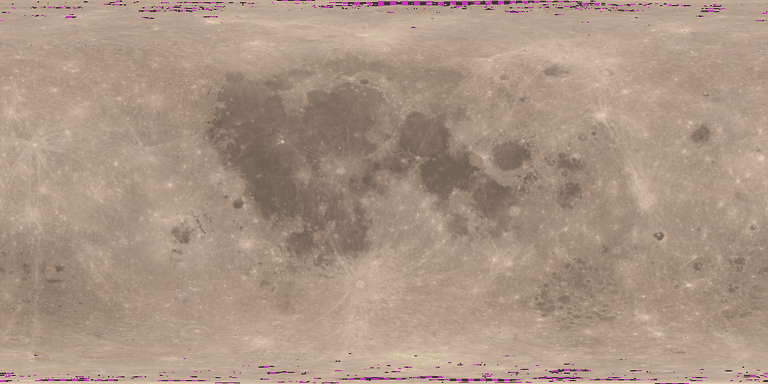
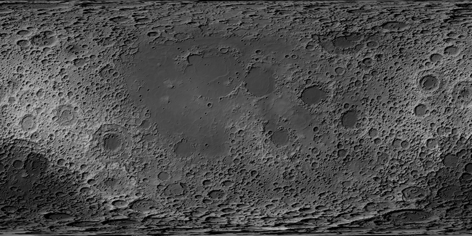

### Jupiter

**Source.** Hubble OPAL global maps (Simon et al. 2015; MAST HLSP doi:10.17909/T9G593, CC BY 4.0), cycle 32, second rotation of 2025 December 11–12. Continuum filters F395N, F467M, F502N, F631N, F658N; F275W and F343N are below 360 nm, FQ889N is a methane band. The OPAL team removed limb darkening with a Minnaert law per filter (k and the I/F scale are parsed from the cycle README).

**Geometry.** 3600 × 1800 cell-registered maps, System III west longitude with 0° W at the left edge decreasing to the right (east longitude increasing to the right), planetographic latitude on the 71492 × 66854 km ellipsoid → converted to planetocentric. Level 3 (4096 × 2048, 0.088°) slightly oversamples the 0.1° maps (linear interpolation).

**Epoch.** Cloud features drift relative to System III (the strongest jets move features by several degrees per rotation, the GRS drifts slowly west). The header carries the observation window; rendering the map at another time is `estimated`.

**Limb cut.** The Minnaert correction diverges towards the limb, and the OPAL maps show filter-dependent artefacts there. Latitudes seen at emission > 72.5° even at central-meridian passage (sub-Earth latitude at the map epoch from DE442s + pck00011; `diagnostics.limbCut`) are left unknown — for Jupiter everything poleward of about 71°S/74°N planetographic. The same rule applies to all four giant planets.

**Known issues.** Colour: the 502–631 nm gap straddles the peak of ȳ.

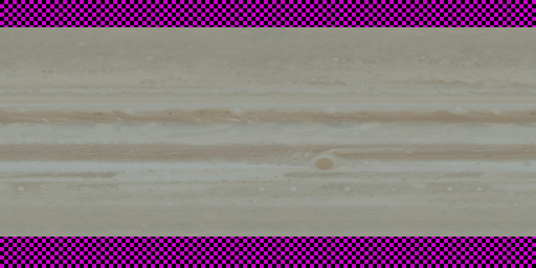

### Saturn

**Source.** OPAL cycle 32, second rotation of 2025 August 29 (F395N, F467M, F502N, F631N, F763M; FQ727N and FQ889N are methane bands, F225W is UV). 1800 × 900 maps (0.2°), System III, planetographic on 60268 × 54364 km → planetocentric; level 2.

**Known issues.** The README warns that moons and their shadows crossing the disk are in the maps. In 2025 the rings are nearly edge-on (Earth crossed the ring plane in March 2025), so ring obscuration and the ring shadow are confined to the equator but may affect equatorial texels. Large linear-vs-cubic colour spread in Z (see table) comes from the few texels with extreme blue/red ratios.

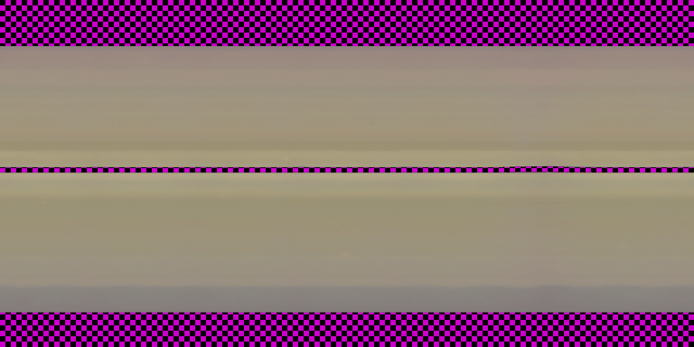

### Uranus

**Source.** OPAL cycle 33 (2025 October 23–24), second rotation: F467M, F547M, F657N, F763M (all Minnaert-corrected); F845M has no limb correction, FQ619N/FQ727N are methane bands. 721 × 361 node-registered maps at 0.5° ("this oversamples the data"); east longitude increasing to the left (reversed here). Level 1 (0.35°).

**Coverage.** Uranus's north pole faces the Sun and Earth before the 2030 solstice (sub-Earth latitude +71°): with the limb cut, data run from about the equator to the north pole; the south is unknown.

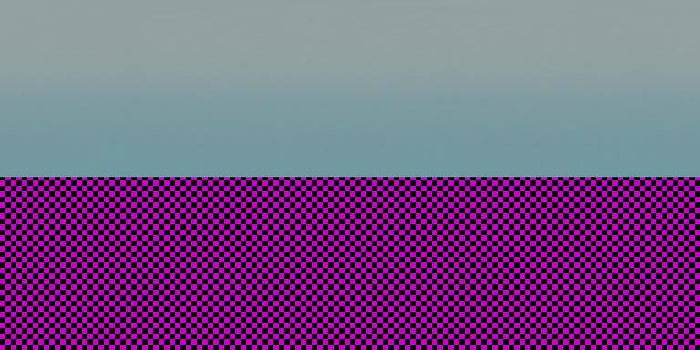

### Neptune

**Source.** OPAL cycle 32, rotation `2025c` (2025 August 24–25): F467M, F547M, F657N. F763M, F845M, FQ619N and FQ727N have no Minnaert correction in this cycle ("none" in the README) and are not used. 721 × 361 node-registered, W longitude like Jupiter. Level 1.

**Colour.** Only three bands, 467–657 nm: most of the Z integrand lies below 467 nm, where the ratio is held flat (table above). The disk colour is the measured one from photometry.json; the per-texel colour variation is the weakest of all maps here. Before the limb cut, the northern edge (seen at grazing emission, sub-Earth latitude −19°) showed strongly coloured artefacts; north of ~53°N planetographic is now unknown.

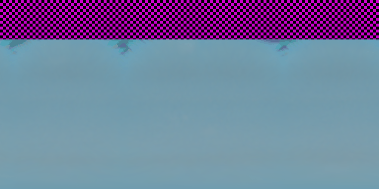

### Mars

**Source.** Mars Express HRSC global colour mosaic from high-altitude images (Michael et al. 2025; data doi:10.17169/refubium-40624, CC BY 4.0 per its DataCite record — this resolves the licence question in the research note). Bands blue 440, green 530, nadir 675 (broad panchromatic) and red 750 nm; 970 nm unused. 2 km/px → level 4 (2.6 km). Height: MOLA MEGDR 32 px/deg radius minus the pck00011 ellipsoid.

**Known issues.** The colour model removes image-to-image atmospheric changes but not the campaign-average dust haze; Michael et al. state that absolute surface colour is uncertain for that reason (only relative colour is used here). Mars's albedo features change with dust storms: the map is a multi-year composite.

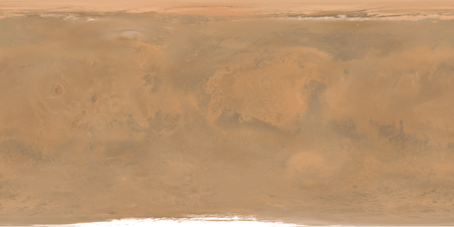
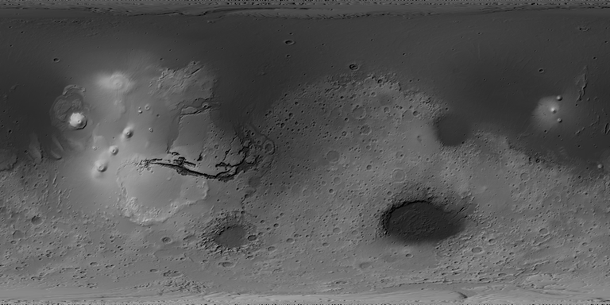

### Mercury

**Source.** MESSENGER MDIS 8-colour MDR v4 (Denevi et al. 2018), 64 px/deg, I/F normalized to i = g = 30°, e = 0 with a global Kaasalainen–Shkuratov correction; bands 430, 480, 560, 630, 750, 830 nm read by byte range (6 of 17 bands per cube, 54 tiles). Polar tiles are polar stereographic; a gap-fill south-polar tile (2.7 km/px images) is used only where the nominal tile has none. Height: USGS global MESSENGER stereo DEM v2 (Becker et al. 2016) re-referenced from its 2439.4 km sphere to the pck00011 ellipsoid.

**Not used.** The USGS `EnhancedColor` (PCA stretch) and `MD3Color` (1000/750/430 nm false colour) mosaics, and the single-band basemaps.

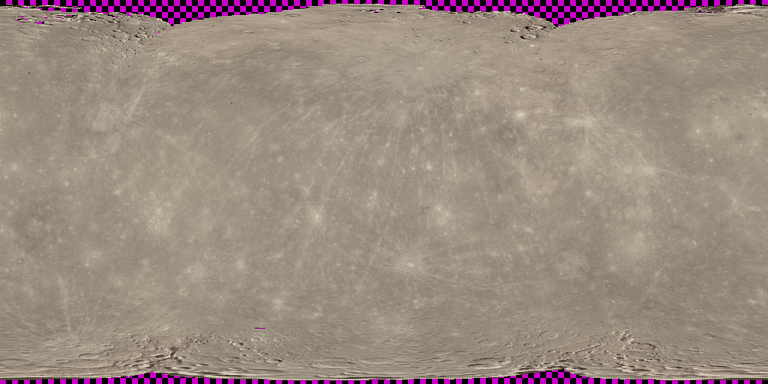
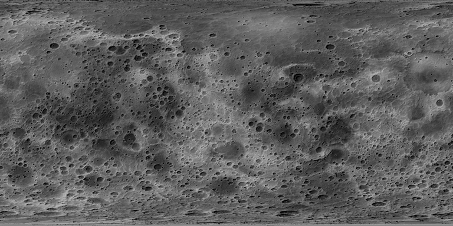

### Panchromatic mosaics

**Galilean moons, Pluto, Charon: 8-bit panchromatic mosaics (USGS Astrogeology).** Each is calibrated and photometrically normalized by its producer (Lunar-Lambert for the Galilean satellites), matched across image boundaries and delivered as 8-bit numbers. Except for Pluto and Charon, whose FGDC metadata document the linear 8-bit stretch (inverted here), the DN scaling is not documented; we assume DN ∝ normalized reflectance. Brightness pattern and colour are therefore `estimated` (single band: the local colour is the disk colour). Colour composites (`ClrMosaic`, `ClrMerge`, `FalseColor`), the high-pass-filtered Enceladus mosaics (`_HPF`) and the Triton `GlobalFill` mosaic (undocumented fill) are not used. Georeferencing is checked against a named albedo feature from the IAU Gazetteer at its east longitude and at the mirrored longitude (catches W/E mix-ups).

| body | source | observed | DN p1 / median / p99 | georeferencing check | leading/trailing (mag) | notes |
|---|---|---|---|---|---|---|
| Io | usgs-io-galileo-voyager-1km | Voyager 1979; Galileo 1996-2001 | 56 / 103 / 150 | Loki Patera: 0.72 vs mirrored 0.98 | 1.066 (+0.07) | Mostly clear-filter SSI images (green and 756 nm substituted where sharper); resolutions 1.3-10 km/px, poorest on the Jupiter-facing side; images empirically matched in brightness and contrast (metadata). Io's surface changes with volcanic activity: this is a 1979-2001 composite. |
| Europa | usgs-europa-voyager-galileo-500m | Voyager 1979; Galileo 1996-2003 | 78 / 153 / 210 | Pwyll (bright ray crater): 1.09 vs mirrored 0.99 | 1.249 (+0.24) | Image resolutions vary widely (tens of m to ~20 km/px gap fill). |
| Ganymede | usgs-ganymede-voyager-galileo-1km | Voyager 1979; Galileo 1996-2000 | 34 / 76 / 147 | Galileo Regio (dark): 0.80 vs mirrored 1.01 | 1.351 (+0.33) | Input resolutions 180 m to 20 km/px (gap fill). |
| Callisto | usgs-callisto-voyager-galileo-1km | Voyager 1979; Galileo 1996-2001 | 31 / 55 / 143 | Valhalla (bright centre): 1.38 vs mirrored 0.97 | 1.294 (+0.28) |  |
| Charon | usgs-charon-newhorizons-300m | 2015-07 (New Horizons flyby, 2015-07-14) | 7 / 123 / 234 | none selected | – | Encounter hemisphere at high resolution, far side from approach images; the south was in polar night. |
| Pluto | usgs-pluto-newhorizons-300m | 2015-07 (New Horizons flyby, 2015-07-14) | 5 / 123 / 225 | Belton Regio (dark): 0.28 vs mirrored 0.66 | – | Encounter hemisphere (centred near 180°E) at up to ~0.3-1 km/px; the far hemisphere only at ~20-40 km/px from approach images; south of ~30°S was in polar night and is unknown. Pluto's surface volatiles (N2, CH4, CO ices) move seasonally; this is the July 2015 state. |

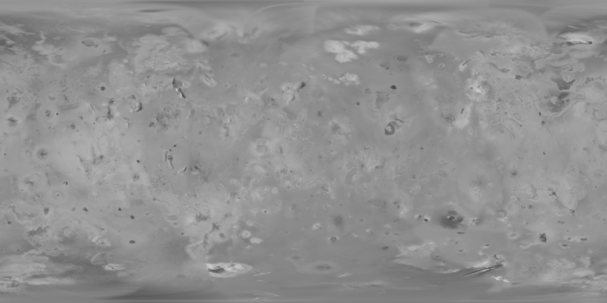
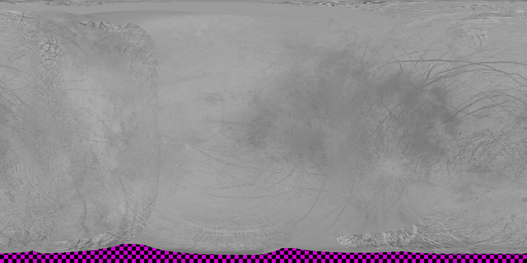
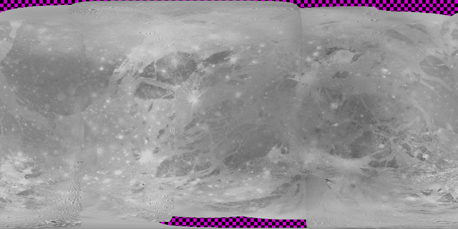
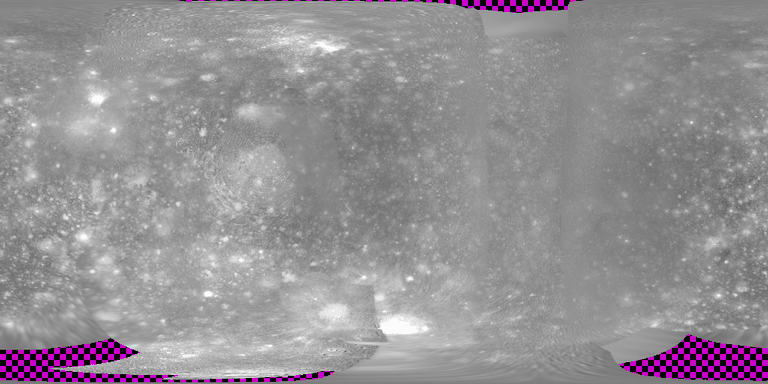
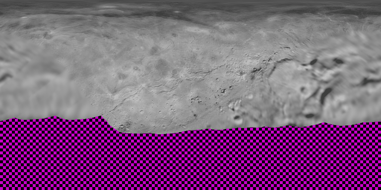
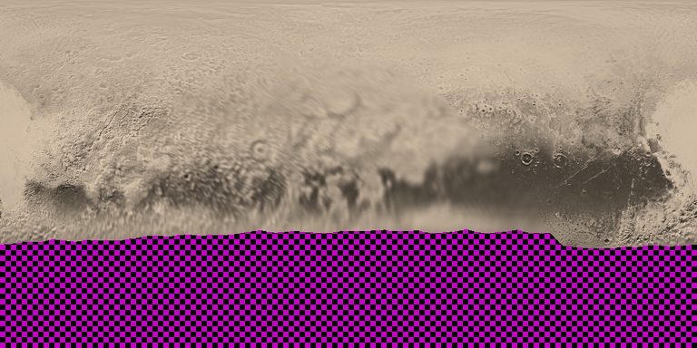

Previews: display renderings of relative reflectance × the body's disk colour, disk mean at display luminance 0.30, adapted to sunlight (Bradford → D65), 256-colour palette; heights: grey = height plus a 10× exaggerated hillshade. Magenta/black checkerboard = unknown. `uv run python -m pipeline.surf_preview`.

## Bodies deliberately without a visible surface map

- **Venus:** the eye sees the cloud deck, featureless to a few percent in the visible; the markings in popular images are ultraviolet. Magellan radar maps show a surface no eye can see. Rendered from photometry.json only.
- **Titan:** the eye sees an orange haze ball; the surface maps are 938 nm methane-window (ISS) or infrared (VIMS) products with the haze removed. Rendered from photometry.json only.
- **Saturn's mid-size moons (rejected after checking):** the USGS/CICLOPS Cassini global maps compress large-scale contrast. The Iapetus map implies a leading/trailing brightness ratio of 0.84 (0.18 mag) at zero phase, while Iapetus's leading hemisphere is ~2 mag fainter than its trailing one; the Dione map implies 1.04 and its bright ray crater Creusa does not stand out. Tethys, Rhea and Enceladus come from the same map series and are held back until its brightness scaling is documented or checked (reasons in `surfaces/index.json` → `rejected`).
- **Earth:** out of scope for this stage (needs daily cloud imagery; research note 1c).
- **Triton, Uranian moons, Mimas, small moons:** not built yet (see open issues).

## Verification

`uv run pytest tests/test_surf_tiles.py tests/test_surf_pds.py tests/test_surf_color_hapke.py tests/test_surf_products.py`: PDS label conventions (LROC tile edges, standard-parallel equirectangular, polar stereographic orientation), pyramid/tiling math and texel addressing (Tycho → level-5 tile 23/30, texel 178/2), exact box and linear resampling (no coverage extension, periodic longitude, regional tiles), float16/float32 tile and header round trips with sha256 listings, band→XYZS weights (rows sum to 1, disk mean preserved), the colour criterion, the Hapke model (Chandrasekhar H, neutral roughness at normal geometry, smooth-surface limit); on the built products: every tile present or listed as missing, sampled sha256, no NaN / negative / infinite albedo texels at any level, disk mean 1 ± 0.01 per channel at every level, and:

- **Moon, Tycho (43.30°S, 11.22°W, IAU Gazetteer), height layer level 4:** mean height within 15 km of the centre -3199 m, on the 38–48 km rim ring 837 m: the crater is 4036 m deep at the right place (test: > 3000 m; published floor-to-rim depth ≈ 4.8 km, smoothed by 1.3 km texels).
- **Moon albedo (level 4, Y):** Tycho's ejecta (≤ 60 km) are 1.19× their 200–400 km surroundings; Mare Crisium (17.0°N, 59.1°E) is 0.62× the highlands 350–550 km from its centre (tests: > 1.15 and < 0.8).
- **Moon, our Hapke implementation vs the product:** mosaic I/F ÷ model RADF(60°,0°,60°) per 1° cell, median by band: 321 nm 0.980, 360 nm 0.972, 415 nm 1.005, 566 nm 0.967, 604 nm 0.948, 643 nm 0.920, 689 nm 0.909 (5–95 % ranges within ±5 %). The few-percent, band-dependent offset is common to all cells of a band, so it cancels in the relative texels; the per-cell conversion factor depends only on the parameter ratios.
- **Jupiter, Great Red Spot:** the reddest (max X/Z) large feature between 10°S and 35°S is at 20.7°S planetocentric, 322°W System III (east 38°); expected 19.6°S planetocentric (≈ 22.2°S planetographic; e.g. Simon et al. 2018, AJ 155, 151), test tolerance 1.5°. **Longitude direction:** the 23.7°N prograde jet moved +4.3° east between the two December 2025 rotations (9.42 h), as it must if east longitude increases to the right in the converted maps.
- **Uranus:** data from -1° to 90° (planetocentric): the north pole faces Earth in 2025, as expected (test).
- **Neptune:** data from -90° to 52° (planetocentric): the south pole faces Earth in 2025, as expected (test).
- **Io, Loki Patera** (13.01°, 51.21°E; IAU Gazetteer of Planetary Nomenclature (planetarynames.wr.usgs.gov)): contrast to its surroundings 0.72 vs 0.98 at the mirrored longitude (expected dark).
- **Europa, Pwyll (bright ray crater)** (-25.20°, 88.60°E; IAU Gazetteer of Planetary Nomenclature (planetarynames.wr.usgs.gov)): contrast to its surroundings 1.09 vs 0.99 at the mirrored longitude (expected bright).
- **Ganymede, Galileo Regio (dark)** (45.00°, -127.00°E; IAU Gazetteer of Planetary Nomenclature (planetarynames.wr.usgs.gov)): contrast to its surroundings 0.80 vs 1.01 at the mirrored longitude (expected dark).
- **Callisto, Valhalla (bright centre)** (14.70°, -56.00°E; IAU Gazetteer of Planetary Nomenclature (planetarynames.wr.usgs.gov)): contrast to its surroundings 1.38 vs 0.97 at the mirrored longitude (expected bright).
- **Pluto, Belton Regio (dark)** (-9.21°, 91.42°E; IAU Gazetteer of Planetary Nomenclature (planetarynames.wr.usgs.gov)): contrast to its surroundings 0.28 vs 0.66 at the mirrored longitude (expected dark).

## Open issues

- Galilean moons: DN scaling undocumented (brightness `estimated`). The headers record the leading/trailing brightness ratio each map implies (`diagnostics.leadingOverTrailing`); comparing it with measured orbital light curves would confirm or reject the linear-DN assumption, as it rejected the Iapetus map.
- Saturn's mid-size moons: find a documented-brightness source (e.g. the DLR Cassini ISS cartographic volumes COISS_3001-3007 in PDS) or check the CICLOPS maps against disk photometry.
- Pluto/Charon: New Horizons MVIC colour (PDS composition bundle) not used yet; colour is the disk colour. The DEMs (encounter hemisphere only) are not exported.
- Not built: Triton (Voyager hemisphere only; the USGS 'GlobalFill' fill is undocumented), Uranian moons, Mimas (DLR atlas in a zip), Ceres/Vesta (M3), Earth.
- Giant planets: maps are one rotation at their epoch; advecting clouds with measured zonal wind profiles (research note 1c) is left to the renderer/M2 follow-up and would be `estimated`.
- Moon: normal albedo excludes the opposition surge by definition (see above); the renderer's opposition effect must come from the disk phase curve or the exported Hapke layer.
- Several bodies (the Galilean moons, Charon) have no photometry.json entry yet, so the renderer has no absolute colour/brightness for them; their maps are ready for when it does.
- Panchromatic layers are stored as four identical float16 channels to keep one albedo tile format; a one-channel variant would make them 4x smaller if the renderer accepts it.
