# Validation set: calibrated observations as ground truth for the renderer

**Rendered sampling:** 4 × 4 = 16 samples per pixel (recorded in the run).

*Generated by `uv run python -m pipeline.validation report` from `validation/cases/*/case.json`; the cases themselves
are built by `uv run python -m pipeline.validation build` (code: `pipeline/src/pipeline/validation/`).*

The question each case answers is *"is this what you would actually see?"*: for a real, calibrated image of a planet,
moon or ring system, the renderer must reproduce the **absolute radiance** in a few well-defined regions of the
picture, within tolerances that come from the data's own uncertainties.

**Method: the cases test the model; they never select it.** The app's data (albedos, phase curves, spatial laws,
calibrations) are chosen by the sources' own merits and by their coverage of the geometry: which body, phase angles,
latitudes, season and wavelengths they measure, and how directly. How a choice scores on these cases plays no part.
- **Competing published laws:** when two exist, or a published law and an approximation of it, the better-supported
  one is used on that evidence. For example, Saturn uses the native Barkstrom law of Dones et al. (1993),
  rather than its Minnaert approximation. The terminator comparison also includes ringshine the app omits (§7).
- **Independence must be stated:** an independent comparison must exclude sources that include the tested frame
  (e.g. Belgacem's regional Europa fits are excluded). Pluto's map and law share flyby inputs with its case;
  those rows do not provide an independent check (§7).
- **No correction factors from the cases:** a factor derived from a case (e.g. the Galilean LORRI offset) is
  documented as a bound, not applied.

A choice made after seeing a case must be justifiable without it; otherwise the test leaks into the model and the
case no longer measures anything.

## 1. What the renderer must output

**Quantity.** The HDR buffer in absolute **XYZS radiance**, before the eye model: X, Y, Z in cd/m² (K_m = 683.002
lm/W, CIE 1931 2° observer), S in scotopic cd/m² (K'_m = 1700.06 lm/W, CIE 1951), i.e. the renderer's `rgba32float`
XYZS luminance target. No exposure, glare/PSF, adaptation or tone mapping. The solar spectrum and observers are those
of `light.json` (TSIS-1 HSRS, CIE tables), so a Lambertian white disk at normal incidence, 1 AU from the Sun, has
Y = E_Y/π with E_Y = the Y of `light.json`'s `irradianceXYZS_1AU`.

**View.** Each case's `view` is explicit and complete; the harness must **not** recompute it from the app's ephemeris
(the epochs lie outside the app's time window, except the Himawari case). It maps 1:1 onto the renderer's types
(`app/src/render/scene.ts`):

| case.json | SceneSnapshot |
|---|---|
| `view.camera.orient` (row-major, camera→ICRF, columns right, up, back) | `camera.orient` |
| `view.camera.fovY`, `width`, `height` | `camera.fovY`, `width`, `height` |
| `view.bodies[i].pos` (camera-relative, km, ICRF, light-time corrected) | `bodies[i].pos` |
| `view.bodies[i].toSun`, `orient` (body-fixed→ICRF, row-major), `radii` | `bodies[i].toSun`, `orient`, `radii` |
| `view.bodies[i].rings` | attach the planet's `rings.json` system |
| `view.sun.pos` | `sun.pos` |
| `view.et` | `et` |

Everything photometric comes from the app's own data, exactly as in normal rendering: `photometry.json` (albedo,
phase function, spatial model, ROLO), surface maps, `rings.json`, `atmospheres.json`, at the reality level being
tested (the tolerances assume the most complete level that the data admit).
Pixel (x, y) with y down has the ray right·(x+½−W/2)s + up·(H/2−y−½)s − back, s = `pixelPitchRad` = 2 tan(fovY/2)/H.
The reference values are **area averages** over each pixel, so the harness should supersample; the recorded grid
and, when supplied, the sampling sweep below describe the numerical evidence for that run.
Local body and ring ROIs exclude pixels that straddle a limb, terminator, ring edge or shadow edge (§3.5).
Disk-integrated rectangles deliberately include the entire disk.

**Interface** (types in `app/src/data/schema.ts`: `ValidationCase`, `ValidationRoi`, `ValidationRatio`), implemented
in the app (`cd app && npm run validate`; app/e2e/README.md "Validation against calibrated images"; results in
`app/shots/validation/`, and §7 below):

```ts
// app/src/validation/runner.ts: the case's view as a SceneSnapshot with the app's data (geometry-only: every body
// placed and oriented as case.json says, so the epoch need not lie in the app's time window).
validationScene(c: ValidationCase, data, opts?: { ss?: number; reality?: 'strict' | 'best' | 'complete' }): ValidationScene;
// validation.html: render it (ss × ss samples per pixel), settle, read and compare every ROI and ratio.
window.__validation.run(c: ValidationCase, opts?): Promise<RunResult>;
// app/src/render/renderer.ts (marked hook; render/hdrReadback.ts): the HDR XYZS target of the last frame, before the
// eye model, in cd/m² (S in scotopic cd/m²): mean, standard deviation and count over [x0, x1) × [y0, y1).
renderer.readHdrRegion(rect: [x0: number, y0: number, x1: number, y1: number]):
    Promise<{ mean: [X, Y, Z, S]; std: [X, Y, Z, S]; n: number }>;
// The whole target, for residual maps against reference.bin (I/F per band, same grid):
renderer.readHdr(): Promise<{ width: number; height: number; data: Float32Array }>;   // width × height × 4
```

**Pass/fail**, per ROI and channel c:

```
value ROI:        |mean_c − expected.XYZS[c]| ≤ expected.tolerance[c]      (tolerance = 2σ)
upper-limit ROI:  mean_c ≤ expected.upperLimitXYZS[c]
ratio:            |mean_c(numerator rect) / mean_c(denominator rect) − ratioXYZS[c]| ≤ tolerance[c]
'none' ROI:       not compared (no valid data or no expectation)
```

A failing ROI is a finding about the app's data or the renderer, to be reported with the ROI's `geometry` (incidence,
emission, phase, latitude/longitude or ring radius), which says which part of the photometric model it probes.
`appDataPreview` (disk-integrated ROIs) evaluates the app's `photometry.json` disk brightness at the case's phase
angle *without* rendering: it tells in advance whether a disagreement is in the data or in the renderer.

## 2. Geometry

* **Observer → target**: JPL Horizons vector tables (VEC_CORR = 'LT', ICRF) from the missions' reconstructed
  trajectories (Cassini −82, Voyager 2 −32, New Horizons −98, EPOXI −140), one query per image mid-time, cached in
  `data/raw/validation/horizons/` with the query in the download ledger.
* **Orientation, radii, Sun**: NAIF pck00011 (IAU rotation models, at t − light time) and de442s; for the Earth
  (Himawari) the high-precision ITRF93 PCK.
* **Pointing and roll are fitted to the image** (the C-kernels are too large to fetch for a few frames): a model
  image (Lambert ellipsoid, rings as single-scattering slabs with the app's measured τ profile, sky offset; amplitudes
  by linear least squares) is matched on a 2× pyramid (FFT translation search every 3° of roll, then Nelder–Mead).
  **Parity** (whether the archive's display order is mirrored): from the image fit where it decides (Saturn's rings);
  otherwise from independent evidence — the LORRI header WCS (sign of det CD); for Voyager 2 a reference frame of
  the same camera with Saturn's rings and four moons (a mirrored solution puts the moons where there is no light);
  for EPOXI the Moon beside the Earth. **Roll**: free for Saturn and the EPOXI Earth (set by the Moon's observed
  position); the LORRI WCS roll for LORRI (a sphere at low phase hardly constrains it: the free fit was 21° off for
  Pluto); for the Voyager sequences the frames' common (mean) roll, their spread being the roll uncertainty.
* **Independent checks** (`pointingChecks`): the fitted boresight against the centre of OPUS's RA/Dec footprint
  (mission C-kernel pointing), and for LORRI the header WCS pixel of the target against the fitted centre; the
  stellar-aberration shift (Horizons LT+S − LT) is added first because the archives' pointing is apparent.
* **Registration uncertainty** δ = max(0.5 view pixel, 3σ of the fitted centre) ⊕ (roll uncertainty × the ROI's
  distance from the target centre), propagated as δ × |∇(ROI mean)|.
* All band images of a case are resampled (area average) onto the reference image's view with their own fits.

## 3. Photometry and uncertainties

1. **I/F** as the archives define it (CISSCAL for Cassini, FICOR77 for Voyager, the SOC recipe with RSOLAR for
   LORRI, MULT2IOF for EPOXI, π L d²/E_band for Himawari): the solar-weighted band average of the reflectance.
2. **Band radiance** L_b = I/F · Ē_b / (π d²), Ē_b the TSIS-1 HSRS irradiance averaged over the band response
   (photon- or energy-weighted as the response is tabulated), d the Sun distance in AU.
3. **XYZS** exactly as the app models surface colour (`surf_color.py`): r(λ) = p̃(λ)·ρ(λ), ρ_b = I/F_b / p̃_b, ρ
   interpolated linearly between the bands' effective wavelengths and held flat beyond; p̃ = the body's
   disk-integrated spectrum (grey for ring ROIs). Colour label `derived` only under surf_color's Nyquist criterion,
   else `estimated`.
4. **1σ budget** per channel: calibration (instrument documentation, fully correlated between bands), noise (ROI
   standard deviation / √n, which also counts the scene's texture inside the ROI), registration, and the spectral
   model (linear vs monotone-cubic interpolation of ρ; for one band, p̃-shaped vs grey spectrum).
5. **ROIs** are square windows (plus a 1-pixel margin) whose every 4 × 4 sub-sample lies in one class: lit surface
   of the target with the kind's angle limits, lit ring face within a radius band, or empty sky. Kinds: disk-centre
   (smallest emission), limb (emission ≥ 60°, 70° for the Earth; brightest), terminator (incidence 65-88°),
   ring (radius band), disk-integrated (rectangle around the whole disk; sums all its light, immune to PSF blur;
   the local sky level in a 5-pixel frame around it, i.e. the camera's scattered light, is subtracted),
   sky-near / sky-far (upper limits).
6. **Tolerance** = 2σ of the combined budget, two-sided.

## 4. The cases

| case | target | instrument | epoch (UTC) | bands | ROIs | calibration 1σ | pointing check (native px) |
|---|---|---|---|---|---|---|---|
| `callisto-nh-lorri-2007` | Callisto | New Horizons LORRI (1×1) | 2007-02-27T05:03:16 | 1 | 6 | 2% | 18.91, 12.98 |
| `earth-himawari9-2026` | Earth | Himawari-9 AHI | 2026-09-28T04:05:34 | 3 | 8 | 5% | — |
| `earth-moon-epoxi-2008` | Earth | EPOXI HRI-VIS (defocused, PSF FWHM ~9 px) | 2008-05-29T02:03:47 | 5 | 5 | 5% | — |
| `europa-nh-lorri-2007` | Europa | New Horizons LORRI (1×1) | 2007-02-27T02:30:01 | 1 | 6 | 2% | 23.22, 17.54 |
| `ganymede-nh-lorri-2007` | Ganymede | New Horizons LORRI (1×1) | 2007-02-26T08:25:16 | 1 | 6 | 2% | 20.43, 14.82 |
| `io-nh-lorri-2007` | Io | New Horizons LORRI (1×1) | 2007-02-27T01:05:01 | 1 | 6 | 2% | 23, 17.21 |
| `jupiter-nh-lorri-2007` | Jupiter | New Horizons LORRI (1×1) | 2007-01-22T01:42:01 | 1 | 6 | 2% | 7.96, 2.48 |
| `neptune-voyager2-1989` | Neptune | Voyager 2 ISS NAC | 1989-08-15T05:02:16 | 3 | 6 | 10% | 90.99, 129.44, 65.35 |
| `pluto-nh-lorri-2015` | Pluto | New Horizons LORRI (1×1) | 2015-07-13T14:36:30 | 1 | 6 | 2% | 19.35, 15.7 |
| `saturn-cassini-wac-2016` | Saturn | Cassini ISS WAC | 2016-04-25T05:55:23 | 3 | 8 | 10% | 9.77, 7.37, 9.95 |
| `uranus-voyager2-1986` | Uranus | Voyager 2 ISS NAC | 1986-01-14T15:53:28 | 4 | 6 | 10% | 35.01, 47.52, 42.74, 46.92 |

Sizes: `validation/` holds only case.json, reference.bin (float32 I/F on the view grid) and preview.png per case; the downloaded images are fetched into `data/raw/validation/` (git-ignored) and may be deleted after the build (`clean`).

### Callisto, New Horizons LORRI, 2007-02-27  (`callisto-nh-lorri-2007`)

Callisto from 4.75 million km at phase 46.4°, 23.6 km per pixel.

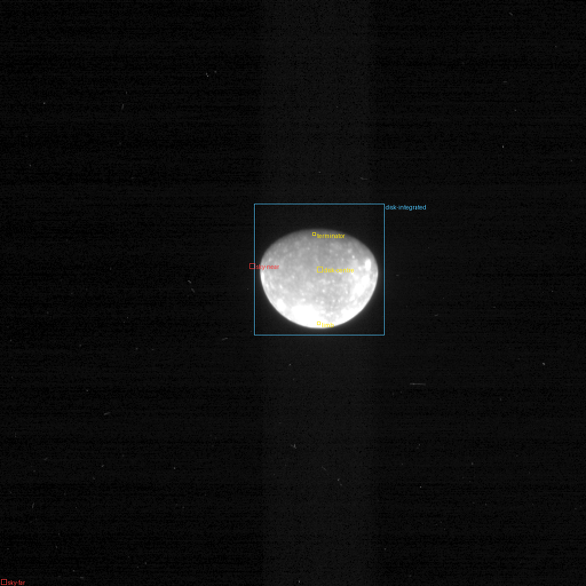

* **Observer / instrument:** New Horizons (Horizons @-98), New Horizons LORRI (1×1).
* **Epoch (reference image):** 2007-02-27T05:03:16.360 UTC (ET 225824661.545).
* **Geometry:** range 4.75094e+06 km, phase 46.49°, Sun distance 5.34963 AU; sub-observer -4.79°, 354.67°E; sub-solar -2.72°, 308.12°E (planetocentric).
* **View:** 512 × 512 px, pixel 9.926 µrad (native 4.963 µrad × 2), mirrored archive order: True.
* **Calibration (1σ):** 2% — As for Pluto: Weaver et al. (2020) give ~2 % (1σ) for the solar-spectrum keyword; this 2007 archive carries the pre-flight keyword values (RSOLAR 266400 for 1×1), so the in-flight value of Weaver et al. (2020) Table 2 (234900) is used, justified by their finding that LORRI's sensitivity did not change at the ~1 % level over the mission; 2 % (1σ). Exposures of 3-16 ms: the +0.6 ms true-exposure offset (Spencer & Weaver 2020, determined from 2007 Io images to ±0.01 ms) is applied.

| image | filter | mid-time (UTC) | fit: centre (px), roll | residual rms (I/F) | other parity rss / rss | registration δ (px) | pointing check |
|---|---|---|---|---|---|---|---|
| LOR_0034858514 | lorri.Pan | 2007-02-27T05:03:16.360 | (279.01, 235.80), 271.052° | 0.0047 | — | 0.5 | 18.91 native px (inside footprint); 12.98 native px (WCS) |

| ROI | kind | rect | geometry | I/F per band | expected Y (cd/m²) ± 2σ | X, Z, S | label |
|---|---|---|---|---|---|---|---|
| disk-centre | disk-centre | [277, 233, 282, 238] | i 46.9°, e 2.2°, α 46.5°, lat -5.3° | 0.0572 | 87.57 ± 6.306 | 84.05, 79.64, 195.3 | estimated |
| limb | limb | [277, 281, 280, 284] | i 19.7°, e 66.2°, α 46.5°, lat -2.3° | 0.145 | 222.5 ± 13.66 | 213.6, 202.4, 496.2 | estimated |
| terminator | terminator | [273, 203, 276, 206] | i 84.3°, e 38.2°, α 46.5°, lat 1.9° | 0.0204 | 31.22 ± 4.656 | 29.96, 28.39, 69.62 | estimated |
| disk-integrated | disk-integrated | [222, 178, 336, 293] | i 59.0°, e 45.0°, α 46.5°, lat -3.8° | 0.0424 | 64.85 ± 3.82 | 62.24, 58.97, 144.6 | estimated |
| sky-near | sky-near | [218, 230, 223, 235] |  | 5.393e-04 | ≤ 1.197 | ≤ 1.159, 1.249, 2.843 | derived |
| sky-far | sky-far | [1, 506, 6, 511] |  | 3.765e-05 | ≤ 0.237 | ≤ 0.23, 0.247, 0.563 | derived |

App data preview (informational, no rendering: `photometry.json` disk brightness at this phase):

* disk-integrated: app Y = 55.11 cd/m², ratio to observed 0.850, 0.850, 0.850, 0.850 (X, Y, Z, S), i.e. -6.3, -5.1, -1.2, -3.2 σ; Φ(46.5°) = 0.325 (measured).

Notes:

* Single band (350-850 nm): the XYZS expectation takes its spectral shape from the body's disk-integrated spectrum ('estimated'), with the difference to a grey spectrum as uncertainty.

### Earth, Himawari-9 AHI, 2026-09-28 04:00 UTC (the app's cloud day), equatorial swath  (`earth-himawari9-2026`)

The swath from the sub-satellite point (0°, 140.7°E; 13:23 local solar time) to ~16°S across the whole disk, from the Indian Ocean at the western limb to the evening terminator in the central Pacific, in AHI bands 1-3 (0.47, 0.51, 0.64 µm), from geostationary orbit (35 786 km).

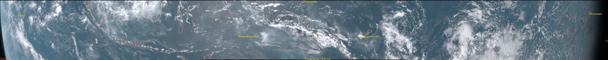

* **Observer / instrument:** Himawari-9 (nominal geostationary position from the image header), Himawari-9 AHI.
* **Epoch (reference image):** 2026-09-28T04:05:34.901 UTC (ET 843840404.083).
* **Geometry:** range 42164 km, phase 24.48°, Sun distance 1.00212 AU; sub-observer -0.00°, 140.70°E; sub-solar -2.01°, 116.30°E (planetocentric).
* **View:** 1375 × 138 px, pixel 223.552 µrad (native 27.944 µrad × 8), mirrored archive order: False.
* **Calibration (1σ):** 5%, 5%, 5% — Okuyama et al. (2018), for the AHI of the same design on Himawari-8: vicarious-calibration slopes against radiative-transfer simulations deviate from 1 by up to 3 % in bands 1-3 (Table 7), and the method's own uncertainty is 3.6-4.0 % (§5.2.a); combined in quadrature, 5 % (1σ) per band, fully correlated.

| image | filter | mid-time (UTC) | fit: centre (px), roll | residual rms (I/F) | other parity rss / rss | registration δ (px) | pointing check |
|---|---|---|---|---|---|---|---|
| HS_H09_20260928_0400_B01_FLDK_R10_S0610.DAT.bz2 | ahi9.B01 | 2026-09-28T04:05:34.901 | navigated (no fit) | — | — | 0.125 | — |
| HS_H09_20260928_0400_B02_FLDK_R10_S0610.DAT.bz2 | ahi9.B02 | 2026-09-28T04:05:35.150 | navigated (no fit) | — | — | 0.125 | — |
| HS_H09_20260928_0400_B03_FLDK_R05_S0610.DAT.bz2 | ahi9.B03 | 2026-09-28T04:05:34.639 | navigated (no fit) | — | — | 0.125 | — |

| ROI | kind | rect | geometry | I/F per band | expected Y (cd/m²) ± 2σ | X, Z, S | label |
|---|---|---|---|---|---|---|---|
| disk-centre (cloud offset -0.0 h) | disk-centre | [685, 1, 690, 6] | i 24.5°, e 0.3°, α 24.5°, lat -0.2° | 0.155, 0.123, 0.0895 | 4678 ± 596.5 | 4570, 7133, 1.350e+04 | estimated |
| limb (cloud offset -4.2 h) | limb | [41, 33, 45, 37] | i 38.1°, e 70.8°, α 32.7°, lat -2.7° | 0.235, 0.178, 0.108 | 6411 ± 773.5 | 6204, 1.078e+04, 1.975e+04 | estimated |
| terminator (cloud offset +4.2 h) | terminator | [1332, 29, 1336, 33] | i 87.3°, e 71.2°, α 16.4°, lat -2.4° | 0.0698, 0.0574, 0.0414 | 2169 ± 228.6 | 2104, 3220, 6189 | estimated |
| near-centre-130E (cloud offset -0.7 h) | point | [539, 81, 543, 85] | i 14.2°, e 14.4°, α 26.5°, lat -6.0° | 0.186, 0.155, 0.122 | 6032 ± 625.7 | 5891, 8577, 1.671e+04 | estimated |
| near-centre-150E (cloud offset +0.6 h) | point | [813, 81, 817, 85] | i 33.8°, e 13.0°, α 23.0°, lat -6.0° | 0.584, 0.542, 0.527 | 2.274e+04 ± 2531 | 2.241e+04, 2.725e+04, 5.690e+04 | estimated |
| near-centre-141E-12S (cloud offset -0.0 h) | point | [690, 133, 694, 137] | i 25.8°, e 11.6°, α 24.6°, lat -9.8° | 0.174, 0.142, 0.069 | 4779 ± 616.6 | 4457, 8033, 1.505e+04 | estimated |
| sky-near | sky-near | [1370, 92, 1374, 96] |  | 7.544e-05, 9.742e-06, 1.109e-05 | ≤ 12.88 | ≤ 12.48, 13.44, 30.6 | derived |
| sky-far | sky-far | [1, 133, 5, 137] |  | 8.426e-04, 5.986e-04, 3.925e-04 | ≤ 43.94 | ≤ 42.56, 45.85, 104.4 | derived |

Notes:

* Clouds: the app's Earth cloud layer is VIIRS/NOAA-20 of 2026-09-28 at ~13:30 local solar time; each ROI's 'cloudTimeOffsetH' is Himawari's local solar time minus 13.5 h at the ROI's mean longitude. Only ROIs within ~±1 h compare the same clouds; elsewhere the ROI tests the cloud statistics only.
* Only segment 6 of 10 was fetched (the swath from the equator to ~16°S): pixels outside it are NaN.
* The Earth's shape spectrum p̃ is the app's (Himawari 2025-03-20 disk average, 'estimated'); it only shapes the spectrum between the three band centres.

### Earth and Moon together, EPOXI HRI-VIS, 2008-05-29 02:04 UTC  (`earth-moon-epoxi-2008`)

The Earth (phase 75°) and the Moon beside it, 11 hours before the Moon crossed the Earth's disk as seen by the EPOXI (Deep Impact) spacecraft 49.5 million km away; five visible filters within 14 s.

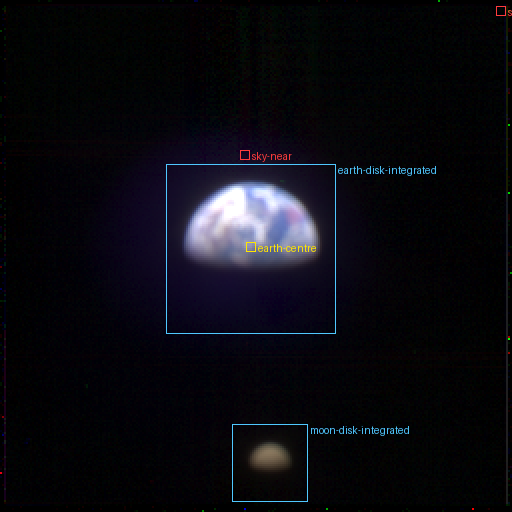

* **Observer / instrument:** EPOXI (Deep Impact flyby spacecraft) (Horizons @-140), EPOXI HRI-VIS (defocused, PSF FWHM ~9 px).
* **Epoch (reference image):** 2008-05-29T02:03:47.021 UTC (ET 265298692.206).
* **Geometry:** range 4.95237e+07 km, phase 75.05°, Sun distance 1.01363 AU; sub-observer -0.33°, 75.41°E; sub-solar 21.66°, 149.15°E (planetocentric).
* **View:** 256 × 256 px, pixel 4.000 µrad (native 2.000 µrad × 2), mirrored archive order: True.
* **Calibration (1σ):** 5%, 5%, 5%, 5%, 5% — EPOXI Calibration Pipeline Summary (2014): 'The uncertainty in conversion to absolute radiometric units is estimated to be 5% for HRI-VIS except for the 950-nm filter'. Taken as 5 % (1σ), fully correlated between filters; the Moon/Earth ratios are free of it. The 350, 550 and 650 nm filters have red leaks (same document).
* **Also in view:** Moon (range 4.91451e+07 km, phase 75.16°).

| image | filter | mid-time (UTC) | fit: centre (px), roll | residual rms (I/F) | other parity rss / rss | registration δ (px) | pointing check |
|---|---|---|---|---|---|---|---|
| HV08052902_1000117_001 | hriv.Violet | 2008-05-29T02:03:49.121 | (125.43, 125.67), 292.259° | 0.0145 | 0.99 | 0.5 | — |
| HV08052902_1000115_001 | hriv.Blue | 2008-05-29T02:03:44.991 | (125.17, 126.45), 292.167° | 0.0172 | — | 0.5 | — |
| HV08052902_1000116_001 | hriv.Green | 2008-05-29T02:03:47.021 | (125.05, 124.76), 292.073° | 0.0155 | — | 0.5 | — |
| HV08052902_1000121_001 | hriv.Orange | 2008-05-29T02:03:58.493 | (124.85, 125.74), 292.134° | 0.0149 | — | 0.5 | — |
| HV08052902_1000119_001 | hriv.Red | 2008-05-29T02:03:54.401 | (124.86, 125.94), 291.925° | 0.0159 | — | 0.5 | — |

| ROI | kind | rect | geometry | I/F per band | expected Y (cd/m²) ± 2σ | X, Z, S | label |
|---|---|---|---|---|---|---|---|
| earth-disk-integrated | disk-integrated | [83, 82, 168, 167] | i 78.4°, e 45.0°, α 75.0°, lat -0.3° | 0.0581, 0.0487, 0.0386, 0.0368, 0.0385 | 1616 ± 161.6 | 1592, 2110, 4247 | estimated |
| moon-disk-integrated | disk-integrated | [116, 212, 154, 251] | i 78.5°, e 45.0°, α 75.2°, lat 2.6° | 0.00234, 0.00311, 0.0039, 0.00461, 0.00529 | 164.3 ± 16.46 | 162.4, 134.6, 344.7 | estimated |
| earth-centre | disk-centre | [123, 121, 128, 126] | i 72.8°, e 4.0°, α 75.0°, lat -0.2° | 0.121, 0.0992, 0.0782, 0.073, 0.0757 | 3260 ± 482.7 | 3206, 4304, 8629 | estimated |
| sky-near | sky-near | [120, 75, 125, 80] |  | 0.0037, 7.865e-04, 1.504e-04, 8.457e-04, 0.00121 | ≤ 183.6 | ≤ 177.8, 191.5, 436.1 | derived |
| sky-far | sky-far | [248, 3, 253, 8] |  | 3.446e-04, 8.644e-05, -7.505e-06, 1.043e-05, -3.172e-07 | ≤ 63.72 | ≤ 61.72, 66.48, 151.4 | derived |

App data preview (informational, no rendering: `photometry.json` disk brightness at this phase):

* earth-disk-integrated: app Y = 1652 cd/m², ratio to observed 1.017, 1.022, 1.056, 1.043 (X, Y, Z, S), i.e. +0.3, +0.4, +1.1, +0.9 σ; Φ(75.0°) = 0.370 (estimated).
* moon-disk-integrated: app Y = 117.1 cd/m², ratio to observed 0.714, 0.713, 0.753, 0.730 (X, Y, Z, S), i.e. -5.7, -5.7, -4.9, -5.4 σ; Φ(75.2°) = 0.124 (estimated).

Calibration-free ratio moon-disk-integrated / earth-disk-integrated: XYZS 0.102, 0.102, 0.0638, 0.0812 ± 8.103e-04, 7.742e-04, 7.597e-04, 9.146e-04 (2σ); per band hriv.Violet 0.0403, hriv.Blue 0.0639, hriv.Green 0.1010, hriv.Orange 0.1253, hriv.Red 0.1372.

Notes:

* The pointing is fitted to the Earth and the Moon together (each with its own amplitude); their places come from Horizons (EPOXI → Earth, EPOXI → Moon). The roll is then set from the Moon's observed position (its centroid brought onto its predicted place) and the Earth's position refitted; the parity is the one that then also explains the Earth's lit side.
* MULT2IOF normalises to the Earth's Sun distance; the Moon's differs by < 0.3 %, and the XYZS radiances use the same distance as the I/F, so they are unaffected.
* The renderer's Earth has the 2026-09-28 clouds, not those of 2008-05-29: the Earth ROIs test the cloud-statistical brightness; the Moon ROI and the Moon/Earth ratio are the sharper tests.

### Europa, New Horizons LORRI, 2007-02-27  (`europa-nh-lorri-2007`)

Europa from 3.20 million km at phase 28.3°, 15.9 km per pixel.

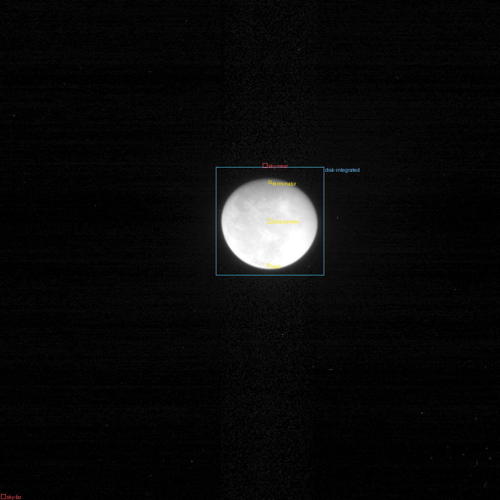

* **Observer / instrument:** New Horizons (Horizons @-98), New Horizons LORRI (1×1).
* **Epoch (reference image):** 2007-02-27T02:30:01.366 UTC (ET 225815466.551).
* **Geometry:** range 3.20168e+06 km, phase 28.22°, Sun distance 5.34966 AU; sub-observer -7.59°, 67.16°E; sub-solar -2.70°, 39.24°E (planetocentric).
* **View:** 512 × 512 px, pixel 9.926 µrad (native 4.963 µrad × 2), mirrored archive order: True.
* **Calibration (1σ):** 2% — As for Pluto: Weaver et al. (2020) give ~2 % (1σ) for the solar-spectrum keyword; this 2007 archive carries the pre-flight keyword values (RSOLAR 266400 for 1×1), so the in-flight value of Weaver et al. (2020) Table 2 (234900) is used, justified by their finding that LORRI's sensitivity did not change at the ~1 % level over the mission; 2 % (1σ). Exposures of 3-16 ms: the +0.6 ms true-exposure offset (Spencer & Weaver 2020, determined from 2007 Io images to ±0.01 ms) is applied.

| image | filter | mid-time (UTC) | fit: centre (px), roll | residual rms (I/F) | other parity rss / rss | registration δ (px) | pointing check |
|---|---|---|---|---|---|---|---|
| LOR_0034849319 | lorri.Pan | 2007-02-27T02:30:01.366 | (276.31, 226.52), 270.102° | 0.0181 | — | 0.5 | 23.22 native px (inside footprint); 17.54 native px (WCS) |

| ROI | kind | rect | geometry | I/F per band | expected Y (cd/m²) ± 2σ | X, Z, S | label |
|---|---|---|---|---|---|---|---|
| disk-centre | disk-centre | [274, 224, 279, 229] | i 28.4°, e 2.2°, α 28.2°, lat -7.8° | 0.491 | 721.1 ± 43.14 | 691.1, 667.5, 1623 | estimated |
| limb | limb | [273, 270, 276, 273] | i 38.4°, e 66.4°, α 28.2°, lat -1.0° | 0.574 | 843.4 ± 47.55 | 808.2, 780.7, 1898 | estimated |
| terminator | terminator | [275, 185, 278, 188] | i 82.5°, e 54.5°, α 28.2°, lat -4.5° | 0.15 | 219.9 ± 44.27 | 210.7, 203.5, 494.9 | estimated |
| disk-integrated | disk-integrated | [221, 171, 332, 282] | i 50.4°, e 45.0°, α 28.2°, lat -5.9° | 0.277 | 407.4 ± 22.73 | 390.4, 377.1, 916.8 | estimated |
| sky-near | sky-near | [269, 167, 274, 172] |  | 0.00169 | ≤ 5.058 | ≤ 4.899, 5.277, 12.01 | derived |
| sky-far | sky-far | [1, 506, 6, 511] |  | -1.547e-04 | ≤ 0.754 | ≤ 0.73, 0.786, 1.79 | derived |

App data preview (informational, no rendering: `photometry.json` disk brightness at this phase):

* disk-integrated: app Y = 433.1 cd/m², ratio to observed 1.063, 1.063, 1.063, 1.063 (X, Y, Z, S), i.e. +1.7, +2.3, +0.4, +0.8 σ; Φ(28.2°) = 0.716 (measured).

Notes:

* Single band (350-850 nm): the XYZS expectation takes its spectral shape from the body's disk-integrated spectrum ('estimated'), with the difference to a grey spectrum as uncertainty.

### Ganymede, New Horizons LORRI, 2007-02-26  (`ganymede-nh-lorri-2007`)

Ganymede from 4.96 million km at phase 29.0°, 24.6 km per pixel.

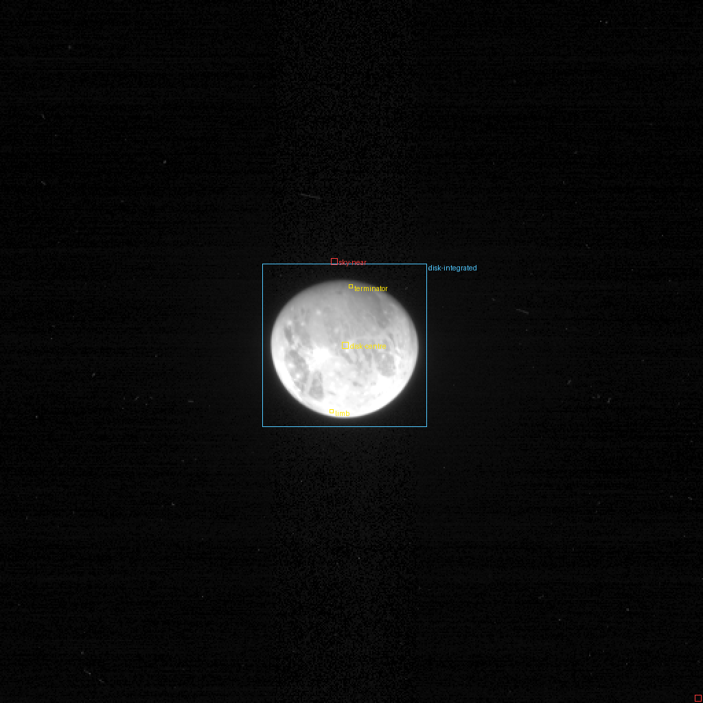

* **Observer / instrument:** New Horizons (Horizons @-98), New Horizons LORRI (1×1).
* **Epoch (reference image):** 2007-02-26T08:25:16.365 UTC (ET 225750381.550).
* **Geometry:** range 4.96318e+06 km, phase 29.01°, Sun distance 5.34988 AU; sub-observer -5.88°, 341.03°E; sub-solar -2.97°, 312.07°E (planetocentric).
* **View:** 512 × 512 px, pixel 9.926 µrad (native 4.963 µrad × 2), mirrored archive order: True.
* **Calibration (1σ):** 2% — As for Pluto: Weaver et al. (2020) give ~2 % (1σ) for the solar-spectrum keyword; this 2007 archive carries the pre-flight keyword values (RSOLAR 266400 for 1×1), so the in-flight value of Weaver et al. (2020) Table 2 (234900) is used, justified by their finding that LORRI's sensitivity did not change at the ~1 % level over the mission; 2 % (1σ). Exposures of 3-16 ms: the +0.6 ms true-exposure offset (Spencer & Weaver 2020, determined from 2007 Io images to ±0.01 ms) is applied.

| image | filter | mid-time (UTC) | fit: centre (px), roll | residual rms (I/F) | other parity rss / rss | registration δ (px) | pointing check |
|---|---|---|---|---|---|---|---|
| LOR_0034784234 | lorri.Pan | 2007-02-26T08:25:16.365 | (251.08, 251.36), 270.523° | 0.0192 | — | 0.5 | 20.43 native px (inside footprint); 14.82 native px (WCS) |

| ROI | kind | rect | geometry | I/F per band | expected Y (cd/m²) ± 2σ | X, Z, S | label |
|---|---|---|---|---|---|---|---|
| disk-centre | disk-centre | [249, 249, 254, 254] | i 28.9°, e 2.1°, α 29.0°, lat -6.3° | 0.355 | 529.3 ± 40.54 | 509.4, 499.3, 1200 | estimated |
| limb | limb | [240, 298, 243, 301] | i 38.1°, e 66.9°, α 29.0°, lat 7.5° | 0.537 | 802.1 ± 34.53 | 771.9, 756.6, 1818 | estimated |
| terminator | terminator | [254, 207, 257, 210] | i 82.8°, e 53.8°, α 29.0°, lat -7.8° | 0.104 | 155.7 ± 24 | 149.8, 146.8, 352.8 | estimated |
| disk-integrated | disk-integrated | [191, 192, 311, 311] | i 50.6°, e 45.0°, α 29.0°, lat -4.6° | 0.2 | 299.2 ± 12.14 | 287.9, 282.2, 678.1 | estimated |
| sky-near | sky-near | [241, 188, 246, 193] |  | 0.00142 | ≤ 4.09 | ≤ 3.961, 4.267, 9.715 | derived |
| sky-far | sky-far | [506, 506, 511, 511] |  | 2.423e-04 | ≤ 0.838 | ≤ 0.812, 0.875, 1.991 | derived |

App data preview (informational, no rendering: `photometry.json` disk brightness at this phase):

* disk-integrated: app Y = 251.8 cd/m², ratio to observed 0.842, 0.842, 0.842, 0.842 (X, Y, Z, S), i.e. -7.1, -7.8, -1.4, -2.9 σ; Φ(29.0°) = 0.630 (measured).

Notes:

* Single band (350-850 nm): the XYZS expectation takes its spectral shape from the body's disk-integrated spectrum ('estimated'), with the difference to a grey spectrum as uncertainty.

### Io, New Horizons LORRI, 2007-02-27  (`io-nh-lorri-2007`)

Io from 2.69 million km at phase 35.7°, 13.4 km per pixel, two days before closest approach.

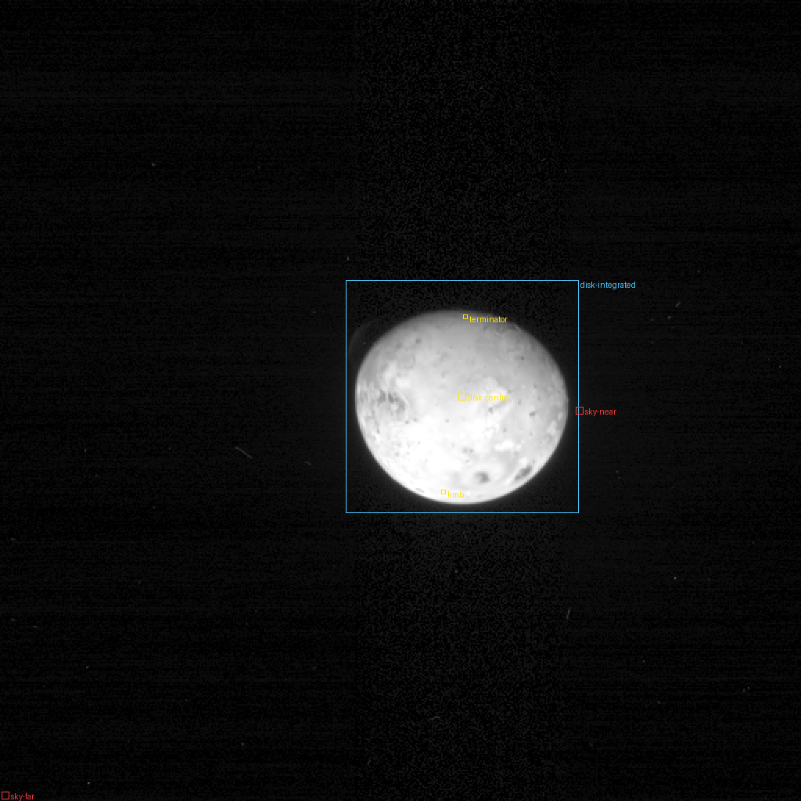

* **Observer / instrument:** New Horizons (Horizons @-98), New Horizons LORRI (1×1).
* **Epoch (reference image):** 2007-02-27T01:05:01.367 UTC (ET 225810366.552).
* **Geometry:** range 2.69049e+06 km, phase 35.63°, Sun distance 5.34968 AU; sub-observer -9.07°, 156.00°E; sub-solar -2.94°, 120.68°E (planetocentric).
* **View:** 512 × 512 px, pixel 9.926 µrad (native 4.963 µrad × 2), mirrored archive order: True.
* **Calibration (1σ):** 2% — As for Pluto: Weaver et al. (2020) give ~2 % (1σ) for the solar-spectrum keyword; this 2007 archive carries the pre-flight keyword values (RSOLAR 266400 for 1×1), so the in-flight value of Weaver et al. (2020) Table 2 (234900) is used, justified by their finding that LORRI's sensitivity did not change at the ~1 % level over the mission; 2 % (1σ). Exposures of 3-16 ms: the +0.6 ms true-exposure offset (Spencer & Weaver 2020, determined from 2007 Io images to ±0.01 ms) is applied.

| image | filter | mid-time (UTC) | fit: centre (px), roll | residual rms (I/F) | other parity rss / rss | registration δ (px) | pointing check |
|---|---|---|---|---|---|---|---|
| LOR_0034844219 | lorri.Pan | 2007-02-27T01:05:01.367 | (295.17, 253.85), 270.918° | 0.0142 | — | 0.5 | 23.0 native px (inside footprint); 17.21 native px (WCS) |

| ROI | kind | rect | geometry | I/F per band | expected Y (cd/m²) ± 2σ | X, Z, S | label |
|---|---|---|---|---|---|---|---|
| disk-centre | disk-centre | [293, 251, 298, 256] | i 35.8°, e 1.6°, α 35.6°, lat -9.3° | 0.464 | 673.7 ± 53.2 | 646.9, 476.8, 1346 | estimated |
| limb | limb | [282, 313, 285, 316] | i 29.5°, e 65.1°, α 35.7°, lat 5.1° | 0.578 | 839.7 ± 63.29 | 806.3, 594.3, 1677 | estimated |
| terminator | terminator | [296, 201, 299, 204] | i 84.4°, e 49.0°, α 35.6°, lat -7.2° | 0.101 | 146.4 ± 31.62 | 140.5, 103.6, 292.4 | estimated |
| disk-integrated | disk-integrated | [221, 179, 370, 328] | i 53.4°, e 45.1°, α 35.6°, lat -7.1° | 0.24 | 348.2 ± 26.05 | 334.3, 246.4, 695.5 | estimated |
| sky-near | sky-near | [368, 260, 373, 265] |  | 0.0029 | ≤ 6.166 | ≤ 5.972, 6.433, 14.65 | derived |
| sky-far | sky-far | [1, 506, 6, 511] |  | 1.741e-04 | ≤ 1.127 | ≤ 1.091, 1.175, 2.676 | derived |

App data preview (informational, no rendering: `photometry.json` disk brightness at this phase):

* disk-integrated: app Y = 311.9 cd/m², ratio to observed 0.896, 0.896, 0.896, 0.896 (X, Y, Z, S), i.e. -2.3, -2.8, -0.2, -0.5 σ; Φ(35.6°) = 0.521 (measured).

Notes:

* Single band (350-850 nm): the XYZS expectation takes its spectral shape from the body's disk-integrated spectrum ('estimated'), with the difference to a grey spectrum as uncertainty.

### Jupiter, New Horizons LORRI, 2007-01-22  (`jupiter-nh-lorri-2007`)

The whole disk of Jupiter from 60.4 million km at phase 9.8°, five weeks before the New Horizons flyby; 300 km per pixel.

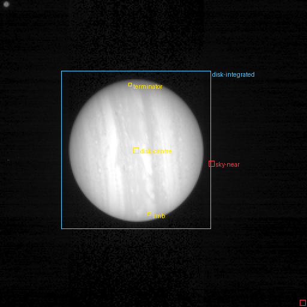

* **Observer / instrument:** New Horizons (Horizons @-98), New Horizons LORRI (1×1).
* **Epoch (reference image):** 2007-01-22T01:42:01.362 UTC (ET 222702186.547).
* **Geometry:** range 6.04095e+07 km, phase 9.81°, Sun distance 5.35999 AU; sub-observer -3.64°, 144.35°E; sub-solar -2.98°, 154.15°E (planetocentric).
* **View:** 256 × 256 px, pixel 19.852 µrad (native 4.963 µrad × 4), mirrored archive order: True.
* **Calibration (1σ):** 2% — As for Pluto: Weaver et al. (2020) give ~2 % (1σ) for the solar-spectrum keyword; this 2007 archive carries the pre-flight keyword values (RSOLAR 266400 for 1×1), so the in-flight value of Weaver et al. (2020) Table 2 (234900) is used, justified by their finding that LORRI's sensitivity did not change at the ~1 % level over the mission; 2 % (1σ). Exposures of 3-16 ms: the +0.6 ms true-exposure offset (Spencer & Weaver 2020, determined from 2007 Io images to ±0.01 ms) is applied.

| image | filter | mid-time (UTC) | fit: centre (px), roll | residual rms (I/F) | other parity rss / rss | registration δ (px) | pointing check |
|---|---|---|---|---|---|---|---|
| LOR_0031736039 | lorri.Pan | 2007-01-22T01:42:01.362 | (113.44, 125.17), 82.204° | 0.0218 | — | 0.5 | 7.96 native px (inside footprint); 2.48 native px (WCS) |

| ROI | kind | rect | geometry | I/F per band | expected Y (cd/m²) ± 2σ | X, Z, S | label |
|---|---|---|---|---|---|---|---|
| disk-centre | disk-centre | [111, 123, 116, 128] | i 9.7°, e 2.0°, α 9.8°, lat -3.6° | 0.646 | 1063 ± 202.9 | 1012, 960.9, 2388 | estimated |
| limb | limb | [123, 177, 126, 180] | i 56.3°, e 66.1°, α 9.9°, lat 2.1° | 0.424 | 698 ± 149.6 | 664.3, 631, 1568 | estimated |
| terminator | terminator | [107, 69, 110, 72] | i 76.9°, e 67.2°, α 9.7°, lat 1.0° | 0.189 | 311 ± 87.03 | 296, 281.1, 698.7 | estimated |
| disk-integrated | disk-integrated | [51, 59, 176, 191] | i 46.4°, e 45.8°, α 9.8°, lat -3.0° | 0.304 | 500.1 ± 95.05 | 476, 452.1, 1124 | estimated |
| sky-near | sky-near | [174, 134, 179, 139] |  | 0.00236 | ≤ 4.339 | ≤ 4.202, 4.527, 10.31 | derived |
| sky-far | sky-far | [250, 250, 255, 255] |  | -1.485e-04 | ≤ 0.49 | ≤ 0.475, 0.512, 1.165 | derived |

App data preview (informational, no rendering: `photometry.json` disk brightness at this phase):

* disk-integrated: app Y = 484.6 cd/m², ratio to observed 0.969, 0.969, 0.969, 0.969 (X, Y, Z, S), i.e. -0.4, -0.3, -0.6, -0.7 σ; Φ(9.8°) = 0.950 (measured).

Notes:

* Single band (350-850 nm): the XYZS expectation takes its spectral shape from the body's disk-integrated spectrum ('estimated'), with the difference to a grey spectrum as uncertainty.

### Neptune, Voyager 2 narrow-angle camera, 1989-08-15 (ten days before closest approach)  (`neptune-voyager2-1989`)

The whole disk of Neptune from 14.5 million km at phase 15.1°, in the VIOLET, GREEN and ORANGE filters (04:33-05:07 UTC).

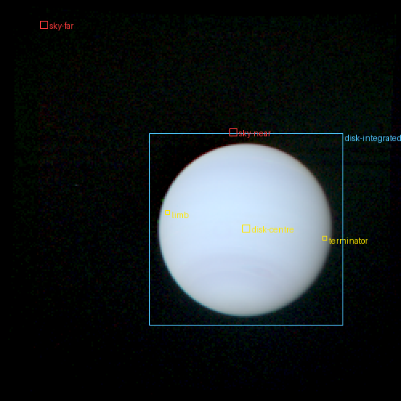

* **Observer / instrument:** Voyager 2 (Horizons @-32), Voyager 2 ISS NAC.
* **Epoch (reference image):** 1989-08-15T05:02:16.240 UTC (ET -327567407.577).
* **Geometry:** range 1.45291e+07 km, phase 15.12°, Sun distance 30.21381 AU; sub-observer -28.67°, 176.34°E; sub-solar -23.14°, 160.68°E (planetocentric).
* **View:** 250 × 250 px, pixel 31.367 µrad (native 7.842 µrad × 4), mirrored archive order: False.
* **Calibration (1σ):** 10%, 10%, 10% — VGISS User Tutorial §6.3: 'Absolute calibration is still probably no more accurate than 5-10%', and the labels' REFLECTANCE_SCALING_FACTOR is 'accurate to the advertised 5-10% level for the CALIB and GEOMED images'. Taken as 10 % (1σ), the upper end, fully correlated between filters.

| image | filter | mid-time (UTC) | fit: centre (px), roll | residual rms (I/F) | other parity rss / rss | registration δ (px) | pointing check |
|---|---|---|---|---|---|---|---|
| C1109146 | voyager.nac.Violet | 1989-08-15T05:07:06.160 | (137.11, 142.12), 6.211° | 0.0258 | — | 0.5 | 90.99 native px (inside footprint) |
| C1109140 | voyager.nac.Green | 1989-08-15T05:02:16.240 | (153.26, 143.54), 6.211° | 0.0269 | — | 0.5 | 129.44 native px (inside footprint) |
| C1109104 | voyager.nac.Orange | 1989-08-15T04:33:26.320 | (137.71, 133.79), 6.211° | 0.0255 | — | 0.5 | 65.35 native px (inside footprint) |

| ROI | kind | rect | geometry | I/F per band | expected Y (cd/m²) ± 2σ | X, Z, S | label |
|---|---|---|---|---|---|---|---|
| disk-centre | disk-centre | [151, 140, 156, 145] | i 15.2°, e 2.1°, α 15.1°, lat -27.5° | 0.621, 0.509, 0.405 | 23.11 ± 4.683 | 19.82, 30.95, 66.67 | estimated |
| limb | limb | [103, 131, 106, 134] | i 52.2°, e 67.0°, α 15.2°, lat -5.5° | 0.502, 0.435, 0.367 | 19.95 ± 4.726 | 17.25, 25.45, 55.83 | estimated |
| terminator | terminator | [201, 146, 204, 149] | i 79.7°, e 65.4°, α 15.0°, lat -10.2° | 0.203, 0.188, 0.159 | 8.56 ± 6.462 | 7.37, 10.51, 23.54 | estimated |
| disk-integrated | disk-integrated | [93, 84, 214, 204] | i 46.6°, e 45.1°, α 15.1°, lat -21.7° | 0.309, 0.255, 0.21 | 11.69 ± 2.369 | 10.1, 15.42, 33.34 | estimated |
| sky-near | sky-near | [143, 202, 148, 207] |  | 0.00127, 8.570e-04, -0.00201 | ≤ 0.178 | ≤ 0.172, 0.186, 0.423 | derived |
| sky-far | sky-far | [25, 13, 30, 18] |  | -0.00233, -5.125e-04, -0.00624 | ≤ 0.111 | ≤ 0.108, 0.116, 0.265 | derived |

App data preview (informational, no rendering: `photometry.json` disk brightness at this phase):

* disk-integrated: app Y = 11.19 cd/m², ratio to observed 0.985, 0.957, 1.002, 0.967 (X, Y, Z, S), i.e. -0.2, -0.4, +0.0, -0.3 σ; Φ(15.1°) = 0.877 (measured).

Notes:

* A second ORANGE frame of the same sequence (C1109153, 30.72 s) reads ~5 % brighter at the 99th percentile and has a +0.02 sky offset; the 15.36 s frame (sky ≈ 0) is used.
* Neptune's clouds (the Great Dark Spot, bright companions) move between frames; ROI means average over them, and the renderer has no time-matched cloud map for Neptune: the ROIs test the disk-integrated albedo and the limb-darkening law.
* The pointing fit's roll is weakly constrained on this nearly featureless disk. The recorded validation-fit-repro starting-point probe (2026-10-07) shifted the optimizer's x start and simplex x coordinates by 0.001 output pixel at each refinement: common roll moved +0.1835 degrees, Green centre moved (+0.060, +0.010) pixels, and maximum finite reference I/F difference was 0.02225524 with 198 finite-mask changes. Probe-minus-unperturbed expectations in the unperturbed build's 2-sigma tolerance units, in X/Y/Z/S order: disk-centre [0.001113690, 0.0006406582, 0.0003535027, 0.0002490441]; limb [-0.004216226, -0.002484336, -0.005605099, -0.003632766]; terminator [-0.02169443, -0.02453043, -0.01479793, -0.02117054] (rectangle moved from [201,146,204,149] to [201,147,204,150]); disk-integrated [0.0002161755, 0.0001308588, 0.0001121974, 0.00007234042]. Sky-near upper-limit changes were [0.0001820, 0.0001879, 0.0001960, 0.0004463] in cd/m2 (X/Y/Z) and scotopic cd/m2 (S); upper limits have no symmetric tolerance. Sky-far was unknown in both probe builds, so no tolerance-unit sensitivity was measured there. This diagnostic is not a roll covariance or a fitted uncertainty; the production optimizer, start, regions and tolerance rule are unchanged.

### Pluto, New Horizons LORRI, 2015-07-13 (one day before closest approach)  (`pluto-nh-lorri-2015`)

The whole disk of Pluto, Sputnik Planitia near the centre, from 1.05 million km at phase 15.8°; LORRI panchromatic (350-850 nm), 5.2 km per pixel.

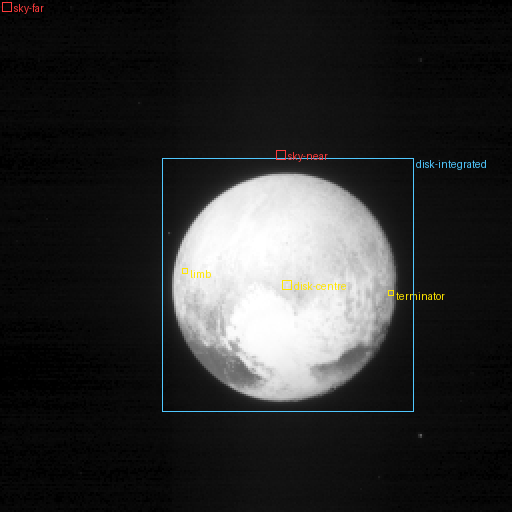

* **Observer / instrument:** New Horizons (Horizons @-98), New Horizons LORRI (1×1).
* **Epoch (reference image):** 2015-07-13T14:36:30.780 UTC (ET 490070258.964).
* **Geometry:** range 1.05184e+06 km, phase 15.82°, Sun distance 32.90790 AU; sub-observer 42.71°, 197.08°E; sub-solar 51.55°, 177.66°E (planetocentric).
* **View:** 256 × 256 px, pixel 19.852 µrad (native 4.963 µrad × 4), mirrored archive order: True.
* **Calibration (1σ):** 2% — Weaver et al. (2020): absolute sensitivity accurate to ~2 % (1σ) for solar-type spectra; the band I/F here uses the solar-spectrum keyword RSOLAR (SOC ICD §9.3.9; value of Weaver et al. 2020 Table 2, equal to this product's header), i.e. it is the solar-weighted LORRI band average, and colour enters only through synthetic photometry with the LORRI response (the spectral-model term), as Weaver et al. recommend for non-solar targets. True exposure = EXPTIME + 0.6 ms (Spencer & Weaver 2020) for products archived before 2020.

| image | filter | mid-time (UTC) | fit: centre (px), roll | residual rms (I/F) | other parity rss / rss | registration δ (px) | pointing check |
|---|---|---|---|---|---|---|---|
| LOR_0299104109 | lorri.Pan | 2015-07-13T14:36:30.780 | (143.97, 142.53), 338.901° | 0.0443 | — | 0.5 | 19.35 native px (inside footprint); 15.7 native px (WCS) |

| ROI | kind | rect | geometry | I/F per band | expected Y (cd/m²) ± 2σ | X, Z, S | label |
|---|---|---|---|---|---|---|---|
| disk-centre | disk-centre | [141, 140, 146, 145] | i 15.4°, e 2.0°, α 15.8°, lat 42.9° | 0.575 | 19.49 ± 6.629 | 19.36, 15.32, 40.04 | estimated |
| limb | limb | [91, 134, 94, 137] | i 50.5°, e 66.0°, α 15.9°, lat 36.9° | 0.57 | 19.32 ± 6.555 | 19.18, 15.18, 39.67 | estimated |
| terminator | terminator | [194, 145, 197, 148] | i 80.6°, e 65.4°, α 15.8°, lat -0.2° | 0.201 | 6.802 ± 2.728 | 6.756, 5.346, 13.97 | estimated |
| disk-integrated | disk-integrated | [81, 79, 207, 206] | i 46.7°, e 45.0°, α 15.8°, lat 30.5° | 0.339 | 11.47 ± 3.885 | 11.39, 9.017, 23.56 | estimated |
| sky-near | sky-near | [138, 75, 143, 80] |  | 0.0047 | ≤ 0.231 | ≤ 0.224, 0.241, 0.549 | derived |
| sky-far | sky-far | [1, 1, 6, 6] |  | 8.971e-05 | ≤ 0.0184 | ≤ 0.0178, 0.0192, 0.0436 | derived |

App data preview (informational, no rendering: `photometry.json` disk brightness at this phase):

* disk-integrated: phase angle 15.82° is outside the app's phase function range: the app has no measured disk brightness here (the renderer hatches or extrapolates, by reality level)

Notes:

* Single band: the XYZS expectation takes the ROI's spectral shape from Pluto's disk-integrated spectrum (label 'estimated'), with the difference to a grey spectrum as its uncertainty; Pluto's regional colour differences (Cthulhu's red vs. Sputnik's white) are larger than that inside some ROIs.
* The renderer's Pluto surface comes from the New Horizons MVIC global colour maps; ROI texture (std) is counted in the noise term.

### Saturn and its rings, Cassini ISS wide-angle camera, 2016-04-25  (`saturn-cassini-wac-2016`)

Saturn's northern hemisphere, the lit north face of the main rings and the planet's shadow across them, 2.97 million km from Saturn at phase 54.6° (sub-spacecraft latitude +28.7°, Sun +26.1°); RED, GRN and BL1 frames taken within 74 s.

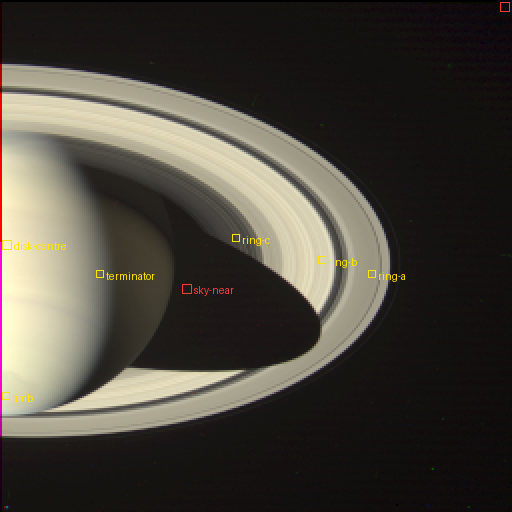

* **Observer / instrument:** Cassini (Horizons @-82), Cassini ISS WAC.
* **Epoch (reference image):** 2016-04-25T05:55:23.254 UTC (ET 514835791.440).
* **Geometry:** range 2.9746e+06 km, phase 54.58°, Sun distance 10.02462 AU; sub-observer 28.68°, 84.12°E; sub-solar 26.11°, 146.24°E (planetocentric).
* **View:** 256 × 256 px, pixel 239.080 µrad (native 59.770 µrad × 4), mirrored archive order: False.
* **Calibration (1σ):** 10%, 10%, 10% — CISSCAL User Guide §5.10.1: absolute correction factors from standard stars carry errors of 10-15 %; 'the uncertainty of stellar fluxes is on the order of 10%, so this is the uncertainty we expect to achieve'. Taken as 10 % (1σ) per filter, fully correlated between filters.

| image | filter | mid-time (UTC) | fit: centre (px), roll | residual rms (I/F) | other parity rss / rss | registration δ (px) | pointing check |
|---|---|---|---|---|---|---|---|
| W1840258828_1 | cassini.wac.RED | 2016-04-25T05:55:23.254 | (2.56, 128.76), 182.771° | 0.024 | 5.40 | 0.5 | 9.77 native px (inside footprint) |
| W1840258865_1 | cassini.wac.GRN | 2016-04-25T05:56:00.241 | (2.11, 128.27), 182.873° | 0.0222 | — | 0.5 | 7.37 native px (inside footprint) |
| W1840258902_1 | cassini.wac.BL1 | 2016-04-25T05:56:37.148 | (2.90, 127.83), 182.902° | 0.0158 | — | 0.5 | 9.95 native px (inside footprint) |

| ROI | kind | rect | geometry | I/F per band | expected Y (cd/m²) ± 2σ | X, Z, S | label |
|---|---|---|---|---|---|---|---|
| disk-centre | disk-centre | [1, 119, 6, 124] | i 55.0°, e 1.4°, α 54.5°, lat 23.7° | 0.321, 0.283, 0.188 | 117.5 ± 23.57 | 115.2, 80.8, 230.1 | estimated |
| limb | limb | [1, 196, 5, 200] | i 66.9°, e 64.4°, α 54.7°, lat 85.8° | 0.246, 0.245, 0.165 | 99.81 ± 20.28 | 95.79, 70.9, 200.4 | estimated |
| terminator | terminator | [48, 134, 52, 138] | i 85.5°, e 34.6°, α 54.0°, lat 26.5° | 0.0493, 0.048, 0.0385 | 20.36 ± 4.57 | 19.47, 16.38, 43.62 | estimated |
| ring-c | ring | [116, 117, 120, 121] | i 63.9°, e 61.1°, α 53.0°, r 84.2 Mm | 0.0221, 0.0202, 0.0172 | 8.468 ± 1.784 | 8.329, 7.751, 18.65 | estimated |
| ring-b | ring | [159, 128, 163, 132] | i 63.9°, e 61.3°, α 52.4°, r 112.7 Mm | 0.224, 0.207, 0.15 | 84.39 ± 17.08 | 82.93, 68.23, 174.7 | estimated |
| ring-a | ring | [184, 135, 188, 139] | i 63.9°, e 61.3°, α 52.1°, r 130.6 Mm | 0.106, 0.0988, 0.0733 | 40.35 ± 8.149 | 39.61, 33.28, 84.4 | estimated |
| sky-near | sky-near | [91, 142, 96, 147] |  | 0.00272, 0.00216, 0.00163 | ≤ 1.195 | ≤ 1.157, 1.246, 2.838 | derived |
| sky-far | sky-far | [250, 1, 255, 6] |  | 5.334e-04, 2.303e-04, 3.744e-04 | ≤ 0.407 | ≤ 0.395, 0.425, 0.968 | derived |

Notes:

* The rings' reflectance model in the app is 'estimated'; ring ROIs test it together with the τ profile.

### Uranus, Voyager 2 narrow-angle camera, 1986-01-14  (`uranus-voyager2-1986`)

The whole, nearly featureless disk of Uranus (south pole towards the Sun) from 13.0 million km at phase 13.8°, in the VIOLET, BLUE, ORANGE and GREEN filters (15:34-15:53 UTC).

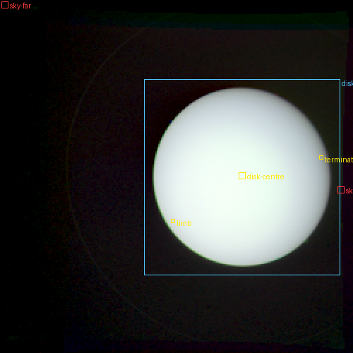

* **Observer / instrument:** Voyager 2 (Horizons @-32), Voyager 2 ISS NAC.
* **Epoch (reference image):** 1986-01-14T15:53:28.240 UTC (ET -440625936.576).
* **Geometry:** range 1.29541e+07 km, phase 13.84°, Sun distance 19.12060 AU; sub-observer -72.51°, 105.04°E; sub-solar -82.13°, 54.59°E (planetocentric).
* **View:** 250 × 250 px, pixel 31.367 µrad (native 7.842 µrad × 4), mirrored archive order: False.
* **Calibration (1σ):** 10%, 10%, 10%, 10% — VGISS User Tutorial §6.3: 'Absolute calibration is still probably no more accurate than 5-10%', and the labels' REFLECTANCE_SCALING_FACTOR is 'accurate to the advertised 5-10% level for the CALIB and GEOMED images'. Taken as 10 % (1σ), the upper end, fully correlated between filters.

| image | filter | mid-time (UTC) | fit: centre (px), roll | residual rms (I/F) | other parity rss / rss | registration δ (px) | pointing check |
|---|---|---|---|---|---|---|---|
| C2654450 | voyager.nac.Violet | 1986-01-14T15:34:18.160 | (129.75, 117.95), 28.110° | 0.0316 | — | 0.5 | 35.01 native px (inside footprint) |
| C2654456 | voyager.nac.Blue | 1986-01-14T15:39:07.120 | (137.90, 116.78), 28.110° | 0.0294 | — | 0.5 | 47.52 native px (inside footprint) |
| C2654514 | voyager.nac.Green | 1986-01-14T15:53:28.240 | (171.33, 125.41), 28.110° | 0.0268 | — | 0.5 | 42.74 native px (inside footprint) |
| C2654502 | voyager.nac.Orange | 1986-01-14T15:43:50.320 | (146.41, 113.94), 28.110° | 0.0235 | — | 0.5 | 46.92 native px (inside footprint) |

| ROI | kind | rect | geometry | I/F per band | expected Y (cd/m²) ± 2σ | X, Z, S | label |
|---|---|---|---|---|---|---|---|
| disk-centre | disk-centre | [169, 122, 174, 127] | i 13.8°, e 1.7°, α 13.8°, lat -71.6° | 0.565, 0.631, 0.613, 0.548 | 69.51 ± 13.93 | 60.81, 75.35, 177.9 | estimated |
| limb | limb | [121, 155, 124, 158] | i 53.1°, e 67.0°, α 13.9°, lat -36.7° | 0.469, 0.501, 0.473, 0.431 | 54.33 ± 11.54 | 47.93, 60.78, 140.4 | estimated |
| terminator | terminator | [226, 110, 229, 113] | i 79.4°, e 66.6°, α 13.7°, lat -10.8° | 0.222, 0.224, 0.22, 0.195 | 24.86 ± 8.466 | 21.89, 27.84, 64.04 | estimated |
| disk-integrated | disk-integrated | [102, 56, 241, 195] | i 45.7°, e 44.6°, α 13.8°, lat -42.6° | 0.294, 0.321, 0.305, 0.269 | 34.63 ± 6.938 | 30.27, 38.67, 90.02 | estimated |
| sky-near | sky-near | [160, 193, 165, 198] |  | 0.00394, 0.00256, 0.00374, 0.00468 | ≤ 0.794 | ≤ 0.769, 0.829, 1.887 | derived |
| sky-far | sky-far | [46, 236, 51, 241] |  | 5.074e-04, -0.00152, -8.368e-04, -0.00141 | ≤ 0.233 | ≤ 0.226, 0.243, 0.554 | derived |

App data preview (informational, no rendering: `photometry.json` disk brightness at this phase):

* disk-integrated: app Y = 33.94 cd/m², ratio to observed 0.998, 0.980, 1.062, 1.014 (X, Y, Z, S), i.e. -0.0, -0.2, +0.6, +0.1 σ; Φ(13.8°) = 0.903 (measured).

## 5. Checks of the set itself

**Image parity and roll** (the archive's display order relative to a right-handed camera):

* `callisto-nh-lorri-2007`: mirrored — header WCS: det(CD) = -8.088e-08 deg², i.e. standard sky orientation with FITS rows running upwards, so the archive order read top-down is mirrored.
  Roll: roll from the header WCS (reconstructed C-kernel attitude); the free fit's roll differed by +7.47° (a nearly spherical body at low phase fixes the roll only weakly); target position refitted with the roll held.
* `earth-himawari9-2026`: direct — navigated grid (no parity question).
* `earth-moon-epoxi-2008`: mirrored — the image fit alone does not decide (other parity's residual 1.004 × the better one's); with the roll set by NAIF 301's observed position, the mirrored order explains the primary with residual 13.88, the other order with 14.26 (companion light at its predicted place 13.04 vs 13.26).
  Roll: roll from NAIF 301's observed position (its light-weighted centroid brought onto its predicted place; +2.04° from the free fit), target position refitted with the roll held.
* `europa-nh-lorri-2007`: mirrored — header WCS: det(CD) = -8.088e-08 deg², i.e. standard sky orientation with FITS rows running upwards, so the archive order read top-down is mirrored.
  Roll: roll from the header WCS (reconstructed C-kernel attitude); the free fit's roll differed by +11.14° (a nearly spherical body at low phase fixes the roll only weakly); target position refitted with the roll held.
* `ganymede-nh-lorri-2007`: mirrored — header WCS: det(CD) = -8.088e-08 deg², i.e. standard sky orientation with FITS rows running upwards, so the archive order read top-down is mirrored.
  Roll: roll from the header WCS (reconstructed C-kernel attitude); the free fit's roll differed by +2.52° (a nearly spherical body at low phase fixes the roll only weakly); target position refitted with the roll held.
* `io-nh-lorri-2007`: mirrored — header WCS: det(CD) = -8.088e-08 deg², i.e. standard sky orientation with FITS rows running upwards, so the archive order read top-down is mirrored.
  Roll: roll from the header WCS (reconstructed C-kernel attitude); the free fit's roll differed by -5.01° (a nearly spherical body at low phase fixes the roll only weakly); target position refitted with the roll held.
* `jupiter-nh-lorri-2007`: mirrored — header WCS: det(CD) = -8.088e-08 deg², i.e. standard sky orientation with FITS rows running upwards, so the archive order read top-down is mirrored.
  Roll: roll from the header WCS (reconstructed C-kernel attitude); the free fit's roll differed by -1.21° (a nearly spherical body at low phase fixes the roll only weakly); target position refitted with the roll held.
* `neptune-voyager2-1989`: direct — from the reference frame C4220129 (1981-06-27T00:05:34.040 UTC; NAIF 699, whose fit fixes the roll, with NAIF 601, 603, 604, 605 in the field): the moons' light at their predicted places sums to 9 (I/F × pixels, background-subtracted) with the direct archive order and 0.0761 with the other (per moon: {601: 0.4305, 603: 1.9569, 604: 2.5353, 605: 4.0769} vs {601: 0.0057, 603: -0.0093, 604: 0.0317, 605: 0.048}); the primary's own fit residuals differ by a factor 1.481.
  Roll: common roll of the 3 frames (circular mean of the free fits); their circular spread 4.60° is the roll uncertainty.
* `pluto-nh-lorri-2015`: mirrored — header WCS: det(CD) = -8.088e-08 deg², i.e. standard sky orientation with FITS rows running upwards, so the archive order read top-down is mirrored.
  Roll: roll from the header WCS (reconstructed C-kernel attitude); the free fit's roll differed by -20.74° (a nearly spherical body at low phase fixes the roll only weakly); target position refitted with the roll held.
* `saturn-cassini-wac-2016`: direct — image fit: the other parity's residual sum of squares is 5.403 × the chosen one's.
* `uranus-voyager2-1986`: direct — from the reference frame C4220129 (1981-06-27T00:05:34.040 UTC; NAIF 699, whose fit fixes the roll, with NAIF 601, 603, 604, 605 in the field): the moons' light at their predicted places sums to 9 (I/F × pixels, background-subtracted) with the direct archive order and 0.0761 with the other (per moon: {601: 0.4305, 603: 1.9569, 604: 2.5353, 605: 4.0769} vs {601: 0.0057, 603: -0.0093, 604: 0.0317, 605: 0.048}); the primary's own fit residuals differ by a factor 1.481.
  Roll: common roll of the 4 frames (circular mean of the free fits); their circular spread 1.95° is the roll uncertainty.

**Fitted pointing against the missions' own pointing** (`pointingChecks`, native pixels):

* `callisto-nh-lorri-2007`: LOR_0034858514 OPUS boresight 18.91; LOR_0034858514 WCS target 12.98, roll +0.00° from the WCS.
* `europa-nh-lorri-2007`: LOR_0034849319 OPUS boresight 23.22; LOR_0034849319 WCS target 17.54, roll -0.00° from the WCS.
* `ganymede-nh-lorri-2007`: LOR_0034784234 OPUS boresight 20.43; LOR_0034784234 WCS target 14.82, roll -0.00° from the WCS.
* `io-nh-lorri-2007`: LOR_0034844219 OPUS boresight 23; LOR_0034844219 WCS target 17.21, roll -0.00° from the WCS.
* `jupiter-nh-lorri-2007`: LOR_0031736039 OPUS boresight 7.96; LOR_0031736039 WCS target 2.48, roll +0.00° from the WCS.
* `neptune-voyager2-1989`: C1109146 OPUS boresight 90.99; C1109140 OPUS boresight 129.44; C1109104 OPUS boresight 65.35.
* `pluto-nh-lorri-2015`: LOR_0299104109 OPUS boresight 19.35; LOR_0299104109 WCS target 15.7, roll -0.00° from the WCS.
* `saturn-cassini-wac-2016`: W1840258828_1 OPUS boresight 9.77; W1840258865_1 OPUS boresight 7.37; W1840258902_1 OPUS boresight 9.95.
* `uranus-voyager2-1986`: C2654450 OPUS boresight 35.01; C2654456 OPUS boresight 47.52; C2654514 OPUS boresight 42.74; C2654502 OPUS boresight 46.92.

These offsets are the missions' attitude-knowledge errors plus ours; the fits themselves are tied to the target's own limb and terminator, which is what the renderer comparison needs.

**App data preview** (disk-integrated ROIs; `photometry.json` alone, no rendering):

* `callisto-nh-lorri-2007` disk-integrated (phase 46.5°, sub-observer -4.8° 354.7° E): app/observed Y = 0.850 (-5.1 σ), X 0.850, Z 0.850; phase function measured.
* `earth-moon-epoxi-2008` earth-disk-integrated (phase 75.0°, sub-observer -0.3° 75.4° E): app/observed Y = 1.022 (+0.4 σ), X 1.017, Z 1.056; phase function estimated.
* `earth-moon-epoxi-2008` moon-disk-integrated (phase 75.2°, sub-observer +3.4° 175.4° E): app/observed Y = 0.713 (-5.7 σ), X 0.714, Z 0.753; phase function estimated.
* `europa-nh-lorri-2007` disk-integrated (phase 28.2°, sub-observer -7.6° 67.2° E): app/observed Y = 1.063 (+2.3 σ), X 1.063, Z 1.063; phase function measured.
* `ganymede-nh-lorri-2007` disk-integrated (phase 29.0°, sub-observer -5.9° 341.0° E): app/observed Y = 0.842 (-7.8 σ), X 0.842, Z 0.842; phase function measured.
* `io-nh-lorri-2007` disk-integrated (phase 35.6°, sub-observer -9.1° 156.0° E): app/observed Y = 0.896 (-2.8 σ), X 0.896, Z 0.896; phase function measured.
* `jupiter-nh-lorri-2007` disk-integrated (phase 9.8°, sub-observer -3.6° 144.3° E): app/observed Y = 0.969 (-0.3 σ), X 0.969, Z 0.969; phase function measured.
* `neptune-voyager2-1989` disk-integrated (phase 15.1°, sub-observer -28.7° 176.3° E): app/observed Y = 0.957 (-0.4 σ), X 0.985, Z 1.002; phase function measured.
* `pluto-nh-lorri-2015` disk-integrated: phase angle 15.82° is outside the app's phase function range: the app has no measured disk brightness here (the renderer hatches or extrapolates, by reality level).
* `uranus-voyager2-1986` disk-integrated (phase 13.8°, sub-observer -72.5° 105.0° E): app/observed Y = 0.980 (-0.2 σ), X 0.998, Z 1.062; phase function measured.

**Sizes:** `validation/` 15.7 MB (committed); downloaded inputs 194.9 MB (download ledger), git-ignored in `data/raw/validation/` (194.9 MB present now: `python -m pipeline.validation clean` deletes the images after a build; `build` fetches them again, and the pointing-fit cache is keyed by each image's sha256, so a changed archive file is refitted).

**Unit tests** (`pipeline/tests/test_validation.py`): the camera puts the target at the requested pixel with the pole up; ray casting reproduces a sphere's projected area to 1 % and face-on emission; ring classes and radii; the pointing fit recovers a synthetic pose to 0.15 px and 2°; grey closure (I/F = 1 in every band gives exactly the XYZS of sunlight / π d²); band radiance definition; PDS3 label parsing; the Himawari grid mapping round trip; the companion parity test; and every committed case.json (orthonormal camera and body matrices, fovY/pitch consistency, reference.bin size, ROI rectangles inside the view, tolerance = 2σ, fitted target centre = the view's projection of the target).

**Rebuild locks.** Each case's `reproducibility` lock hashes the static import closure of its build path (the stage fingerprint walker, with the selected instrument reader or Himawari prepare module), and only the source tables actually read in that build. Shared modules are hashed as whole files; unrelated stages and their tables are excluded. Raw inputs retain exact byte hashes. Product dependencies hash canonically serialized consumed fields, including presence, nulls, labels and source IDs where read: ring profile radii/depths/sources and disk-photometry values/labels. Unconsumed product method text does not stale a lock; changing a consumed value does. This costs an explicit field selection at each product read, checked again by the rebuild input capture. The lock also records the numerical libraries, BLAS/LAPACK configuration, CPU features, PNG compression, one-thread environment, artifact creation time and exact fit inputs/results. The pipeline suite checks implementation/tables, environment and present input products offline without raw images; a missing product is a counted skip. After an applicable code/table/product change, run `cd pipeline && python -m pipeline.validation renew-locks` with the project Python. It restarts with BLAS/OMP/MKL threads set to 1, uses each case's recorded SOURCE_DATE_EPOCH and Earth kernel, and rebuilds from the pinned raw bytes. It refuses the entire batch if any JSON outside the lock (including regions, expected values, tolerances and fits), reference.bin or preview.png bytes differ; otherwise it rewrites only the eleven locks. Verification remains `OPENBLAS_NUM_THREADS=1 OMP_NUM_THREADS=1 MKL_NUM_THREADS=1 python -m pipeline.validation verify`.

* `callisto-nh-lorri-2007`: [`reproducibility`](../../validation/cases/callisto-nh-lorri-2007/case.json).
* `earth-himawari9-2026`: [`reproducibility`](../../validation/cases/earth-himawari9-2026/case.json).
* `earth-moon-epoxi-2008`: [`reproducibility`](../../validation/cases/earth-moon-epoxi-2008/case.json).
* `europa-nh-lorri-2007`: [`reproducibility`](../../validation/cases/europa-nh-lorri-2007/case.json).
* `ganymede-nh-lorri-2007`: [`reproducibility`](../../validation/cases/ganymede-nh-lorri-2007/case.json).
* `io-nh-lorri-2007`: [`reproducibility`](../../validation/cases/io-nh-lorri-2007/case.json).
* `jupiter-nh-lorri-2007`: [`reproducibility`](../../validation/cases/jupiter-nh-lorri-2007/case.json).
* `neptune-voyager2-1989`: [`reproducibility`](../../validation/cases/neptune-voyager2-1989/case.json).
* `pluto-nh-lorri-2015`: [`reproducibility`](../../validation/cases/pluto-nh-lorri-2015/case.json).
* `saturn-cassini-wac-2016`: [`reproducibility`](../../validation/cases/saturn-cassini-wac-2016/case.json).
* `uranus-voyager2-1986`: [`reproducibility`](../../validation/cases/uranus-voyager2-1986/case.json).

## 6. Limitations and open issues

1. **Pointing is fitted, not taken from C-kernels.** The fitted camera is tied to the target itself (limb,
   terminator, rings); the mission pointing serves as a check (§5) and, where the image cannot decide,
   for the parity (Voyager: a Saturn frame with moons; LORRI: the header WCS, which also gives the roll).
2. **Scene changes with time are not in the tolerance.** Earth's clouds, giant-planet cloud features,
   Io's volcanic deposits and seasonal changes can differ from the observation. `cloudTimeOffsetH`
   records the Himawari regions' timing relative to the cloud overpass. Texture in a region contributes
   to the noise term but does not cover a systematically different scene.
3. **Single-band cases (LORRI)** give XYZS only through the body's disk-integrated spectral shape
   ('estimated'). Regional colour differences can exceed the grey-versus-shape spectral term.
   The band radiance itself is 'derived' and is the sharper quantity.
4. **Instrument responses:** the Voyager filter curves are the pre-launch curves digitized from Smith
   et al. (1977), generic to both spacecraft; the EPOXI calibration notes in each case describe the
   HRI-VIS red leaks; the LORRI response is the SVO copy of the archive's launch calibration.
5. **LORRI calibration:** the reader uses the in-flight RSOLAR from Weaver et al. (2020), including
   for the Jupiter-encounter frames. The case's calibration notes record both it and the archived keyword.
6. **Not in this set:** Mars, Mercury, a high-resolution lunar case, Titan and Venus.
7. **Himawari:** an equatorial segment, without a disk-integrated ROI. The app's Earth albedo comes
   from a different Himawari scene; each case records its spectral convention.
8. **Sky ROIs** are upper limits: the camera's scattered light and zero level are included in them.
9. **Sampling:** the reference is an area average per pixel. Sampling only pixel centres can miss
   within-pixel variation, which the registration term does not include for the renderer.
10. **App data previews (§5)** evaluate the data without rendering, as built with the cases. The Moon's
    preview uses ROLO's Earth-based near-side photometry, while EPOXI saw the far side. The renderer
    uses the lunar maps at ROLO's reference geometry. The Galilean previews are longitude-averaged;
    the renderer also uses the measured rotational variation (`rotation-slices-v1`). A preview is not
    a rendered measurement.

## 7. The renderer against the cases

Run of 2026-10-07 13:02 UTC (git 2f33e69, data built 2026-10-07 11:04), reality level best, 4 × 4 samples per pixel, rendered by the machine's GPU, adapter `nvidia blackwell`, on AMD Ryzen 9 9950X3D 16-Core Processor (32 threads): `cd app && npm run validate -- --ss 4 --gpu hardware` (the full table, with X, Z, S, is in `app/shots/validation/report.md`). Y in cd/m²; the verdict covers X, Y, Z and S (failing channels named).

| case | ROI | expected Y ± 2σ | rendered Y | rendered / expected | σ | verdict |
|---|---|---|---|---|---|---|
| `callisto-nh-lorri-2007` | disk-centre | 87.57 ± 6.3 | 71.68 | 0.819 | -5.0 | **fail** (XYS) |
| `callisto-nh-lorri-2007` | limb | 222.5 ± 14 | 235.9 | 1.060 | +2.0 | **fail** (X) |
| `callisto-nh-lorri-2007` | terminator | 31.22 ± 4.7 | 21.28 | 0.682 | -4.3 | **fail** (XYZS) |
| `callisto-nh-lorri-2007` | disk-integrated | 64.85 ± 3.8 | 52.66 | 0.812 | -6.4 | **fail** (XYS) |
| `callisto-nh-lorri-2007` | sky-near | ≤ 1.197 | 0 | — | — | pass |
| `callisto-nh-lorri-2007` | sky-far | ≤ 0.2372 | 0 | — | — | pass |
| `earth-himawari9-2026` | disk-centre | 4678 ± 6e+02 | 7054 | 1.508 | +8.0 | **fail** (XYZS) |
| `earth-himawari9-2026` | limb | 6411 ± 7.7e+02 | 6363 | 0.992 | -0.1 | pass |
| `earth-himawari9-2026` | terminator | 2169 ± 2.3e+02 | 1377 | 0.635 | -6.9 | **fail** (XYZS) |
| `earth-himawari9-2026` | near-centre-130E | 6032 ± 6.3e+02 | 8339 | 1.383 | +7.4 | **fail** (XYZS) |
| `earth-himawari9-2026` | near-centre-150E | 2.274e+04 ± 2.5e+03 | 2.319e+04 | 1.020 | +0.4 | pass |
| `earth-himawari9-2026` | near-centre-141E-12S | 4779 ± 6.2e+02 | 6574 | 1.375 | +5.8 | **fail** (XYZS) |
| `earth-himawari9-2026` | sky-near | ≤ 12.88 | 0.0008047 | — | — | pass |
| `earth-himawari9-2026` | sky-far | ≤ 43.94 | 0 | — | — | pass |
| `earth-moon-epoxi-2008` | earth-disk-integrated | 1616 ± 1.6e+02 | 1560 | 0.966 | -0.7 | pass |
| `earth-moon-epoxi-2008` | moon-disk-integrated | 164.3 ± 16 | 157.1 | 0.956 | -0.9 | pass |
| `earth-moon-epoxi-2008` | earth-centre | 3260 ± 4.8e+02 | 3228 | 0.990 | -0.1 | pass |
| `earth-moon-epoxi-2008` | sky-near | ≤ 183.6 | 0 | — | — | pass |
| `earth-moon-epoxi-2008` | sky-far | ≤ 63.72 | 0 | — | — | pass |
| `earth-moon-epoxi-2008` | moon-disk-integrated / earth-disk-integrated | 0.1017 ± 0.00077 | 0.1007 | — | — | **fail** (YZ) |
| `europa-nh-lorri-2007` | disk-centre | 721.1 ± 43 | 650.1 | 0.902 | -3.3 | **fail** (XY) |
| `europa-nh-lorri-2007` | limb | 843.4 ± 48 | 759.3 | 0.900 | -3.5 | **fail** (XY) |
| `europa-nh-lorri-2007` | terminator | 219.9 ± 44 | 168.6 | 0.767 | -2.3 | **fail** (XY) |
| `europa-nh-lorri-2007` | disk-integrated | 407.4 ± 23 | 362.3 | 0.889 | -4.0 | **fail** (XY) |
| `europa-nh-lorri-2007` | sky-near | ≤ 5.058 | 0 | — | — | pass |
| `europa-nh-lorri-2007` | sky-far | ≤ 0.7535 | 0 | — | — | pass |
| `ganymede-nh-lorri-2007` | disk-centre | 529.3 ± 41 | 427.9 | 0.808 | -5.0 | **fail** (XYS) |
| `ganymede-nh-lorri-2007` | limb | 802.1 ± 35 | 699.1 | 0.872 | -6.0 | **fail** (XYS) |
| `ganymede-nh-lorri-2007` | terminator | 155.7 ± 24 | 90.94 | 0.584 | -5.4 | **fail** (XYZS) |
| `ganymede-nh-lorri-2007` | disk-integrated | 299.2 ± 12 | 267.3 | 0.893 | -5.3 | **fail** (XY) |
| `ganymede-nh-lorri-2007` | sky-near | ≤ 4.09 | 0 | — | — | pass |
| `ganymede-nh-lorri-2007` | sky-far | ≤ 0.8382 | 0 | — | — | pass |
| `io-nh-lorri-2007` | disk-centre | 673.7 ± 53 | 570.8 | 0.847 | -3.9 | **fail** (XY) |
| `io-nh-lorri-2007` | limb | 839.7 ± 63 | 751 | 0.894 | -2.8 | **fail** (XY) |
| `io-nh-lorri-2007` | terminator | 146.4 ± 32 | 128.4 | 0.878 | -1.1 | pass |
| `io-nh-lorri-2007` | disk-integrated | 348.2 ± 26 | 308.5 | 0.886 | -3.0 | **fail** (XY) |
| `io-nh-lorri-2007` | sky-near | ≤ 6.166 | 0 | — | — | pass |
| `io-nh-lorri-2007` | sky-far | ≤ 1.127 | 0 | — | — | pass |
| `jupiter-nh-lorri-2007` | disk-centre | 1063 ± 2e+02 | 1280 | 1.204 | +2.1 | **fail** (XYZS) |
| `jupiter-nh-lorri-2007` | limb | 698 ± 1.5e+02 | 720.3 | 1.032 | +0.3 | pass |
| `jupiter-nh-lorri-2007` | terminator | 311 ± 87 | 300.2 | 0.965 | -0.2 | pass |
| `jupiter-nh-lorri-2007` | disk-integrated | 500.1 ± 95 | 464.9 | 0.930 | -0.7 | pass |
| `jupiter-nh-lorri-2007` | sky-near | ≤ 4.339 | 0 | — | — | pass |
| `jupiter-nh-lorri-2007` | sky-far | ≤ 0.4903 | 0 | — | — | pass |
| `neptune-voyager2-1989` | disk-centre | 23.11 ± 4.7 | 23.16 | 1.002 | +0.0 | pass |
| `neptune-voyager2-1989` | limb | 19.95 ± 4.7 | 19.12 | 0.959 | -0.3 | pass |
| `neptune-voyager2-1989` | terminator | 8.56 ± 6.5 | 7.064 | 0.825 | -0.5 | pass |
| `neptune-voyager2-1989` | disk-integrated | 11.69 ± 2.4 | 11.16 | 0.954 | -0.4 | pass |
| `neptune-voyager2-1989` | sky-near | ≤ 0.1781 | 0 | — | — | pass |
| `neptune-voyager2-1989` | sky-far | ≤ 0.1115 | 0 | — | — | pass |
| `pluto-nh-lorri-2015` | disk-centre | 19.49 ± 6.6 | 20.81 | 1.067 | +0.4 | pass |
| `pluto-nh-lorri-2015` | limb | 19.32 ± 6.6 | 19.96 | 1.033 | +0.2 | pass |
| `pluto-nh-lorri-2015` | terminator | 6.802 ± 2.7 | 6.2 | 0.911 | -0.4 | pass |
| `pluto-nh-lorri-2015` | disk-integrated | 11.47 ± 3.9 | 11.43 | 0.996 | -0.0 | pass |
| `pluto-nh-lorri-2015` | sky-near | ≤ 0.231 | 0.01247 | — | — | pass |
| `pluto-nh-lorri-2015` | sky-far | ≤ 0.01838 | 0 | — | — | pass |
| `saturn-cassini-wac-2016` | disk-centre | 117.5 ± 24 | 104 | 0.885 | -1.1 | pass |
| `saturn-cassini-wac-2016` | limb | 99.81 ± 20 | 109 | 1.092 | +0.9 | pass |
| `saturn-cassini-wac-2016` | terminator | 20.36 ± 4.6 | 14.38 | 0.706 | -2.6 | **fail** (XYZS) |
| `saturn-cassini-wac-2016` | ring-c | 8.468 ± 1.8 | 0 | 0.000 | -9.5 | **fail** (XYZS) |
| `saturn-cassini-wac-2016` | ring-b | 84.39 ± 17 | 0 | 0.000 | -9.9 | **fail** (XYZS) |
| `saturn-cassini-wac-2016` | ring-a | 40.35 ± 8.1 | 0 | 0.000 | -9.9 | **fail** (XYZS) |
| `saturn-cassini-wac-2016` | sky-near | ≤ 1.195 | 0 | — | — | pass |
| `saturn-cassini-wac-2016` | sky-far | ≤ 0.4074 | 0 | — | — | pass |
| `uranus-voyager2-1986` | disk-centre | 69.51 ± 14 | 69.29 | 0.997 | -0.0 | pass |
| `uranus-voyager2-1986` | limb | 54.33 ± 12 | 57.91 | 1.066 | +0.6 | pass |
| `uranus-voyager2-1986` | terminator | 24.86 ± 8.5 | 22.52 | 0.906 | -0.6 | pass |
| `uranus-voyager2-1986` | disk-integrated | 34.63 ± 6.9 | 34.69 | 1.002 | +0.0 | pass |
| `uranus-voyager2-1986` | sky-near | ≤ 0.7942 | 0 | — | — | pass |
| `uranus-voyager2-1986` | sky-far | ≤ 0.2333 | 0 | — | — | pass |

**Regions: 45 pass, 24 fail, 0 not rendered, 0 not compared.**

**Brightness regions: 23 pass, 24 fail, 0 not rendered, 0 not compared.**

**Sky upper limits: 22 pass, 0 fail, 0 not rendered, 0 not compared.**

**Ratio rows: 0 pass, 1 fail, 0 not rendered, 0 not compared.**

How each body was drawn:

* `callisto-nh-lorri-2007`: Callisto: disk photometry, disk model rotation-slices-v1, spatial model, map albedo.
* `earth-himawari9-2026`: Earth: disk photometry, map albedo, map clouds, map cloudTau, map water, map night, map wind, partly-cloudy τ statistic for the cloud without a retrieval (estimated), atmosphere.
* `earth-moon-epoxi-2008`: Earth: disk photometry, map albedo, map clouds, map cloudTau, map water, map night, map wind, partly-cloudy τ statistic for the cloud without a retrieval (estimated), atmosphere; Moon: disk photometry, disk model rolo-v1, map albedo, map height, map photometry.
* `europa-nh-lorri-2007`: Europa: disk photometry, disk model rotation-slices-v1, spatial model, map albedo.
* `ganymede-nh-lorri-2007`: Ganymede: disk photometry, disk model rotation-slices-v1, spatial model, map albedo.
* `io-nh-lorri-2007`: Io: disk photometry, disk model rotation-slices-v1, spatial model, map albedo.
* `jupiter-nh-lorri-2007`: Jupiter: disk photometry, spatial model, map albedo.
* `neptune-voyager2-1989`: Neptune: disk photometry, spatial model, map albedo.
* `pluto-nh-lorri-2015`: Pluto: disk photometry, spatial model, map albedo, atmosphere. Renderer warnings: Pluto: phase extrapolated beyond measured range (0–1.74°) with the spatial law → estimated.
* `saturn-cassini-wac-2016`: Saturn: disk photometry, spatial model, map albedo, rings. Renderer warnings: Saturn rings: phase angle 54.58° outside the reflectance model's 0.25–47° → ring brightness not measured (hatched).
* `uranus-voyager2-1986`: Uranus: disk photometry, spatial model, map albedo.

**What the failures say.**

### Findings computed from this run

25 failing rows: 24 regions and 1 ratio row (valid frames only). Each row below names a failing channel; relative error and tolerance are percentages of the expected value. ROI radiance is in cd/m² (S: scotopic cd/m²); ratios are dimensionless.

#### Galilean moons

| case | row | channel | expected ± tolerance | rendered | relative error (%) | tolerance (%) | σ |
|---|---|---|---|---|---|---|---|
| `callisto-nh-lorri-2007` | disk-centre | X | 84.054 ± 5.3 | 68.802 | -18.15 | 6.3 | -5.75 |
| `callisto-nh-lorri-2007` | disk-centre | Y | 87.575 ± 6.31 | 71.684 | -18.15 | 7.2 | -5.04 |
| `callisto-nh-lorri-2007` | disk-centre | S | 195.29 ± 20 | 159.85 | -18.15 | 10.3 | -3.54 |
| `callisto-nh-lorri-2007` | limb | X | 213.58 ± 10.8 | 226.46 | +6.03 | 5.1 | +2.38 |
| `callisto-nh-lorri-2007` | terminator | X | 29.964 ± 4.35 | 20.422 | -31.85 | 14.5 | -4.39 |
| `callisto-nh-lorri-2007` | terminator | Y | 31.219 ± 4.66 | 21.277 | -31.85 | 14.9 | -4.27 |
| `callisto-nh-lorri-2007` | terminator | Z | 28.39 ± 8.06 | 19.349 | -31.85 | 28.4 | -2.24 |
| `callisto-nh-lorri-2007` | terminator | S | 69.617 ± 11.6 | 47.447 | -31.85 | 16.6 | -3.84 |
| `callisto-nh-lorri-2007` | disk-integrated | X | 62.245 ± 2.96 | 50.547 | -18.79 | 4.8 | -7.90 |
| `callisto-nh-lorri-2007` | disk-integrated | Y | 64.852 ± 3.82 | 52.664 | -18.79 | 5.9 | -6.38 |
| `callisto-nh-lorri-2007` | disk-integrated | S | 144.62 ± 13.6 | 117.44 | -18.79 | 9.4 | -4.01 |
| `europa-nh-lorri-2007` | disk-centre | X | 691.07 ± 52.3 | 623.01 | -9.85 | 7.6 | -2.60 |
| `europa-nh-lorri-2007` | disk-centre | Y | 721.11 ± 43.1 | 650.09 | -9.85 | 6.0 | -3.29 |
| `europa-nh-lorri-2007` | limb | X | 808.24 ± 59 | 727.66 | -9.97 | 7.3 | -2.73 |
| `europa-nh-lorri-2007` | limb | Y | 843.37 ± 47.6 | 759.28 | -9.97 | 5.6 | -3.54 |
| `europa-nh-lorri-2007` | terminator | X | 210.72 ± 43.5 | 161.56 | -23.33 | 20.7 | -2.26 |
| `europa-nh-lorri-2007` | terminator | Y | 219.88 ± 44.3 | 168.58 | -23.33 | 20.1 | -2.32 |
| `europa-nh-lorri-2007` | disk-integrated | X | 390.41 ± 28.3 | 347.18 | -11.07 | 7.3 | -3.05 |
| `europa-nh-lorri-2007` | disk-integrated | Y | 407.37 ± 22.7 | 362.27 | -11.07 | 5.6 | -3.97 |
| `ganymede-nh-lorri-2007` | disk-centre | X | 509.41 ± 40.1 | 411.82 | -19.16 | 7.9 | -4.87 |
| `ganymede-nh-lorri-2007` | disk-centre | Y | 529.34 ± 40.5 | 427.92 | -19.16 | 7.7 | -5.00 |
| `ganymede-nh-lorri-2007` | disk-centre | S | 1199.7 ± 153 | 969.88 | -19.16 | 12.8 | -3.00 |
| `ganymede-nh-lorri-2007` | limb | X | 771.94 ± 36 | 672.78 | -12.85 | 4.7 | -5.51 |
| `ganymede-nh-lorri-2007` | limb | Y | 802.14 ± 34.5 | 699.1 | -12.85 | 4.3 | -5.97 |
| `ganymede-nh-lorri-2007` | limb | S | 1818 ± 202 | 1584.5 | -12.85 | 11.1 | -2.31 |
| `ganymede-nh-lorri-2007` | terminator | X | 149.81 ± 23.3 | 87.513 | -41.59 | 15.5 | -5.36 |
| `ganymede-nh-lorri-2007` | terminator | Y | 155.67 ± 24 | 90.936 | -41.59 | 15.4 | -5.39 |
| `ganymede-nh-lorri-2007` | terminator | Z | 146.84 ± 39.3 | 85.778 | -41.59 | 26.8 | -3.11 |
| `ganymede-nh-lorri-2007` | terminator | S | 352.83 ± 65.3 | 206.1 | -41.59 | 18.5 | -4.49 |
| `ganymede-nh-lorri-2007` | disk-integrated | X | 287.95 ± 12.8 | 257.21 | -10.67 | 4.4 | -4.81 |
| `ganymede-nh-lorri-2007` | disk-integrated | Y | 299.21 ± 12.1 | 267.27 | -10.67 | 4.1 | -5.26 |
| `io-nh-lorri-2007` | disk-centre | X | 646.85 ± 60.8 | 548.09 | -15.27 | 9.4 | -3.25 |
| `io-nh-lorri-2007` | disk-centre | Y | 673.7 ± 53.2 | 570.84 | -15.27 | 7.9 | -3.87 |
| `io-nh-lorri-2007` | limb | X | 806.25 ± 73.3 | 721.1 | -10.56 | 9.1 | -2.32 |
| `io-nh-lorri-2007` | limb | Y | 839.72 ± 63.3 | 751.03 | -10.56 | 7.5 | -2.80 |
| `io-nh-lorri-2007` | disk-integrated | X | 334.29 ± 30.3 | 296.23 | -11.39 | 9.1 | -2.52 |
| `io-nh-lorri-2007` | disk-integrated | Y | 348.17 ± 26.1 | 308.52 | -11.39 | 7.5 | -3.04 |

#### Earth

| case | row | channel | expected ± tolerance | rendered | relative error (%) | tolerance (%) | σ |
|---|---|---|---|---|---|---|---|
| `earth-himawari9-2026` | disk-centre | X | 4569.8 ± 575 | 6895.6 | +50.89 | 12.6 | +8.09 |
| `earth-himawari9-2026` | disk-centre | Y | 4677.9 ± 596 | 7054.3 | +50.80 | 12.8 | +7.97 |
| `earth-himawari9-2026` | disk-centre | Z | 7132.9 ± 883 | 10293 | +44.31 | 12.4 | +7.16 |
| `earth-himawari9-2026` | disk-centre | S | 13497 ± 1.57e+03 | 20075 | +48.73 | 11.7 | +8.36 |
| `earth-himawari9-2026` | terminator | X | 2103.9 ± 222 | 1329.1 | -36.83 | 10.5 | -6.99 |
| `earth-himawari9-2026` | terminator | Y | 2168.8 ± 229 | 1377 | -36.51 | 10.5 | -6.93 |
| `earth-himawari9-2026` | terminator | Z | 3219.5 ± 342 | 2621 | -18.59 | 10.6 | -3.50 |
| `earth-himawari9-2026` | terminator | S | 6189.4 ± 642 | 4679.8 | -24.39 | 10.4 | -4.71 |
| `earth-himawari9-2026` | near-centre-130E | X | 5890.9 ± 610 | 8097.4 | +37.46 | 10.4 | +7.23 |
| `earth-himawari9-2026` | near-centre-130E | Y | 6031.8 ± 626 | 8339.1 | +38.25 | 10.4 | +7.37 |
| `earth-himawari9-2026` | near-centre-130E | Z | 8576.8 ± 891 | 11007 | +28.34 | 10.4 | +5.46 |
| `earth-himawari9-2026` | near-centre-130E | S | 16711 ± 1.71e+03 | 22490 | +34.58 | 10.2 | +6.75 |
| `earth-himawari9-2026` | near-centre-141E-12S | X | 4457.1 ± 547 | 6240.2 | +40.01 | 12.3 | +6.52 |
| `earth-himawari9-2026` | near-centre-141E-12S | Y | 4779.2 ± 617 | 6573.7 | +37.55 | 12.9 | +5.82 |
| `earth-himawari9-2026` | near-centre-141E-12S | Z | 8032.9 ± 855 | 10242 | +27.50 | 10.6 | +5.17 |
| `earth-himawari9-2026` | near-centre-141E-12S | S | 15048 ± 1.63e+03 | 19876 | +32.08 | 10.8 | +5.94 |

#### Ratio rows

| case | row | channel | expected ± tolerance | rendered | relative error (%) | tolerance (%) | σ |
|---|---|---|---|---|---|---|---|
| `earth-moon-epoxi-2008` | moon-disk-integrated / earth-disk-integrated | Y | 0.10167 ± 0.000774 | 0.1007 | -0.96 | 0.8 | -2.51 |
| `earth-moon-epoxi-2008` | moon-disk-integrated / earth-disk-integrated | Z | 0.063763 ± 0.00076 | 0.066173 | +3.78 | 1.2 | +6.34 |

#### jupiter-nh-lorri-2007

| case | row | channel | expected ± tolerance | rendered | relative error (%) | tolerance (%) | σ |
|---|---|---|---|---|---|---|---|
| `jupiter-nh-lorri-2007` | disk-centre | X | 1011.6 ± 162 | 1209.9 | +19.60 | 16.0 | +2.45 |
| `jupiter-nh-lorri-2007` | disk-centre | Y | 1062.9 ± 203 | 1279.7 | +20.39 | 19.1 | +2.14 |
| `jupiter-nh-lorri-2007` | disk-centre | Z | 960.88 ± 99.6 | 1235 | +28.52 | 10.4 | +5.51 |
| `jupiter-nh-lorri-2007` | disk-centre | S | 2388.2 ± 222 | 2974.6 | +24.56 | 9.3 | +5.27 |

#### Saturn globe

| case | row | channel | expected ± tolerance | rendered | relative error (%) | tolerance (%) | σ |
|---|---|---|---|---|---|---|---|
| `saturn-cassini-wac-2016` | terminator | X | 19.465 ± 4.3 | 13.829 | -28.96 | 22.1 | -2.62 |
| `saturn-cassini-wac-2016` | terminator | Y | 20.361 ± 4.57 | 14.377 | -29.39 | 22.4 | -2.62 |
| `saturn-cassini-wac-2016` | terminator | Z | 16.381 ± 3.97 | 10.391 | -36.57 | 24.2 | -3.02 |
| `saturn-cassini-wac-2016` | terminator | S | 43.617 ± 9.85 | 29.209 | -33.03 | 22.6 | -2.93 |

#### Saturn rings

| case | row | channel | expected ± tolerance | rendered | relative error (%) | tolerance (%) | σ |
|---|---|---|---|---|---|---|---|
| `saturn-cassini-wac-2016` | ring-c | X | 8.3292 ± 1.73 | 0 | -100.00 | 20.8 | -9.61 |
| `saturn-cassini-wac-2016` | ring-c | Y | 8.4683 ± 1.78 | 0 | -100.00 | 21.1 | -9.49 |
| `saturn-cassini-wac-2016` | ring-c | Z | 7.7512 ± 1.67 | 0 | -100.00 | 21.5 | -9.30 |
| `saturn-cassini-wac-2016` | ring-c | S | 18.647 ± 3.91 | 0 | -100.00 | 21.0 | -9.54 |
| `saturn-cassini-wac-2016` | ring-b | X | 82.932 ± 16.7 | 0 | -100.00 | 20.1 | -9.96 |
| `saturn-cassini-wac-2016` | ring-b | Y | 84.388 ± 17.1 | 0 | -100.00 | 20.2 | -9.88 |
| `saturn-cassini-wac-2016` | ring-b | Z | 68.228 ± 13.7 | 0 | -100.00 | 20.1 | -9.95 |
| `saturn-cassini-wac-2016` | ring-b | S | 174.7 ± 35.6 | 0 | -100.00 | 20.4 | -9.80 |
| `saturn-cassini-wac-2016` | ring-a | X | 39.606 ± 7.94 | 0 | -100.00 | 20.1 | -9.97 |
| `saturn-cassini-wac-2016` | ring-a | Y | 40.354 ± 8.15 | 0 | -100.00 | 20.2 | -9.90 |
| `saturn-cassini-wac-2016` | ring-a | Z | 33.28 ± 6.67 | 0 | -100.00 | 20.0 | -9.98 |
| `saturn-cassini-wac-2016` | ring-a | S | 84.401 ± 17.2 | 0 | -100.00 | 20.3 | -9.84 |

### Current reading (decisions of 2026-10-07)

* **Galilean moons:** the disk totals have a common deficit; no factor is applied. Their maps also
  carry hemispheric gradients: the large-scale term is estimated. The leading/trailing comparison
  with measured rotation slices identifies a disagreement for Ganymede and Callisto. These rows
  do not separate every map contribution from the spatial law.
* **Earth:** clouds without a thickness retrieval use an estimated population statistic. A design
  for that term is under way. Cloud timing and a different scene limit what these rows establish.
* **Jupiter's centre:** the app uses a 2025 map against a 2007 planet. This is a scene difference,
  outside the case's uncertainty budget, rather than evidence for choosing a different law.
* **Saturn's terminator:** the frame shows night-side light with ringshine's signature, which the
  app does not draw. The deficit does not establish that the Barkstrom law darkens too steeply.
  **Ring rows:** the case's phase is beyond the ring reflectance model's domain. Ring brightness
  is shown as unknown, and these HDR rows compare the reference with zero ring light.
* **Moon/Earth ratio:** the table above gives its refreshed tolerance, failing channels and relative
  errors. It depends on the Earth's rendered clouds and on a scene from another epoch. It is not
  an independent test of the Moon's scale.
* **Passes have limits:** sky upper limits test leakage beyond bodies, with no sky loaded; they
  cannot fail because a sky model is too bright. Pluto's map and law use the same flyby as the
  case, so those rows test the app against its own inputs; only its albedo is independent.
  Saturn's limb is outside the map's polar coverage, and Uranus's view is outside its map.
  Jupiter's disk total and the broad single-band spectral budgets do not establish that the
  spatial pattern or spectral convention is correct.

These readings follow the validation triage's findings, not a fit of any case, tolerance or model.

### History: sampling sweep

Measured 2026-10-07T12:28:27.747Z through 2026-10-07T12:39:08.097Z at git `306c576`, data 2026-10-07T11:04:06+00:00, rendered by the machine's GPU, adapter `nvidia blackwell`, on AMD Ryzen 9 9950X3D 16-Core Processor (32 threads). Source: `app/shots/validation/sampling-history.json`. This is a separate historical sweep, not measurements of the run above.

Frame-validity audit: Root's validation-report-text brief of 2026-10-07 identifies the Himawari Earth frames at 3 × 3 and 6 × 6 as not rendered. Legacy run-level GPU errors are attributed to those cases only on that explicit audit; their measurements and verdicts are removed. Original: sweep-306c576.json, SHA-256 2027d0a12064396b3e5d27102124bea9298ddea42ef8f6a063ab69ccbe89780d.

Largest absolute relative difference over all ROI and ratio channels, against each case's finest valid level. Invalid frames contribute no measurements. Zero/zero contributes zero; nonzero/zero has no relative difference.

| sampling | largest relative difference (%) | not rendered cases |
|---|---|---|
| 1 × 1 | 17.8974 | none |
| 2 × 2 | 4.4074 | none |
| 3 × 3 | 0.550659 | `earth-himawari9-2026` |
| 4 × 4 | 0.222535 | none |
| 6 × 6 | 0 | `earth-himawari9-2026` |

`earth-himawari9-2026`: finest valid level is 4 × 4; it has no finer valid check.

Current run sampling 4 × 4: the historical sweep's matching level differs by at most 0.222535 % from each case's finest valid level. The default remains provisional, with the missing finer checks stated above; finite grids do not establish the coarsest converged grid.
